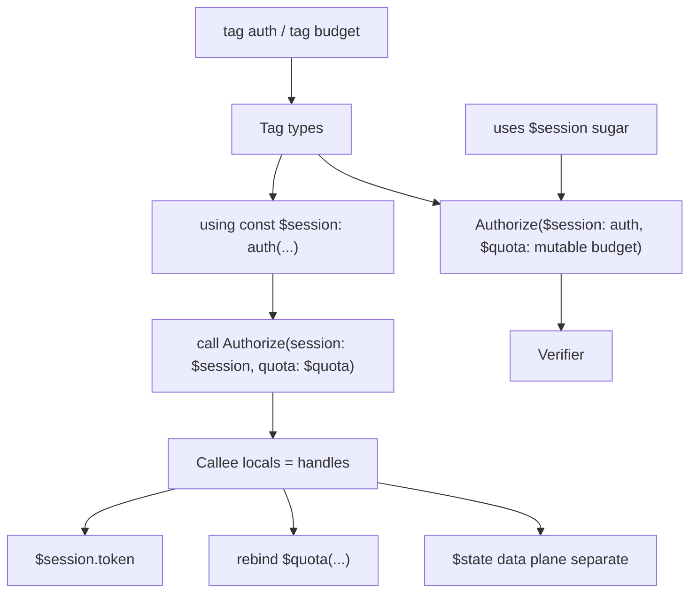

# RFC-0004: Executable Parameters and Tagged Variables v1

Status: draft
Authors: language + runtime + lsp
Created: 2026-07-28
Updated: 2026-07-28
Target release window: after typed-records verifier baseline

Revision notes:

1. Part B activation model changed from frame-lifetime `bind` to C#-style scoped `using` with multi-bind and nesting.
2. Part C added: signature-embedded context (`uses`) and sugar so semantics live at boundaries (Rust-lifetime style), reducing LLM/human cognitive load without Python-like looseness.
3. Part D added: named context handles (`using const|mutable $name: tag(...)`) for program-global and block scopes — still explicit, not anonymous god-context.
4. Part E added: **tags as typed parameters** — the fundamental call-edge contract; `uses` becomes sugar over tag-typed params + ambient fill.
5. Part F added: **generics as a forward door** — A–E do not ship generics, but they create the signature/type slots generics need (without committing v1 scope).

## Summary

Introduce a closed binding stack that moves Grapheme closer to Lua-class composability without embedding a general-purpose scripting VM:

1. **Executable parameters v1** — finish the existing GraphQL-style `variable_defs` surface so `query` / `mutation` / `iterator` / `subscription` act as typed callables with named arguments.
2. **Tagged variables v1** — ambient context schemas activated through **scoped `using`**, with visibility driven primarily by **signature `uses` clauses** (not giant central allow-lists).
3. **Ergonomic embedding (Part C)** — syntactic sugar that keeps the same IR/governance model while putting semantic load at declaration sites, where LLMs and humans already look.
4. **Named context handles (Part D)** — `using const|mutable $name: tag(...)` binds a handle at program or block scope.
5. **Tag-typed parameters (Part E)** — `$session: auth` / `$quota: mutable budget` as real parameters; pass handles or construct at the call site. **This is the fundamental model** the rest sugars into.

Unified jobs:

| Mechanism | Job |
|---|---|
| Parameters (`$ticket_id`, `$session: auth`) | Call-edge API — scalars **and** tag handles |
| `$state` / `$current` | Pipeline value flowing step → step |
| `tag` schemas | Types for context handles |
| `using` / named handles | Provide/activate instances (program or block) |
| `uses …` | Sugar: tag-typed params filled from ambient |

## Motivation

### Current strengths

1. Typed executable signatures (`on InputType -> OutputType`) already parse, lower to HIR, and verify.
2. Grammar already accepts GraphQL-style params: `query Foo($x: String = "a")`.
3. `call Target(args…)` and bare `Target(args…)` already lower call args into `HirStep.args` / MIR `Call.args`.
4. Runtime already tracks call depth and has a `TemplateScope` for `$state` / `$item` / `$loop`.
5. Struct-shaped `$state` is a workable “arg bag” for many workflows today.

### Current gaps

1. `QueryDef.variables` / `MutationDef.variables` / `SubscriptionDef.variables` are parsed into AST, then **dropped at HIR** — they do not become runtime locals.
2. `IteratorDef` / `FragmentDef` / `NodeDef` have no `variable_defs` in grammar (only `on In -> Out`).
3. Call-site args on `call` are mostly ignored except special keys such as `max_depth`; they are **not** bound into the callee frame.
4. There is a single mutable `AgentState.current` for all scopes — nested calls and loops share one blob (`docs/internal/runtime/runtime-state-flow.md`).
5. Cross-cutting values (tokens, request ids, budgets) must either pollute `$state` or rely on host/env side channels.

### Desired outcome

- Authors can write reusable callables with named parameters.
- Authors can declare ambient context with explicit visibility and **scoped** lifetime.
- Authors can activate **multiple tags together** and nest scopes (C# `using` analogue).
- **Semantic cognitive load lives in signatures** (params + tag types + `uses` sugar), not in repeated body ceremony.
- Tag contexts are **values you can pass**, not only ambient ghosts.
- LLM authoring stays structured and checkable — sugar lowers verbosity, not rigor.
- Governance model stays intact: compile-time ACL + runtime scope stack, no soft `eval`.

## Goals

1. Lower executable parameters from AST → HIR → MIR → runtime frame locals.
2. Bind call-site named args into callee locals with deterministic missing/default/type rules.
3. Expose params in template resolution as `$name` / `$args.name` without breaking `$state`.
4. Add tagged variable schemas; derive access from signature `uses` (Part C), with optional explicit allow-lists as escape.
5. Activate tags via `using` scopes that support **one or many bindings**, nesting, and drop-on-exit.
6. Enforce tag visibility by **current frame membership** (`uses` / tag-typed params — not ancestor leakage).
7. Keep tag values off the `$state` data plane by default (no silent escape).
8. Provide sugar that preserves IR semantics while cutting authoring noise (Part C).
9. Support named program/block context handles with `const` / `mutable` (Part D).
10. Support **tag types in parameter position** and pass/construct handles at call sites (Part E).
11. Define `uses` as sugar over tag-typed params + ambient fill (closed loop).
12. Preserve untyped / signature-only programs (gradual adoption).

## Non-Goals

1. General lexical `let` for arbitrary pipeline locals (deferred; `using` is only for declared tags).
2. Rust-style lifetime inference, borrows, or exclusive mutable alias analysis.
3. First-class function values / closures / higher-order `map` callables (follow-on).
4. General expression AST for `until` / arithmetic (orthogonal; see control-flow deferred items).
5. Embedding Lua / Rhai / JS or any guest scripting VM.
6. Unrestricted mutation of `const` handles (mutable/`rebind` only where declared).
7. Cross-execution persistence of tags (tags die with scope exit / run end).
8. IDisposable-style host resource finalizers in v1 (`using` scopes values; optional `@dispose` hook is follow-on).
9. Treating tag handles as JSON blobs inside `$state` (handles remain a distinct runtime kind).

## Relationship to Existing Surfaces

### Keep and document

```grapheme
iterator Step on SupportTicketState -> SupportTicketState { ... }
query Run on Any -> SupportTicketState { call Step }
```

`on In -> Out` remains the typed **pipeline value** contract for `$state`.

### Finish (params)

```grapheme
iterator Step($priority: String) on SupportTicketState -> SupportTicketState {
  echo(message: "priority={$priority}")
}

query Run {
  call Step(priority: "high")
}
```

### Closed loop — preferred authoring shape

```grapheme
tag auth {
  $token: String
  $request_id: String
}

tag budget {
  $max_usd: Float
}

// Fundamental: tags as typed parameters
iterator Authorize(
  $session: auth,
  $quota: mutable budget,
  $dry_run: Bool = false
) on Request -> Decision {
  http.fetch(headers: { authorization: "Bearer {$session.token}" })
  |> rebind $quota(max_usd: 0.2)
}

// Sugar: `uses` ≡ tag-typed params filled from ambient (Part E)
iterator Audit uses $session on Decision -> Decision { ... }

query Entrypoint {
  using const $session: auth(token: $env.token, request_id: "r-1")
  using mutable $quota: budget(max_usd: 1.0)

  // explicit pass
  call Authorize(session: $session, quota: $quota)
  // or construct at call site:
  // call Authorize(session: auth(token: "...", request_id: "r-2"), quota: $quota)
  |> call Audit
}
```

Verbose explicit `tag auth for [A, B, C]` remain valid as an override form; Parts C–E make signatures the source of truth.

## Part A — Executable Parameters v1

### A.1 Surface syntax

Extend parameter lists consistently:

```text
query Name ( $param: Type (= value)? , ... )? (on In (-> Out)?)? { ... }
mutation Name ( $param: Type (= value)? , ... )? (on In (-> Out)?)? { ... }
subscription Name ( $param: Type (= value)? , ... )? (on In (-> Out)?)? { ... }
iterator Name ( $param: Type (= value)? , ... )? on In (-> Out)? { ... }
node Name ( $param: Type (= value)? , ... )? on In (-> Out)? { ... }
```

Notes:

1. `query` / `mutation` / `subscription` already have `variable_defs` in `grapheme.pest`.
2. Add the same optional `variable_defs` to `iterator_def` / `node_def` (and optionally `fragment_def` once fragment call semantics stabilize).
3. Param names are `$`-prefixed at declaration (existing `VariableDef`) and referenced as `$priority` in bodies.
4. Call sites use bare keys: `call Step(priority: "high")` — matching existing `named_arg` grammar.
5. Part A lands **scalar / JSON value** params first; Part E extends the same lists so `Type` may be a **tag** (`$session: auth`, `$quota: mutable budget`).

Compatibility:

- Programs with only `on In -> Out` remain valid.
- Programs with only params and no signature remain valid.
- Entrypoint params may be supplied by CLI/SDK initial bindings (see A.5).

### A.2 Semantics

For each invocation of executable `E`:

1. Create a **call frame** with:
   - `locals: Map<String, JsonValue>` (params)
   - optional link to active tag env (Part B)
   - existing call-depth bookkeeping
2. Resolve each declared param:
   - If call-site arg present → use it (after template resolution in caller scope).
   - Else if default present → use default (resolved in caller scope).
   - Else → compile error for required params at verified call sites; runtime structured error for entrypoints missing SDK/CLI bindings.
3. `$state` / `$current` continue to carry the pipeline value.
4. Params do **not** automatically merge into `$state`.
5. On return, frame locals are dropped. Callee mutations to `$state` remain the return value (current passthrough model).

Template resolution order (v1):

1. Exact `$param` / `$param.field…` from frame locals
2. Existing `$state` / `$current` / `$item` / `$loop`
3. Active tagged bindings if allowed (Part B)
4. Unresolved → null / existing template behavior (choose one in open questions; prefer hard error in typed mode)

Alias (optional sugar, same object):

- `$args.priority` ≡ `$priority`

### A.3 Compiler / IR changes

#### AST (mostly done)

- `VariableDef { name, type_ref, default }` already exists.
- `CallStep.args` / `FieldCall.args` already exist.

#### HIR

Extend `HirExecutable`:

```rust
pub struct HirParam {
    pub name: String,              // without leading '$'
    pub type_ref: TypeRef,
    pub default: Option<JsonValue>,
    pub required: bool,
}

pub struct HirExecutable {
    // existing fields…
    pub params: Vec<HirParam>,
}
```

Lowering rules:

1. Preserve `Query/Mutation/Subscription.variables` into `params` (today dropped).
2. Parse new iterator/node variable lists into the same field.
3. Keep call args on `HirStep.args` as today.

Verifier additions:

1. Param names unique per executable.
2. No collision with reserved roots: `state`, `current`, `item`, `loop`, `args`, `env` (policy TBD for `$env`).
3. Call-site unknown arg names → error.
4. Missing required args → error when target params are known.
5. Type checks reuse typed-records assignability when types are named/scalars.
6. `on InputType` field checks remain about `$state`, not params.

#### MIR / artifact

Extend `MirFunction`:

```rust
pub struct MirParam {
    pub name: String,
    pub type_name: Option<String>,
    pub default: Option<JsonValue>,
    pub required: bool,
}

pub struct MirFunction {
    // existing fields…
    pub params: Vec<MirParam>,
}
```

`MirInst::Call.args` already carries call-site args JSON object — retain that. Runtime binds using callee `params` + instruction `args`.

Artifact format bump: include `params` with default `[]` for backward compatibility.

### A.4 Runtime changes

1. Introduce `CallFrame` (or extend the call path around `execute_function`) with `locals`.
2. When entering a function from `module == "call"`:
   - build locals from callee `params` + instruction args
   - do **not** require args to be stuffed into `state.current`
3. Extend `TemplateScope` with `locals: &'a Map<String, JsonValue>` (and later `tags`).
4. Resolve `$priority` from locals before `$state` path handling.
5. Trace: record bound param **names** always; values subject to existing redaction / `TracePolicy` (same posture as DB params in RFC-0003).

Entrypoint binding (CLI/SDK):

```rust
// SDK sketch
engine.execute(ExecuteRequest {
    source: Some(src),
    entrypoint_args: json!({ "priority": "high" }),
    ..
})?;
```

CLI sketch: `--arg priority=high` (repeatable) or `--args-json '{}'`.

### A.5 Acceptance for Part A

1. `iterator`/`query` with params round-trip AST→HIR→MIR.
2. `call Step(priority: "high")` binds `$priority` inside `Step`.
3. Missing required param fails at compile time for static call sites.
4. Defaulted params work when omitted.
5. Params do not appear in `$state` unless author explicitly `set`/`merge` them.
6. Existing no-param programs keep identical behavior.

## Part B — Tagged Variables v1 (scoped `using`)

### B.1 Concept

A **tag** is a named ambient environment schema:

1. Declares one or more typed bindings.
2. Is readable by executables that **declare `uses <tag>`** (Part C) — or, in the verbose form, appear in an explicit `for […]` allow-list.
3. Is activated only inside an explicit **`using` scope** (C# `using` analogue).
4. Supports **multiple tag activations in one `using`**.
5. Supports **nested `using`** scopes.
6. Drops deterministically on scope exit (not merely on function return).

This is **not** full Rust lifetime inference. It is an explicit ACL + scope stack, with the ACL **embedded in signatures** the way Rust embeds lifetime parameters.

`using` scopes **tag environments only**. `$state` still threads through the scope body and out to the continuation unchanged in shape (unless body steps mutate it).

### B.2 Why `using` instead of bare `bind`

A frame-lifetime `bind` is too coarse for real workflows:

1. Authors often need auth+trace together for a region, then neither afterward.
2. Nested regions need tighter budgets/secrets without ending the outer scope.
3. Multiple ambient contexts should activate/deactivate as one unit.
4. Visible braces are LLM- and audit-friendly (“what is live here?”).

v1 activation surface is therefore **`using`**, not free-floating `bind`.

### B.3 Surface syntax (proposed)

Top-level declaration (schema; allow-list optional):

```grapheme
// Preferred: schema only — consumers declare `uses auth`
tag auth {
  $token: String
  $request_id: String
}

// Verbose override still allowed:
tag legacy_secrets for [Rotate, AuditOnly] {
  $api_key: String
}
```

Signature requirement (normative with Part C):

```grapheme
iterator Authorize uses auth, budget on Request -> Decision { ... }
```

Scoped activation (single or multiple bindings). Compact call-like field sugar is preferred:

```grapheme
using auth(token: $env.token, request_id: "r-1") {
  call FetchUser
  |> call Authorize
}

using auth(token: $env.token, request_id: "r-1"),
      trace(correlation_id: "c-9"),
      budget(max_usd: 1.5) {
  call FetchUser
  |> call Authorize
}
```

Object form remains accepted (same IR):

```grapheme
using auth { token: $env.token, request_id: "r-1" } { ... }
```

Nested scopes:

```grapheme
using auth(token: $env.token, request_id: "r-1") {
  call FetchUser
  |> using budget(max_usd: 0.25) {
       call ExpensiveModel
     }
  |> call Authorize   // budget ended; auth still active
}
```

As a pipeline step (scope is still a block, not an open-ended suffix):

```grapheme
call Prepare
|> using auth(token: $env.token, request_id: "r-1"),
         trace(correlation_id: "c-9") {
     call FetchUser
     |> call Authorize
   }
|> call FormatHtml
```

References inside an executable that `uses auth`:

```grapheme
iterator Authorize uses auth on Request -> Decision {
  http.fetch(
    url: "https://example.test/authz",
    headers: { authorization: "Bearer {$token}" }
  )
}
```

Grammar sketch:

```pest
tag_def = {
    "tag" ~ ident ~ ("for" ~ "[" ~ ident ~ ("," ~ ident)* ~ "]")? ~ "{"
    ~ variable_def+
    ~ "}"
}

uses_clause = { "uses" ~ ident ~ ("," ~ ident)* }

using_binding = {
    ident ~ (arg_list | object_value)
}

using_step = {
    "using"
    ~ using_binding
    ~ ("," ~ using_binding)*
    ~ "{"
    ~ pipeline+
    ~ "}"
}
```

`uses_clause` attaches to executable defs beside `variable_defs` / `executable_signature`.
`tag_def` becomes a `Definition`. `using_step` becomes a `PipelineStep`.

### B.4 Visibility and lifetime rules

**Visibility (v1, strict):**

A tagged binding `$token` from tag `auth` is readable in the current frame **iff**:

1. An activation of `auth` is on the **scope stack**, and
2. Current executable **`uses auth`** (or is named in an explicit `tag auth for […]` override list).

Being under an allowed ancestor is **not** enough for a callee that does not `uses auth`:

```text
Entrypoint
  using auth, trace {
    FetchUser        // uses auth, trace → sees both
    FormatHtml       // uses nothing → cannot see $token
    Authorize        // uses auth, budget → sees $token if budget also active
  }
  FormatHtml         // scopes popped
```

**Lifetime (v1):**

1. Entering `using` pushes one **scope frame** containing N tag activations (atomic with respect to body entry).
2. Body steps and nested calls observe those activations subject to allow-lists.
3. Leaving the `using` block pops that scope frame and drops all of its activations together.
4. Nested `using` pushes another scope frame; inner exit pops only the inner frame.
5. Function return pops any scopes still open in that call frame (safety net for early `$return` / failure paths).
6. Same tag activated again in an inner `using`: **forbid in v1** (no shadow/rebind). Revisit after fixtures exist.

**Failure / control-flow:**

1. If a body step fails fatally, runtime still pops the scope (drop is best-effort/deterministic before propagating failure).
2. `match` / `if` / `call` targets that `$return` out of the owning executable pop open scopes for that frame.
3. Jumping into a `using` body without entering it is impossible — scopes are structured.

**Mutability (v1):**

- Bindings are read-only after scope enter.
- No mid-scope mutation API in v1.

**Multi-bind atomicity:**

- Either all bindings in a `using` header validate and activate, or none do (fail before body).
- Duplicate tag names in one header → compile error.
- Unknown field for a tag → compile error.

### B.5 Escape / governance rules

1. Verifier rejects reading tagged names outside allow-listed executables.
2. Verifier rejects reading tagged names in code regions that are not statically nested in a `using` that activates that tag (best-effort static); runtime still enforces presence.
3. Verifier rejects copying tagged bindings into `set` / `apply` / `merge` / struct init **by default**.
4. Escape hatch (optional, explicit), only inside an active scope:

   ```grapheme
   set { request_id: $request_id } @promote(tag: auth, fields: [request_id])
   ```

   Without `@promote`, promotion is a compile error. This preserves “tags are not `$state`.”

5. Capability policy remains orthogonal: tags do not grant host capabilities; they only transport values.
6. Host dispose hooks (true C# `IDisposable`) are **out of v1**; a future `@dispose(op: secrets.forget)` on a tag binding may appear later.

### B.6 Compiler / IR changes

#### AST

```rust
pub struct TagDef {
    pub name: String,
    pub allow_list: Vec<String>,
    pub variables: Vec<VariableDef>,
}

pub struct UsingBinding {
    pub tag: String,
    pub fields: Vec<(String, Value)>,
}

pub struct UsingStep {
    pub bindings: Vec<UsingBinding>, // 1..N, atomic
    pub pipelines: Vec<Pipeline>,    // scoped body
}
```

`PipelineStep` gains `Using(UsingStep)`.

#### HIR

```rust
pub struct HirTagDef {
    pub name: String,
    pub allow_list: Vec<String>,
    pub bindings: Vec<HirParam>, // reuse param shape
}

pub struct HirUsingStep {
    pub scope_id: u32,
    pub bindings: Vec<(String /* tag */, JsonValue /* fields */)>,
    pub body: HirPipeline,
}

pub struct HirProgram {
    // existing…
    pub tag_defs: Vec<HirTagDef>,
}
```

Prefer dedicated MIR ops (not host capability calls):

```rust
pub enum MirInst {
    // existing Call / BranchCall / MatchCall…
    UsingEnter {
        scope_id: u32,
        activations: Vec<MirTagActivation>,
    },
    UsingExit {
        scope_id: u32,
    },
}

pub struct MirTagActivation {
    pub tag: String,
    pub fields: JsonValue,
}
```

Lowering:

1. `using a {…}, b {…} { body }` → `UsingEnter` + lowered body instructions + `UsingExit`.
2. Nested `using` → nested enter/exit pairs with distinct `scope_id`s.
3. Verifier/MIR emitter guarantee matching enter/exit on all exits from the body (including early return lowering).

Artifact carries `tag_defs` beside functions.

Verifier:

1. Tag names unique.
2. Every `uses` name refers to a declared tag.
3. Explicit `for […]` names (if present) refer to existing executables.
4. Binding names unique within a tag; recommend globally unique tagged names in v1 for bare `$token` (or require `$auth.token` — open question).
5. Every `$token`-style read resolves to param, reserved root, or exactly one tag binding declaration.
6. Body reads of a tag binding require `uses <tag>` on that executable.
7. Static call-graph check: `call F` requires all of `F.uses` to be active in the enclosing `using` stack (conservative; runtime remains source of truth for dynamic edges).

### B.7 Runtime changes

Extend engine state with a **scope stack** (orthogonal to call stack, but always cleared on call-frame return):

```rust
struct TagActivation {
    tag: String,
    values: Map<String, JsonValue>,
}

struct UsingScope {
    scope_id: u32,
    activations: Vec<TagActivation>,
}

struct CallFrame {
    function_name: String,
    locals: Map<String, JsonValue>,
    using_stack: Vec<UsingScope>,
}
```

Ops:

1. `UsingEnter` — validate fields, push `UsingScope`.
2. Execute body with `$state` threading as today.
3. `UsingExit` — pop matching `scope_id` (assert top), emit drop trace.
4. On call-frame return / fatal failure — pop all remaining `using_stack` entries outermost-last or innermost-first (pick innermost-first to mirror C# dispose order).

Lookup for `$token`:

1. Frame locals (params)
2. Reserved templates (`$state` / `$item` / `$loop`)
3. From **top of `using_stack` downward**, find first activation containing `token` whose tag is permitted for the **current** function (`uses` or explicit `for`)
4. Else unresolved

Trace:

- `using_enter` with `scope_id`, tag names, field names (values redacted)
- `using_exit` / `using_drop` with `scope_id`
- Nested scopes appear as nested enter/exit pairs

### B.8 Acceptance for Part B

1. `tag` + `using` parse and appear in artifact metadata.
2. Multi-bind `using a {…}, b {…}` activates both atomically.
3. Nested `using` pops only the inner scope at inner exit.
4. Allowed executable inside scope can read `$token`; disallowed cannot.
5. Steps after scope exit cannot read those bindings.
6. Early failure / `$return` still drops open scopes for the frame.
7. Promotion into `$state` without `@promote` fails verification.
8. Trace shows enter/exit boundaries for each scope.
9. No-tag programs unchanged.

## Part C — Embedding Semantic Cognitive Load (sugar without Python)

### C.1 Design principle

Rust does not make lifetimes cheap by hiding them. It makes them cheap by putting them **where eyes already go**: signatures and region boundaries. Bodies stay boring.

Grapheme should do the same for ambient context:

| Put semantics here | Not here |
|---|---|
| `uses auth, budget` on the callable | Repeating allow-lists at every tag def |
| `using auth(...) { ... }` at the provider edge | Threading tokens through `$state` fields |
| Param lists on the callable | Ad-hoc locals stuffed into `set` |
| Verifier errors naming the missing `uses`/`using` | Runtime mystery nulls |

Sugar is allowed when it is **total and local** — it desugars to the same HIR/MIR as the verbose form. Sugar is rejected when it requires global inference across the program (that is the Python/soft-script trap).

### C.2 The verbosity problem with Part B alone

Without Part C, authors maintain three noisy surfaces:

1. Central `tag auth for [FetchUser, Authorize, Audit, …]` lists that rot.
2. Call-site `using` blocks even when the outer scope already provides the tag.
3. Long object literals and repeated tag field names.

LLMs especially pay for (1): every edit churns a distant list.

### C.3 Signature-embedded context: `uses`

**Normative authoring model:**

```grapheme
tag auth { $token: String, $request_id: String }

iterator Authorize($dry_run: Bool = false)
  uses auth, budget
  on Request -> Decision {
  // body just uses $token / $max_usd / $dry_run
}
```

Rules:

1. `uses` is part of the executable’s public contract (shown in LSP signature help / reflection).
2. Effective allow-list for tag `auth` =  
   `union(explicit for […] if present, all executables that declare uses auth)`.
3. If a body references `$token` but the executable does not `uses auth`, compile error:  
   `Authorize reads $token from tag auth but does not declare 'uses auth'`.
4. If `call Authorize` occurs where `auth` or `budget` is not active, compile error (static call graph) / structured runtime error otherwise:  
   `call Authorize missing active tags: budget`.
5. Callees do **not** need a nested `using` when the caller’s active scope already satisfies `uses`.

This is the Rust lifetime analogue:

- `uses auth` ≈ taking a lifetime/`Context` param
- `using auth(...)` ≈ creating the region that provides it
- no need to annotate every internal expression

### C.4 Provider-edge sugar

Keep one provider construct; make it short.

**Compact activation (preferred sugar):**

```grapheme
using auth(token: $env.token, request_id: "r-1"),
      budget(max_usd: 0.25) {
  call Authorize
}
```

Desugars to object-form `using` + `UsingEnter`/`UsingExit` (Part B).

**Pipeline-scoped helper (optional sugar):**

```grapheme
call Prepare
|> with auth(token: $env.token) {
     call Authorize
   }
```

`with` is a pure alias for `using` (pick one keyword in implementation; RFC treats them as synonyms, prefer `using` in docs).

**Satisfied-by-ambient calls (no sugar needed, just omit):**

```grapheme
using auth(token: $env.token, request_id: "r-1"), budget(max_usd: 1.0) {
  call FetchUser      // uses auth
  |> call Authorize   // uses auth, budget — both already active
}
```

### C.5 Bundle sugar: context groups

When the same multi-bind repeats, allow a **tag bundle** (schema-level sugar):

```grapheme
bundle session = auth, trace

query Entrypoint {
  using session(
    auth: { token: $env.token, request_id: "r-1" },
    trace: { correlation_id: "c-9" }
  ) {
    call FetchUser
    |> call Audit
  }
}
```

Desugars to multi-bind `using auth(...), trace(...)`.
Bundles never grant capabilities; they only group provider edges.

v1 can ship without bundles if time-constrained; `uses` + compact `using` are the load-bearing pieces.

### C.6 What we deliberately do not sugar

1. **No implicit tag activation** from reading `$env` or host secrets.
2. **No anonymous global god-context** that every executable can read without `uses` (Part D allows *named* program-scoped handles — still declared and ACL’d).
3. **No body-level invent-a-local** that outlives a step (`let` remains separate/deferred).
4. **No inferring `uses` from body reads without a signature declaration** — that hides the contract from callers/LLMs. Auto-*fix* suggestions in LSP are fine; silent inference is not.
5. **No Python-like dynamic scope** where callees see caller locals automatically.

### C.7 Cognitive load checklist (LLM + human)

A patch should answer these from **signatures and `using` headers alone**:

1. What does this callable take? → params + `on In -> Out`
2. What ambient context must be live? → `uses …`
3. Where is that context provided/dropped? → nearest `using` braces
4. What flows as data? → `$state` only

If a reader must scan distant `for […]` lists or body archaeology to answer (2)/(3), the sugar has failed.

### C.8 Compiler / LSP implications

1. HIR stores `uses: Vec<String>` on `HirExecutable`.
2. Derived allow-list computed once per program for runtime lookup.
3. Signature help renders:  
   `Authorize($dry_run: Bool) uses auth, budget on Request -> Decision`
4. Quick-fix: “add `uses auth`” when body reads `$token`.
5. Call-site diagnostic: “wrap in `using budget(...)` or move call into active scope”.
6. Reflection/metadata exposes `uses` for agents (aligned with grapheme-reflection surfaces).

### C.9 Acceptance for Part C

1. Preferred examples in docs use `uses` + compact `using`, not giant `for` lists.
2. `uses`-only programs typecheck without any `tag … for […]`.
3. Missing active tag at `call` is a clear verifier diagnostic.
4. Compact `using auth(k: v)` desugars identically to object form.
5. No silent `uses` inference from body text in the compiler.

## Part D — Named Context Handles (`const` / `mutable`, program or block)

### D.1 The idea

Block `using auth(...) { ... }` is great for local regions. Workflows also need **long-lived context** for a whole program/run — without making every field a free-floating global.

Bind a **named handle** to a tag instance:

```grapheme
tag auth {
  $token: String
  $request_id: String
}

tag budget {
  $max_usd: Float
}

// Program-scoped (global to this artifact / execution)
using const $session: auth(token: $env.token, request_id: "r-1")
using mutable $quota: budget(max_usd: 1.0)

iterator Authorize uses $session, $quota on Request -> Decision {
  http.fetch(
    headers: { authorization: "Bearer {$session.token}" }
  )
}

query Entrypoint {
  call Authorize
}
```

Reading the top of the file tells you what ambient instances exist, their tag types, and whether they can change — same cognitive slot as Rust `static` / scoped `let` with an explicit type.

### D.2 Syntax (proposed)

```text
using const   $<name>: <tag>(<fields…>)     // program scope (no braces)
using mutable $<name>: <tag>(<fields…>)

using const   $<name>: <tag>(<fields…>) { <pipeline> }   // block scope
using mutable $<name>: <tag>(<fields…>) { <pipeline> }

// Multi-bind still allowed; each arm may be anonymous (Part B) or named:
using const $session: auth(...),
      mutable $quota: budget(...),
      trace(...) {   // anonymous arm still ok
  ...
}
```

Notes on the user’s sketch (`using mutable $myVar: auth()`):

1. **Colon-as-type** is the right instinct — `$myVar` is a value of tag-type `auth`.
2. Prefer **initializer args in the constructor**: `auth(token: …)` not a bare `auth()` unless all fields have defaults.
3. `const` / `mutable` qualifies the **handle**, not the tag schema.
4. Keyword stays `using` so block and global forms are one concept.

Rejected / deferred spellings:

| Spelling | Why not (for now) |
|---|---|
| `global auth = …` | Introduces a second concept; loses scope unity with block `using` |
| `using $myVar = auth()` without const/mutable | Mutability becomes implicit; worse for LLMs |
| Bare `using auth(...)` at program scope with no name | Anonymous god-context — Part C forbids this |

### D.3 Semantics

**Handle** = named activation of exactly one tag instance.

| Form | Lifetime | Access |
|---|---|---|
| Program `using const\|mutable $x: tag(...)` | Entire execution (artifact run); init before entrypoint | Only executables that `uses $x` |
| Block `using … $x: tag(...) { body }` | Enter/exit of that block (Part B scope stack) | `uses $x` + dynamic scope presence |

**`const` handle:**

1. Fields frozen after initialization.
2. No `rebind` / field writes.
3. Default for secrets, request ids, identity.

**`mutable` handle:**

1. Fields may be updated through an explicit op (v1 surface below).
2. Updates are traced; still not `$state`.
3. Only executables that `uses $quota` may update `$quota` (and optionally require `uses mutable $quota` — open question; proposed: mutability is on the binding, `uses $quota` is enough).

**Reference style (proposed default):**

1. Prefer **qualified** access via the handle: `$session.token`, `$quota.max_usd`.
2. Bare `$token` is allowed only when it is unambiguous (single active handle providing that field) — or forbidden in Part D programs to reduce ambiguity (open question; proposed: allow bare as sugar when unique).

**`uses` clause gains handle targets:**

```grapheme
iterator Authorize uses $session, $quota on Request -> Decision { ... }
// still valid:
iterator Legacy uses auth on Request -> Decision { ... }  // any active auth instance / anonymous auth scope
```

Rules:

1. `uses $session` requires an in-scope handle named `session` whose tag is compatible.
2. `uses auth` means “some active activation of tag auth” (anonymous Part B scope **or** a named handle of that tag).
3. Program-scoped handles are in scope for all executables in the artifact (subject to `uses`).
4. Block-scoped handles are in scope only inside that block’s dynamic region.

### D.4 Mutation surface (mutable only)

v1 minimal:

```grapheme
rebind $quota(max_usd: 0.25)
```

or field patch:

```grapheme
update $quota { max_usd: 0.25 }
```

Proposed pick: **`rebind $quota(...)`** — mirrors constructor syntax; whole-field replacement for listed keys; omitted keys unchanged.

Semantics:

1. Only legal if `$quota` is `mutable`.
2. Compile error on `rebind $session(...)` if `$session` is `const`.
3. Emits trace event `context_rebind` with handle name + field names (values redacted by policy).
4. Does not alter `$state`.

### D.5 How this scopes “to a global level” without Python

Program-scoped handles are **execution globals**, not language-globals with free reads:

1. Declared once at the top (visible contract).
2. Still require `uses $session` on consumers.
3. Still off the `$state` data plane.
4. `const` by default recommendation in style guide; `mutable` is the loud word.

Mental model:

```text
tag auth { ... }                      // schema (type)
using const $session: auth(...)       // instance (value) for this run
iterator X uses $session ...          // capability to observe/use it
```

That is closer to Rust `static` / `'static` context passing than to Python module-level mutable ambient state.

### D.6 Desugar / IR

Program-scoped handles lower to a synthetic root scope around the entrypoint:

```text
UsingEnter { handle: "$session", tag: auth, mutability: const, fields }
UsingEnter { handle: "$quota", tag: budget, mutability: mutable, fields }
  <entrypoint body>
UsingExit { handle: "$quota" }
UsingExit { handle: "$session" }
```

Or a dedicated preamble list on `MirProgram`:

```rust
pub struct MirContextHandle {
    pub name: String,            // "session"
    pub tag: String,             // "auth"
    pub mutability: MirMutability, // Const | Mutable
    pub fields: JsonValue,
    pub scope: MirContextScope,  // Program | Block(scope_id)
}
```

Block named forms attach `handle` to the existing `UsingEnter` activation record.

Lookup becomes:

1. Params / reserved templates
2. Named handles in scope (`$session.token` direct; bare `$token` via unique provider)
3. Anonymous tag activations (Part B) if permitted by `uses auth`

### D.7 Interaction with Parts A–C / E

| Feature | Interaction |
|---|---|
| Scalar params | Same param list; tag-typed params are a param kind (Part E) |
| Tag-typed params | Passing `$session` into `$session: auth` **is** the closed loop — not a name collision |
| `$state` | Unchanged data plane; promotion still needs `@promote` |
| Anonymous `using auth(...)` | Still valid for short regions; can ambient-fill `uses auth` / `$x: auth` |
| `uses $session` | Sugar for a tag-typed param with ambient fill (Part E) |
| Bundles (C.5) | May expand to multiple named handles later (`using const $s: session(...)`) |

### D.8 Authoring guidance (LLM-optimized)

Prefer:

```grapheme
using const $session: auth(token: $env.token, request_id: "r-1")
using mutable $quota: budget(max_usd: 1.0)

iterator Authorize uses $session, $quota on Request -> Decision {
  ...
  rebind $quota(max_usd: 0.2)
}
```

Over:

- stuffing tokens into `$state`
- repeating anonymous `using auth` at every call site
- central `for [twenty, names]` lists

### D.9 Acceptance for Part D

1. Program-scoped `using const $session: auth(...)` initializes before entrypoint and drops after run.
2. Consumers access via `uses $session` and/or tag-typed params (Part E).
3. `rebind` allowed only on `mutable` handles.
4. Block-scoped named handles pop on block exit.
5. No anonymous program-scoped `using auth(...)` without a handle name.
6. Trace distinguishes program preamble binds from block enter/exit.

## Part E — Tags as Typed Parameters (closing the loop)

### E.1 Thesis

Everything above converges on one fundamental call-edge idea:

> **A tag is a type. A handle is a value of that type. Executables take those values as parameters.**

Ambient `using` / `uses` are ergonomic ways to *provide* and *elide* those parameters — not a second parallel system.

This matches the Rust instinct: contexts show up in the signature (`$session: auth`), providers construct them (`auth(...)` / `using const $session: auth(...)`), and call sites pass them (`session: $session`).

### E.2 Surface syntax

Extend Part A `variable_defs` so `type_ref` may name a **tag** (and optional mutability):

```grapheme
iterator Authorize(
  $session: auth,
  $quota: mutable budget,
  $dry_run: Bool = false
) on Request -> Decision {
  http.fetch(headers: { authorization: "Bearer {$session.token}" })
  |> rebind $quota(max_usd: 0.2)
}

query Entrypoint {
  using const $session: auth(token: $env.token, request_id: "r-1")
  using mutable $quota: budget(max_usd: 1.0)

  call Authorize(session: $session, quota: $quota, dry_run: false)
}
```

Call-site value forms for a tag-typed arg:

1. **Handle reference:** `session: $session`
2. **Inline construct:** `session: auth(token: "...", request_id: "r-2")`
3. **Ambient fill (sugar):** omit the arg when a compatible ambient handle exists (see E.4)

Grammar sketch:

```pest
mutability = { "const" | "mutable" }

// existing type_ref gains tag names via qualified_ident / ident already;
// mutability prefix is new in variable_def / type position:
variable_def = {
    "$" ~ ident ~ ":" ~ mutability? ~ type_ref ~ ("=" ~ value)?
}
```

Defaults:

1. Omitting mutability on a tag-typed param means **`const`**.
2. `mutable budget` requires the passed handle to be mutable (or an inline construct, which is born mutable only if annotated — proposed: inline constructs are `const` unless written `mutable budget(...)`).
3. Scalar types ignore `mutable`/`const` prefixes (error if applied to `String`/`Int`/…).

### E.3 Semantics

For each tag-typed parameter `$session: auth`:

1. Callee frame binds a **local handle** named `session` with tag `auth`.
2. Body access is `$session.token` (qualified); bare `$token` only if unique sugar permits.
3. `rebind $session(...)` legal iff param (and incoming handle) are `mutable`.
4. Handle identity: passing `$session` passes the **same activation** (by reference / shared identity for mutability), not a deep JSON copy.
5. Inline `auth(...)` at the call site creates an ephemeral activation whose lifetime is the callee frame (dropped on return), unless bound into an outer `using` (not in v1 — ephemeral only).
6. Still distinct from `$state`; `@promote` required to copy fields into state.

Verifier:

1. Arg tag type must match param tag type.
2. Passing a `const` handle into `mutable` param → error.
3. Passing `mutable` into `const` param → ok (callee cannot rebind through const view) — proposed: **view is const**, shared identity cannot be rebound via this alias.
4. Unknown field access on handle → error from tag schema.
5. Tag name must refer to a `tag` def, not a `struct` (or allow both later; v1: tags only in this position unless we unify — open question).

### E.4 `uses` as sugar over tag-typed params

Normative desugar (closes Parts C–E):

```grapheme
iterator Audit uses $session on Decision -> Decision { ... }
```

desugars to:

```grapheme
iterator Audit($session: auth) on Decision -> Decision { ... }
// with ambient-fill calling convention for $session
```

and

```grapheme
iterator Legacy uses auth on Decision -> Decision { ... }
```

desugars to:

```grapheme
iterator Legacy($auth: auth) on Decision -> Decision { ... }
// ambient-fill by tag type: any active auth handle / anonymous auth scope
```

**Ambient-fill calling convention:**

When a call omits a tag-typed argument:

1. If there is an ambient named handle with the **same name** and compatible tag/mutability → fill it.
2. Else if the param was introduced by `uses auth` (type-only) and exactly one active `auth` activation exists → fill it.
3. Else → compile error at static call sites / structured runtime error otherwise.

Explicit args always win over ambient fill.

So authors can choose the loudness knob:

| Style | Example | When |
|---|---|---|
| Explicit DI | `Authorize($session: auth, …)` + `call Authorize(session: $session)` | Libraries, reusable nodes, clarity |
| Ambient sugar | `uses $session` + outer `using const $session: …` | App workflows, low ceremony |
| Inline | `call F(session: auth(...))` | One-off ephemeral context |

All three share one IR: callee locals holding handles.

### E.5 Relationship to scalar params and `on In -> Out`

```grapheme
iterator Authorize(
  $session: auth,              // context handle (Part E)
  $dry_run: Bool = false,      // scalar param (Part A)
) on Request -> Decision       // pipeline $state contract
```

Three lanes, one signature — the LLM checklist from Part C becomes complete:

1. Context → tag-typed params / `uses`
2. Knobs → scalar params
3. Data → `on In -> Out` / `$state`

### E.6 IR / runtime

Extend `HirParam` / `MirParam`:

```rust
pub enum MirParamKind {
    Value, // existing scalars / JSON-shaped values
    TagHandle {
        tag: String,
        mutability: MirMutability,
        ambient_fill: MirAmbientFill, // None | ByName | ByTag
    },
}
```

Call lowering:

1. Evaluate each tag arg to a `HandleId` (existing activation or ephemeral `UsingEnter` tied to callee frame).
2. Bind into callee `locals` as a handle, not as `JsonValue` (runtime distinct kind; may serialize for trace as redacted field map).
3. On callee return, drop ephemeral activations created for inline constructs; do **not** drop caller-owned program/block handles.

### E.7 Acceptance for Part E

1. `$session: auth` parses as a tag-typed param and appears in HIR/MIR.
2. `call F(session: $session)` and `call F(session: auth(...))` both work.
3. `uses $session` / `uses auth` desugar to tag-typed params + ambient fill.
4. Mutability mismatch (`const` → `mutable` param) fails verification.
5. `rebind` through a `const` param alias fails verification.
6. Tag handles do not appear as ordinary `$state` fields unless `@promote`d.
7. Signature help shows tag types alongside scalars.

## Part F — Forward Door: Generics (not v1)

### F.1 Honest status

Parts A–E **do not introduce generics**. They close the *binding* loop (provide → type → pass → use).

They **do** create the substrate generics want:

1. Types appear in signature positions (params, `on In -> Out`, tag schemas).
2. Mutability qualifiers already exist (`const` / `mutable`).
3. Constraints already exist in embryonic form (`uses auth`, tag-typed params).
4. Handles are typed values distinct from `$state` JSON blobs.

So: wrong to say “the loop includes generics,” right to say “the loop makes a Grapheme-shaped generics design possible without bolting on Java noise.”

### F.2 What generics would mean here

Three layers, in likely order:

#### F.2.1 Parametric executables over data (`$state`)

```grapheme
iterator IncField[T]($field: String) on T -> T {
  // operate structurally / via known field ops
}
```

This is the highest-value, lowest-ceremony generic: reusable iterators over different struct shapes, still pipeline-first.

#### F.2.2 Parametric tags / structs

```grapheme
tag Page[T] {
  $items: [T]
  $cursor: String
}

struct Result[T] {
  ok: Bool
  value: T
}
```

Lets tag handles and state types carry payload type parameters — natural once Part E exists.

#### F.2.3 Constrained context parameters (the interesting one)

Because Part E treats tags as parameter types, generics can abstract over *families* of context:

```grapheme
tag trait Authed {
  $token: String
}

tag UserSession: Authed {
  $token: String
  $user_id: String
}

tag ServiceSession: Authed {
  $token: String
  $service: String
}

iterator Authorize[S: Authed]($session: S) on Request -> Decision {
  http.fetch(headers: { authorization: "Bearer {$session.token}" })
}
```

That is the Rust analogue of trait bounds — not “generic soup,” but **bounds in the same cognitive slot as `uses` / tag params**.

### F.3 How A–E unlock this without becoming Java

| Already in A–E | Generics reuse |
|---|---|
| `$session: auth` | `$session: S` with `S: Authed` |
| `uses auth` sugar | `uses S` / bound implied by param |
| `mutable budget` | `mutable S` / bound + mutability |
| `on Request -> Decision` | `on T -> U` |
| Named handles | `using const $session: UserSession(...)` still provides concrete `S` |

Cognitive rule stays the same: **read the signature**. Generics add brackets/bounds there, not body magic.

### F.4 What still has to be invented (why it’s a door, not done)

1. Syntax for type parameters: `Foo[T]`, `Foo<T>`, or `Foo(T)` — pick one (lean `[T]` to avoid JS/Java angle-bracket noise in pipelines).
2. Bound language: tag traits / required fields / `S: auth`-style nominal bounds.
3. Inference rules: when can `call Authorize(session: $session)` infer `S = UserSession`? (Hopefully always at monomorphic call sites.)
4. MIR story: monomorphization (likely) vs runtime type reps (probably not — fights Wasm/artifact determinism).
5. Ambient fill + generics: ByTag fill must stay unambiguous under bounds.
6. Interaction with structural `$state` typing from typed-records v1.

### F.5 Non-goals for this RFC

1. Ship generics in the A–E implementation phases.
2. Higher-kinded types, variance algebra, or lifetime-polymorphism beyond handle scopes.
3. Generic capability modules / Wasm plugins in this doc.

### F.6 Recommendation

Treat generics as **RFC-0005+**, scaffolded by this one:

1. Land concrete tag types + tag-typed params (E).
2. Add parametric `on T -> T` executables next (smallest win).
3. Only then tag traits / constrained `$session: S`.

If a choice in A–E would paint generics into a corner, prefer the more signature-explicit option (qualified `$session.token`, nominal tag types, monomorphic artifacts).

### F.7 Acceptance for Part F (doc-only)

1. This RFC states clearly that generics are enabled-by, not included-in, A–E.
2. A plausible generics shape is sketched that reuses tag-typed params / bounds.
3. Sequencing points generics at a follow-on RFC after monomorphic tag params exist.

## Combined Mental Model



## Sequencing

### Phase 0 — Spec lock

1. Land this RFC.
2. Add language-contract subsections + examples fixtures skeletons (compile-fail + run-ok).

### Phase 1 — Scalar params v1

1. HIR/MIR `params` plumbing (stop dropping AST variables).
2. Grammar: iterator/node `variable_defs`.
3. Runtime frame locals + template resolution.
4. Verifier call-arity/name checks.
5. CLI/SDK entrypoint arg binding.
6. Docs + LSP hover for params.

### Phase 2 — Tag schemas + block `using` + named handles

1. Grammar `tag`, compact/multi/nested `using`, `using const|mutable $name: tag(...)`.
2. MIR `UsingEnter` / `UsingExit` + program preamble handles.
3. Runtime scope stack; qualified `$name.field`; `rebind` for mutable.
4. Trace enter/exit/rebind + redaction.

### Phase 3 — Tag-typed parameters (close the loop)

1. Param types may be tags (`$session: auth`, `$quota: mutable budget`).
2. Call-site pass handle / inline construct.
3. Handle identity + const views over shared activations.
4. LSP signature help shows tag-typed params.

### Phase 4 — `uses` sugar + ambient fill

1. Desugar `uses $session` / `uses auth` → tag-typed params + ambient-fill convention.
2. Verifier diagnostics for missing ambient / mutability mismatch.
3. Docs: three loudness styles (explicit DI / ambient / inline).

### Phase 5 — Hardening / optional sugar

1. Conformance fixtures across A–E.
2. Policy-profile checks for redacted handle fields in traces.
3. Optional: `bundle session = auth, trace`.
4. Decide follow-ons: `@dispose`, HOFs, lexical `let`, bare-field sugar policy.

### Later — Generics (RFC-0005+, see Part F)

1. Parametric executables `on T -> T`.
2. Parametric tags/structs.
3. Tag traits / constrained `$session: S`.
4. Prefer monomorphization for artifact determinism.

## Testing Strategy

1. **Parser/AST**: scalar + tag-typed params; `uses`; `tag` schema; compact/multi/nested/named `using`.
2. **HIR/MIR golden**: params kinds preserved; `uses` desugar; matching `UsingEnter`/`UsingExit`; compact==object desugar.
3. **Verifier**:
   - unknown call arg / missing required param
   - tag/mutability mismatch on handle pass
   - ambient fill success/failure cases
   - `const` alias cannot `rebind`
   - duplicate tag in one `using` header
   - illegal promotion into `set`
4. **Runtime**:
   - pass-by-handle identity for mutable rebind visibility
   - ephemeral inline `auth(...)` dropped on callee return
   - multi-bind / nest / program preamble lifetimes
   - params/handles do not leak into `$state`
5. **SDK/CLI**: entrypoint `--arg` for scalars; handle init remains source-level `using` in v1.
6. **LSP** (soft gate): signature help shows tag types; quick-fix `uses` ↔ tag param (not silent inference).

## Observability

1. Pipeline / step context gains optional `params_bound: [names…]`, `tags_active: [tag…]`, `using_scope_id`.
2. Values governed by existing `TracePolicy` redaction.
3. Deterministic event order: `using_enter` → body steps → `using_exit` (nested pairs nest in the trace).

## Security Considerations

1. Tags are not a capability bypass — host ops still pass `PolicyGuard`.
2. Secrets in tags must default to redacted in traces (treat like secrets-module handles where possible).
3. Forbid serializing entire tag env into Wasm plugin args implicitly; only explicit arg references pass values.
4. Allow-list is deny-by-default for ambient reads.

## Documentation Plan

1. This RFC under `docs/internal/rfc/`.
2. Add language notes:
   - `docs/internal/language/params-v1.md` (normative contract extract)
   - `docs/internal/language/tagged-vars-v1.md` (normative contract extract)
3. Update `docs/internal/language-contract.md` with binding precedence.
4. Update `docs/internal/runtime/runtime-state-flow.md` with frame locals + tag activations.
5. Tutorial touch: one realworld example with params + `uses` + compact multi-bind `using`.

## Open Questions

1. **Param reference style:** is `$priority` enough, or require `$args.priority` for disambiguation?
2. **Tagged reference style:** bare `$token` (v1, globally unique names) vs qualified `$auth.token`?
3. **Does a `using` body in executable `E` require `E uses auth` to read `$token`?** Proposed: **yes** — signatures stay honest even at the provider edge.
4. **Unresolved template policy:** null (legacy) vs hard error in typed programs?
5. **Should `fragment` support params/`uses` in v1** or wait until fragment invocation rules settle?
6. **CLI UX:** repeatable `--arg k=v` vs single `--args-json`?
7. **Inner re-activation of same tag:** forbid in v1 (proposed) or allow nested shadow?
8. **Promotion:** is `@promote` required, or is a dedicated `promote auth.request_id -> state.request_id` step clearer?
9. **Interaction with `@loop each`:** does `$item` shadow params of the same name? Proposed: yes, `$item` wins inside each-body templates; params remain addressable via `$args.name`.
10. **`using` as expression-step only vs also statement-prefix?** Proposed: both, as long as body braces are required (no open-ended `using` that leaks to function end).
11. **Dispose order on multi-bind exit:** reverse header order (C# style) vs declaration order? Proposed: reverse header order.
12. **Should v1 include a non-block `bind` sugar** that means “using for remainder of current pipeline”? Proposed: **no** — braces required.
13. **Keyword `using` vs `with`:** one keyword only; proposed docs/`using`, reject synonym churn in v1.
14. **Ship `bundle` with named handles or later?** Proposed: after Part D.
15. **Explicit `for […]` when `uses` exist:** union (proposed) vs error-on-redundant vs `for` replaces derived set?
16. **Bare `$token` when `$session.token` exists:** allow if unique (proposed) vs require qualified in Part D/E programs?
17. **Must `uses` say `mutable $quota` to rebind, or is binding mutability enough?** Proposed: binding/param mutability enough.
18. **Program-handle init timing:** before any executable vs first entrypoint only? Proposed: before entrypoint; available to all executables in the artifact.
19. **Multiple handles of same tag** (`$session` + `$service_auth` both `auth`): allowed (proposed); `uses auth` / ByTag fill needs exactly one or else error.
20. **Can `struct` types appear in the same param slot as tags?** Proposed v1: no — tags for handles, structs for `$state` / value params only.
21. **Inline construct mutability:** default `const` (proposed) vs inherit from param slot?
22. **Const view over mutable handle:** forbids rebind via that alias but reflects peer rebinds (proposed) vs snapshot at pass?
23. **Entrypoint tag params from CLI/SDK:** support in v1 or source-level `using` only? Proposed: source-level `using` only in v1.
24. **Generics syntax:** `Foo[T]` (proposed lean) vs `Foo<T>` vs other — defer to RFC-0005.
25. **Tag traits vs structural field bounds** for `S: Authed` — defer; keep Part E nominal concrete tags.

## Acceptance Criteria (RFC-level)

1. Spec distinguishes scalar params, tag-typed params, `$state`, `using` scopes, and named handles — with Part E as the unifying call-edge model.
2. Parts A–E each have phased implementation checklists grounded in current AST/HIR/MIR/runtime types.
3. `uses` is defined as sugar over tag-typed params + ambient fill.
4. Multi-bind and nested `using` behavior is specified, including drop-on-failure.
5. Program-scoped `using const|mutable $name: tag(...)` is specified without allowing anonymous god-context.
6. Sugar rules are explicit: total local desugar only; no silent contract inference beyond documented ambient fill.
7. Part F documents generics as a forward door unlocked by A–E, not as v1 scope.
8. Backward compatibility for programs that use none of these features is explicit.
9. Open questions are listed with proposed defaults so Phase 1 can start without blocking on later bikesheds.

## Appendix — Current Code Anchors

| Area | Path | Notes |
|---|---|---|
| Grammar `variable_defs` | `crates/grapheme-compiler/src/grapheme.pest` | Present on query/mutation/subscription; missing on iterator/node |
| AST `VariableDef` | `crates/grapheme-compiler/src/ast.rs` | Parsed today |
| HIR drop of variables | `crates/grapheme-compiler/src/hir.rs` | `HirExecutable` has no `params` |
| Call arg lowering | `crates/grapheme-compiler/src/hir.rs` `lower_step` | Args kept on step; not callee schema |
| MIR ISA | `crates/grapheme-artifact/src/mir.rs` | `Call` / `BranchCall` / `MatchCall` only |
| Template scope | `crates/grapheme-runtime/src/runtime.rs` | `$state` / `$item` / `$loop` |
| State model pressure | `docs/internal/runtime/runtime-state-flow.md` | Single global `current` |
| Typed signatures | `docs/internal/language/typed-records-v1.md` | `on In -> Out` baseline |
