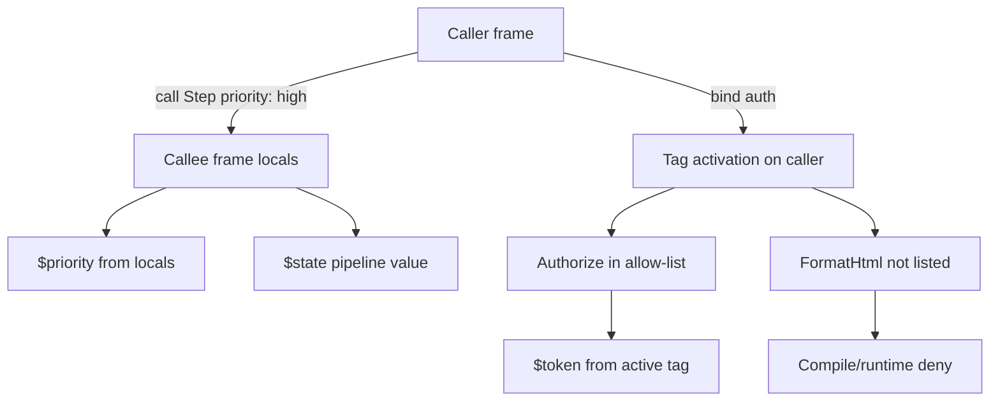

# RFC-0004: Executable Parameters and Tagged Variables v1

Status: draft
Authors: language + runtime + lsp
Created: 2026-07-28
Target release window: after typed-records verifier baseline

## Summary

Introduce two complementary binding mechanisms that move Grapheme closer to Lua-class composability without embedding a general-purpose scripting VM:

1. **Executable parameters v1** — finish the existing GraphQL-style `variable_defs` surface so `query` / `mutation` / `iterator` / `subscription` act as typed callables with named arguments.
2. **Tagged variables v1** — explicit ambient bindings declared at a high scope, visible only to an allow-listed set of executables, with lifetime managed by the call stack.

These are intentionally separate:

| Mechanism | Job |
|---|---|
| Parameters (`$ticket_id`) | Explicit inputs at the call edge — function API |
| `$state` / `$current` | Pipeline value flowing step → step |
| Tagged vars (`tag auth …`) | Cross-cutting context (auth, trace, budget) without stuffing `$state` |

## Motivation

### Current strengths

1. Typed executable signatures (`on InputType -> OutputType`) already parse, lower to HIR, and verify.
2. Grammar already accepts GraphQL-style params: `query Foo($x: String = "a")`.
3. `call Target(args…)` and bare `Target(args…)` already lower call args into `HirStep.args` / MIR `Call.args`.
4. Runtime already tracks call depth and has a `TemplateScope` for `$state` / `$item` / `$loop`.
5. Struct-shaped `$state` is a workable “arg bag” for many workflows today.

### Current gaps

1. `QueryDef.variables` / `MutationDef.variables` / `SubscriptionDef.variables` are parsed into AST, then **dropped at HIR** — they do not become runtime locals.
2. `IteratorDef` / `FragmentDef` / `NodeDef` have no `variable_defs` in grammar (only `on In -> Out`).
3. Call-site args on `call` are mostly ignored except special keys such as `max_depth`; they are **not** bound into the callee frame.
4. There is a single mutable `AgentState.current` for all scopes — nested calls and loops share one blob (`docs/internal/runtime/runtime-state-flow.md`).
5. Cross-cutting values (tokens, request ids, budgets) must either pollute `$state` or rely on host/env side channels.

### Desired outcome

- Authors can write reusable callables with named parameters.
- Authors can declare ambient context with explicit visibility and stack-scoped lifetime.
- LLM authoring stays explicit (allow-lists, named bindings) rather than inferred borrow checking.
- Governance model stays intact: compile-time ACL + runtime frame presence, no soft `eval`.

## Goals

1. Lower executable parameters from AST → HIR → MIR → runtime frame locals.
2. Bind call-site named args into callee locals with deterministic missing/default/type rules.
3. Expose params in template resolution as `$name` / `$args.name` without breaking `$state`.
4. Add tagged variable declarations with executable allow-lists.
5. Enforce tag visibility by **current frame executable membership** (not ancestor leakage).
6. Keep tag values off the `$state` data plane by default (no silent escape).
7. Preserve untyped / signature-only programs (gradual adoption).

## Non-Goals

1. Full lexical `let` blocks / nested block scopes (deferred; tags + params cover the high-value cases).
2. Rust-style lifetime inference, borrows, or exclusive mutable alias analysis.
3. First-class function values / closures / higher-order `map` callables (follow-on).
4. General expression AST for `until` / arithmetic (orthogonal; see control-flow deferred items).
5. Embedding Lua / Rhai / JS or any guest scripting VM.
6. Mutable tagged slots with complex rebind semantics in v1 (read-only after `bind`).
7. Cross-execution persistence of tags (tags die with the run’s call stack).

## Relationship to Existing Surfaces

### Keep and document

```grapheme
iterator Step on SupportTicketState -> SupportTicketState { ... }
query Run on Any -> SupportTicketState { call Step }
```

`on In -> Out` remains the typed **pipeline value** contract for `$state`.

### Finish (params)

```grapheme
iterator Step($priority: String) on SupportTicketState -> SupportTicketState {
  echo(message: "priority={$priority}")
}

query Run {
  call Step(priority: "high")
}
```

### Add (tags)

```grapheme
tag auth for [FetchUser, Authorize, Audit] {
  $token: String
  $request_id: String
}

query Entrypoint {
  bind auth { token: $env.token, request_id: "r-1" }
  |> call FetchUser
  |> call FormatHtml   // compile error: FormatHtml not in tag auth
}
```

## Part A — Executable Parameters v1

### A.1 Surface syntax

Extend parameter lists consistently:

```text
query Name ( $param: Type (= value)? , ... )? (on In (-> Out)?)? { ... }
mutation Name ( $param: Type (= value)? , ... )? (on In (-> Out)?)? { ... }
subscription Name ( $param: Type (= value)? , ... )? (on In (-> Out)?)? { ... }
iterator Name ( $param: Type (= value)? , ... )? on In (-> Out)? { ... }
node Name ( $param: Type (= value)? , ... )? on In (-> Out)? { ... }
```

Notes:

1. `query` / `mutation` / `subscription` already have `variable_defs` in `grapheme.pest`.
2. Add the same optional `variable_defs` to `iterator_def` / `node_def` (and optionally `fragment_def` once fragment call semantics stabilize).
3. Param names are `$`-prefixed at declaration (existing `VariableDef`) and referenced as `$priority` in bodies.
4. Call sites use bare keys: `call Step(priority: "high")` — matching existing `named_arg` grammar.

Compatibility:

- Programs with only `on In -> Out` remain valid.
- Programs with only params and no signature remain valid.
- Entrypoint params may be supplied by CLI/SDK initial bindings (see A.5).

### A.2 Semantics

For each invocation of executable `E`:

1. Create a **call frame** with:
   - `locals: Map<String, JsonValue>` (params)
   - optional link to active tag env (Part B)
   - existing call-depth bookkeeping
2. Resolve each declared param:
   - If call-site arg present → use it (after template resolution in caller scope).
   - Else if default present → use default (resolved in caller scope).
   - Else → compile error for required params at verified call sites; runtime structured error for entrypoints missing SDK/CLI bindings.
3. `$state` / `$current` continue to carry the pipeline value.
4. Params do **not** automatically merge into `$state`.
5. On return, frame locals are dropped. Callee mutations to `$state` remain the return value (current passthrough model).

Template resolution order (v1):

1. Exact `$param` / `$param.field…` from frame locals
2. Existing `$state` / `$current` / `$item` / `$loop`
3. Active tagged bindings if allowed (Part B)
4. Unresolved → null / existing template behavior (choose one in open questions; prefer hard error in typed mode)

Alias (optional sugar, same object):

- `$args.priority` ≡ `$priority`

### A.3 Compiler / IR changes

#### AST (mostly done)

- `VariableDef { name, type_ref, default }` already exists.
- `CallStep.args` / `FieldCall.args` already exist.

#### HIR

Extend `HirExecutable`:

```rust
pub struct HirParam {
    pub name: String,              // without leading '$'
    pub type_ref: TypeRef,
    pub default: Option<JsonValue>,
    pub required: bool,
}

pub struct HirExecutable {
    // existing fields…
    pub params: Vec<HirParam>,
}
```

Lowering rules:

1. Preserve `Query/Mutation/Subscription.variables` into `params` (today dropped).
2. Parse new iterator/node variable lists into the same field.
3. Keep call args on `HirStep.args` as today.

Verifier additions:

1. Param names unique per executable.
2. No collision with reserved roots: `state`, `current`, `item`, `loop`, `args`, `env` (policy TBD for `$env`).
3. Call-site unknown arg names → error.
4. Missing required args → error when target params are known.
5. Type checks reuse typed-records assignability when types are named/scalars.
6. `on InputType` field checks remain about `$state`, not params.

#### MIR / artifact

Extend `MirFunction`:

```rust
pub struct MirParam {
    pub name: String,
    pub type_name: Option<String>,
    pub default: Option<JsonValue>,
    pub required: bool,
}

pub struct MirFunction {
    // existing fields…
    pub params: Vec<MirParam>,
}
```

`MirInst::Call.args` already carries call-site args JSON object — retain that. Runtime binds using callee `params` + instruction `args`.

Artifact format bump: include `params` with default `[]` for backward compatibility.

### A.4 Runtime changes

1. Introduce `CallFrame` (or extend the call path around `execute_function`) with `locals`.
2. When entering a function from `module == "call"`:
   - build locals from callee `params` + instruction args
   - do **not** require args to be stuffed into `state.current`
3. Extend `TemplateScope` with `locals: &'a Map<String, JsonValue>` (and later `tags`).
4. Resolve `$priority` from locals before `$state` path handling.
5. Trace: record bound param **names** always; values subject to existing redaction / `TracePolicy` (same posture as DB params in RFC-0003).

Entrypoint binding (CLI/SDK):

```rust
// SDK sketch
engine.execute(ExecuteRequest {
    source: Some(src),
    entrypoint_args: json!({ "priority": "high" }),
    ..
})?;
```

CLI sketch: `--arg priority=high` (repeatable) or `--args-json '{}'`.

### A.5 Acceptance for Part A

1. `iterator`/`query` with params round-trip AST→HIR→MIR.
2. `call Step(priority: "high")` binds `$priority` inside `Step`.
3. Missing required param fails at compile time for static call sites.
4. Defaulted params work when omitted.
5. Params do not appear in `$state` unless author explicitly `set`/`merge` them.
6. Existing no-param programs keep identical behavior.

## Part B — Tagged Variables v1

### B.1 Concept

A **tag** is a named ambient environment:

1. Declares one or more typed bindings.
2. Declares an allow-list of executable names that may observe those bindings.
3. Is activated by an explicit `bind` step.
4. Remains live while at least one stack frame whose executable is in the allow-list exists under the activating frame — see visibility rule below.
5. Is destroyed when the activating frame returns (stack-scoped lifetime).

This is **not** Rust lifetime inference. It is an explicit ACL + stack region.

### B.2 Surface syntax (proposed)

Top-level declaration:

```grapheme
tag auth for [FetchUser, Authorize, Audit] {
  $token: String
  $request_id: String
}
```

Activation step inside a pipeline:

```grapheme
bind auth { token: $env.token, request_id: "r-1" }
```

References inside allowed executables:

```grapheme
iterator Authorize on Request -> Decision {
  http.fetch(
    url: "https://example.test/authz",
    headers: { authorization: "Bearer {$token}" }
  )
}
```

Grammar sketch:

```pest
tag_def = {
    "tag" ~ ident ~ "for" ~ "[" ~ ident ~ ("," ~ ident)* ~ "]" ~ "{"
    ~ variable_def+
    ~ "}"
}

bind_step = {
    "bind" ~ ident ~ object_value
}
```

`tag_def` becomes a `Definition`. `bind_step` becomes a pipeline step (peer of `set` / `call`).

### B.3 Visibility and lifetime rules

**Visibility (v1, strict):**

A tagged binding `$token` from tag `auth` is readable in the current frame **iff**:

1. Tag `auth` is active on the stack, and
2. Current executable name ∈ `auth.allow_list`.

Ancestor activation alone is **not** enough for a disallowed callee. Example:

```text
Entrypoint (bind auth) → FetchUser (allowed: sees $token)
                       → FormatHtml (not allowed: unresolved / compile error)
                       → Authorize (allowed: sees $token again)
```

Rationale: keeps access auditable and LLM-simple; prevents accidental ambient leakage through helpers.

**Lifetime (v1):**

1. `bind auth { … }` creates an activation record on the current frame.
2. Activation is visible to subsequent steps and nested calls while that frame remains.
3. When the binding frame returns, the activation is popped and bindings are dropped.
4. Re-`bind` of the same tag in a nested allowed frame shadows for the nested region (optional; default **forbid rebind** in v1 for simplicity).

**Mutability (v1):**

- Bindings are read-only after `bind`.
- No `rebind` / in-place mutation in v1.

### B.4 Escape / governance rules

1. Verifier rejects reading tagged names outside allow-listed executables.
2. Verifier rejects copying tagged bindings into `set` / `apply` / `merge` / struct init **by default**.
3. Escape hatch (optional, explicit):

   ```grapheme
   set { request_id: $request_id } @promote(tag: auth, fields: [request_id])
   ```

   Without `@promote`, promotion is a compile error. This preserves “tags are not `$state`.”

4. Capability policy remains orthogonal: tags do not grant host capabilities; they only transport values.

### B.5 Compiler / IR changes

#### AST

```rust
pub struct TagDef {
    pub name: String,
    pub allow_list: Vec<String>,
    pub variables: Vec<VariableDef>,
}

pub struct BindStep {
    pub tag: String,
    pub fields: Vec<(String, Value)>,
}
```

#### HIR

```rust
pub struct HirTagDef {
    pub name: String,
    pub allow_list: Vec<String>,
    pub bindings: Vec<HirParam>, // reuse param shape
}

pub struct HirProgram {
    // existing…
    pub tag_defs: Vec<HirTagDef>,
}
```

`bind` lowers to a step with `module: Some("runtime".into())`, `op: "bind_tag"`, args `{ "tag": "auth", "fields": { … } }` **or** a dedicated `HirStep` kind if we prefer not to overload capability dispatch.

Prefer a **dedicated MIR instruction** so bind cannot be confused with host ops:

```rust
pub enum MirInst {
    // existing Call / BranchCall / MatchCall…
    BindTag {
        tag: String,
        fields: JsonValue,
    },
}
```

Artifact carries `tag_defs` beside functions.

Verifier:

1. Tag names unique.
2. Allow-list executables must exist.
3. Binding names unique across a tag; recommend globally unique tagged names in v1 to simplify `$token` resolution (open question if tags require `$auth.token` qualification).
4. Every `$token`-style read resolves to either param, reserved root, or exactly one active tag binding declaration; ambiguous multi-tag same name → error.
5. Reads only legal inside allow-listed executable bodies (and inside the binder executable if we allow — default **binder may write via bind but not read unless listed**).

### B.6 Runtime changes

Extend frame / engine state:

```rust
struct TagActivation {
    tag: String,
    values: Map<String, JsonValue>,
    binder_depth: usize,
}

struct CallFrame {
    function_name: String,
    locals: Map<String, JsonValue>,
    // activations created by this frame
    tag_activations: Vec<TagActivation>,
}
```

Lookup for `$token`:

1. Frame locals (params)
2. Reserved templates
3. From top of stack downward, find first activation containing `token` whose allow-list includes **current** function name
4. Else unresolved

On function return: drop that frame’s activations.

Trace:

- Record `tag_bind` / `tag_drop` events with tag name + field names (values redacted by policy).

### B.7 Acceptance for Part B

1. `tag` + `bind` parse and appear in artifact metadata.
2. Allowed executable can read `$token`; disallowed cannot (compile-time for static refs).
3. After binder returns, subsequent siblings do not see the tag.
4. Promotion into `$state` without `@promote` fails verification.
5. Trace shows bind/drop boundaries.
6. No-tag programs unchanged.

## Combined Mental Model



## Sequencing

### Phase 0 — Spec lock

1. Land this RFC.
2. Add language-contract subsections + examples fixtures skeletons (compile-fail + run-ok).

### Phase 1 — Params v1

1. HIR/MIR `params` plumbing (stop dropping AST variables).
2. Grammar: iterator/node `variable_defs`.
3. Runtime frame locals + template resolution.
4. Verifier call-arity/name checks.
5. CLI/SDK entrypoint arg binding.
6. Docs + LSP hover for params.

### Phase 2 — Tagged vars v1

1. Grammar `tag` / `bind`.
2. HIR tag defs + MIR `BindTag`.
3. Runtime activations + lookup ACL.
4. Verifier allow-list + anti-escape rules.
5. Trace events + redaction.
6. Docs + LSP: “who can see this tag?”

### Phase 3 — Hardening

1. Conformance fixtures for shadowing, defaults, missing args, deny lists.
2. Policy-profile checks for redacted param/tag values in traces.
3. Decide follow-ons: `rebind`, `$auth.token` qualification, HOFs, lexical `let`.

## Testing Strategy

1. **Parser/AST**: param lists on iterators; tag/bind syntax.
2. **HIR/MIR golden**: params preserved; `BindTag` emitted; artifact backward compatible defaults.
3. **Verifier**:
   - unknown call arg
   - missing required param
   - tag allow-list unknown executable
   - tagged read outside allow-list
   - illegal promotion into `set`
4. **Runtime**:
   - bind → allowed call reads value
   - disallowed call does not see value
   - drop on return
   - params do not leak into `$state`
5. **SDK/CLI**: entrypoint `--arg` / `entrypoint_args` wiring.
6. **LSP** (soft gate): signature help shows params; unused tag binding warnings later.

## Observability

1. Pipeline / step context gains optional `params_bound: [names…]` and `tags_active: [tag…]`.
2. Values governed by existing `TracePolicy` redaction.
3. Deterministic event order: `tag_bind` before subsequent steps; `tag_drop` on frame exit.

## Security Considerations

1. Tags are not a capability bypass — host ops still pass `PolicyGuard`.
2. Secrets in tags must default to redacted in traces (treat like secrets-module handles where possible).
3. Forbid serializing entire tag env into Wasm plugin args implicitly; only explicit arg references pass values.
4. Allow-list is deny-by-default for ambient reads.

## Documentation Plan

1. This RFC under `docs/internal/rfc/`.
2. Add language notes:
   - `docs/internal/language/params-v1.md` (normative contract extract)
   - `docs/internal/language/tagged-vars-v1.md` (normative contract extract)
3. Update `docs/internal/language-contract.md` with binding precedence.
4. Update `docs/internal/runtime/runtime-state-flow.md` with frame locals + tag activations.
5. Tutorial touch: one realworld example using params; one using `tag auth`.

## Open Questions

1. **Param reference style:** is `$priority` enough, or require `$args.priority` for disambiguation?
2. **Tagged reference style:** bare `$token` (v1, globally unique names) vs qualified `$auth.token`?
3. **May the binder executable read the tag without being in `for […]`?** Default proposed: no (must list itself).
4. **Unresolved template policy:** null (legacy) vs hard error in typed programs?
5. **Should `fragment` support params in v1** or wait until fragment invocation rules settle?
6. **CLI UX:** repeatable `--arg k=v` vs single `--args-json`?
7. **Rebind/shadow:** forbid in v1 (proposed) or allow nested shadow?
8. **Promotion:** is `@promote` required, or is a dedicated `promote auth.request_id -> state.request_id` step clearer?
9. **Interaction with `@loop each`:** does `$item` shadow params of the same name? Proposed: yes, `$item` wins inside each-body templates; params remain addressable via `$args.name`.

## Acceptance Criteria (RFC-level)

1. Spec distinguishes params, `$state`, and tags with non-overlapping jobs.
2. Part A and Part B each have phased implementation checklists grounded in current AST/HIR/MIR/runtime types.
3. Strict allow-list visibility + stack lifetime for tags is normative.
4. Backward compatibility for programs that use neither feature is explicit.
5. Open questions are listed with proposed defaults so implementation can start on Phase 1 without blocking on Part B syntax bikesheds.

## Appendix — Current Code Anchors

| Area | Path | Notes |
|---|---|---|
| Grammar `variable_defs` | `crates/grapheme-compiler/src/grapheme.pest` | Present on query/mutation/subscription; missing on iterator/node |
| AST `VariableDef` | `crates/grapheme-compiler/src/ast.rs` | Parsed today |
| HIR drop of variables | `crates/grapheme-compiler/src/hir.rs` | `HirExecutable` has no `params` |
| Call arg lowering | `crates/grapheme-compiler/src/hir.rs` `lower_step` | Args kept on step; not callee schema |
| MIR ISA | `crates/grapheme-artifact/src/mir.rs` | `Call` / `BranchCall` / `MatchCall` only |
| Template scope | `crates/grapheme-runtime/src/runtime.rs` | `$state` / `$item` / `$loop` |
| State model pressure | `docs/internal/runtime/runtime-state-flow.md` | Single global `current` |
| Typed signatures | `docs/internal/language/typed-records-v1.md` | `on In -> Out` baseline |
