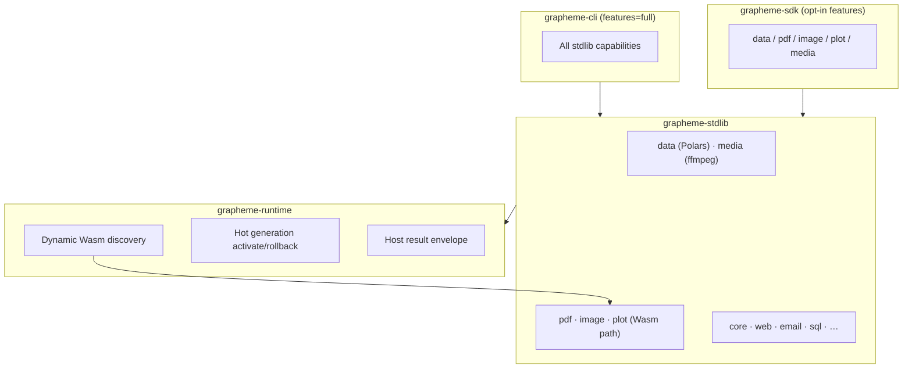

# Release 0.6.0 — Extensible Platform + Capability Stack

Status: **released** (2026-06-03)
Target tag: **v0.6.0**
Owner: runtime + stdlib + language + sdk + cli

## One-line pitch

Grapheme 0.6.0 makes workflows **typed**, **hot-extensible via Wasm**, and **capable out of the box** — Polars-native data, Wasm PDF/image/plot modules, native media/ffmpeg — without becoming Python.

## Release principles

1. **Single coordinated release** — platform, typing, and capabilities ship together (all related; not a concurrency/async rewrite).
2. **CLI ships full** — `grapheme-cli` enables all capability features by default.
3. **SDK ships opt-in** — embedders enable only what they need (`data`, `pdf`, `image`, `plot`, `media`, or `full`).
4. **Contracts before convenience** — Wasm discovery requires manifests; capability results normalize to `{ data, meta, error }`.
5. **Native vs Wasm is an implementation detail** — language surface is always `module.op(args)`.

## Architecture

## Workstreams

### A — Platform (Wasm discovery + hotload + invoke)

| Item | Status | Notes |
| --- | --- | --- |
| Wasm module manifest v1 sidecar | done | See `docs/internal/runtime/wasm-module-manifest-v1.md` |
| `grapheme.toml` `[modules]` scan paths | done | Schema in `grapheme.schema.json` |
| `grapheme modules scan` | done | Lists discovered Wasm + manifests |
| `grapheme modules activate\|rollback\|status` | done | Hotload store + legacy bindings fallback |
| `pdf-rs` / `image-rs` / `plot-rs` Wasm plugins | done | `plugins/*`, manifests `modules/*.module.json` |
| WASIX op invocation | done | Backend executes; envelope normalize in dispatch |
| Hot activate / rollback CLI + SDK | done | `.grapheme/modules/hotload.json` |
| Compatibility validator | partial | ABI + signature on activation; policy matrix follow-up |

**Exit criteria:** drop manifest + `.wasm` in a configured dir → scan finds it → run invokes it → hot reload persists generations. **Met.**

### B — Typed results v1

| Item | Status | Notes |
| --- | --- | --- |
| Host envelope `{ data, meta, error }` | done | `grapheme-stdlib::envelope` |
| Capability output field specs | done | data, pdf, image, plot, media in signatures |
| Pipeline shape propagation | partial | LSP infers from prior pipeline op |
| LSP field completion on `$current` | done | Envelope + `$current.data.*` |
| `grapheme modules types` for Wasm | done | From signatures + exported ops |

**Exit criteria:** `$current.data.page_count` gets LSP hints after `pdf.generate(...)`; signature help documents envelope fields. **Met.**

### C — Capability modules

| Module | Route | Rust stack | Feature flag | Status |
| --- | --- | --- | --- | --- |
| `data` | **native** `mir_v1` | Polars ingest + JSON frame pipeline | `grapheme-stdlib/data` | **done** |
| `media` | **native** `mir_v1` | ffmpeg/ffprobe CLI bridge | `grapheme-stdlib/media` | **done** |
| `image` | **Wasm** `wasix_v1` | `image` crate in `image-rs` plugin | `grapheme-stdlib/image` | **done** |
| `plot` | **Wasm** `wasix_v1` | SVG in `plot-rs` plugin | `grapheme-stdlib/plot` | **done** |
| `pdf` | **Wasm** `wasix_v1` | minimal PDF in `pdf-rs` plugin | `grapheme-stdlib/pdf` | **done** |

**Exit criteria:** each module has signatures, manifest or native dispatch, example `.gr`, and policy capability names. **Met.**

### D — Docs & examples

| Item | Status |
| --- | --- |
| SDK feature flags doc | done | `docs/internal/sdk-feature-flags.md` |
| Wasm plugin catalog | done | `plugins/README.md` |
| LSP envelope quickstart | done | `docs/internal/lsp/quickstart.md` |
| Platform integration example | done | `examples/platform-release-060.gr` |
| Authoring Wasm capability module guide | planned | follow-up |

## Feature flags

See `docs/internal/sdk-feature-flags.md` and crate `Cargo.toml` files.

## Definition of done (0.6.0)

- [x] CLI default build includes all capability modules
- [x] SDK embedders can enable `data` only (or any subset) via Cargo features
- [x] Dynamic Wasm discovery + manifest validation works end-to-end
- [x] Hot module activation with in-flight pinning is CLI/SDK accessible
- [x] Typed result hints cover stdlib + new modules in LSP/`modules types`
- [x] `data`, `pdf`, `image`, `plot`, `media` ops implemented (not stubs)
- [x] CHANGELOG, examples, and internal docs match shipped behavior

## Related docs

- `docs/internal/runtime/wasm-module-manifest-v1.md`
- `docs/internal/rfc/rfc-0002-wasm-hot-module-loading-v1.md`
- `docs/internal/language/typed-records-v1.md`
- `docs/internal/language/llm-native-contract-v1.md`
- `schemas/wasm-module-manifest.schema.json`
