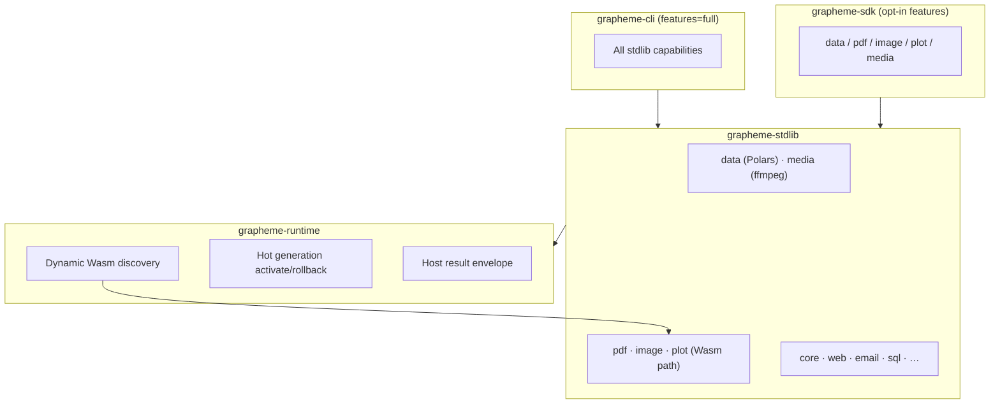

# Release 0.6.0 — Extensible Platform + Capability Stack

Status: **in progress**
Target tag: **v0.6.0**
Owner: runtime + stdlib + language + sdk + cli

## One-line pitch

Grapheme 0.6.0 makes workflows **typed**, **hot-extensible via Wasm**, and **capable out of the box** — Polars-native data, Wasm PDF/image/plot modules, native media/ffmpeg — without becoming Python.

## Release principles

1. **Single coordinated release** — platform, typing, and capabilities ship together (all related; not a concurrency/async rewrite).
2. **CLI ships full** — `grapheme-cli` enables all capability features by default.
3. **SDK ships opt-in** — embedders enable only what they need (`data`, `pdf`, `image`, `plot`, `media`, or `full`).
4. **Contracts before convenience** — Wasm discovery requires manifests; capability results normalize to `{ data, meta, error }`.
5. **Native vs Wasm is an implementation detail** — language surface is always `module.op(args)`.

## Architecture



## Workstreams

### A — Platform (Wasm discovery + hotload + invoke)

| Item | Status | Notes |
| --- | --- | --- |
| Wasm module manifest v1 sidecar | in progress | See `docs/internal/runtime/wasm-module-manifest-v1.md` |
| `grapheme.toml` `[modules]` scan paths | in progress | Schema in `grapheme.schema.json` |
| `grapheme modules scan` | in progress | Lists discovered Wasm + manifests |
| WASIX op invocation (real) | planned | Finish beyond routing scaffold |
| Hot activate / rollback CLI | planned | Wire `ModuleManager` to CLI + SDK session |
| Compatibility validator | planned | ABI + signature + policy on activation |

**Exit criteria:** drop `module.manifest.json` + `.wasm` in a configured dir → scan finds it → run invokes it → hot reload pins in-flight runs.

### B — Typed results v1

| Item | Status | Notes |
| --- | --- | --- |
| Host envelope `{ data, meta, error }` | in progress | `grapheme-stdlib::envelope` |
| Full signatures output schemas | planned | All stdlib + new capability modules |
| Pipeline shape propagation | planned | Compiler best-effort → stricter for known ops |
| LSP field completion on `$current` | planned | From signatures + inference |
| `grapheme modules types` for Wasm | planned | From manifest + signatures merge |

**Exit criteria:** `$current.results[0].url` gets LSP hints after `web.brave(...)`; unknown fields warn in typed scopes.

### C — Capability modules

| Module | Route | Rust stack | Feature flag |
| --- | --- | --- | --- |
| `data` | **native** `mir_v1` | Polars | `grapheme-stdlib/data` |
| `media` | **native** `mir_v1` | ffmpeg bridge | `grapheme-stdlib/media` |
| `pdf` | **Wasm** `wasix_v1` | printpdf (+ extract later) | `grapheme-stdlib/pdf` |
| `image` | **Wasm** `wasix_v1` | photon | `grapheme-stdlib/image` |
| `plot` | **Wasm** `wasix_v1` | plotters | `grapheme-stdlib/plot` |

**Initial ops (v1):**

- `data.read_csv`, `data.filter`, `data.group_by`, `data.aggregate`, `data.to_json`, `data.schema`
- `pdf.generate`, `pdf.extract_text`
- `image.resize`, `image.convert`, `image.metadata`
- `plot.line`, `plot.bar`, `plot.scatter` → `{ format, data }` (svg/png)
- `media.probe`, `media.transcode` (policy-gated)

**Exit criteria:** each module has signatures, manifest entry, example `.gr`, and policy capability names.

### D — Docs & examples

| Item | Status |
| --- | --- |
| Authoring Wasm capability module guide | planned |
| Native vs Wasm decision doc | planned |
| SDK feature flags doc | done | `docs/internal/sdk-feature-flags.md` |
| Real-world example: data → plot → pdf → email | planned |

## Feature flags

### `grapheme-stdlib`

```toml
[features]
default = []
full = ["data", "pdf", "image", "plot", "media"]
data = []      # Polars wired in follow-up PRs
pdf = []       # printpdf Wasm plugin path
image = []     # photon Wasm plugin path
plot = []      # plotters Wasm plugin path
media = []     # ffmpeg native bridge
```

### `grapheme-sdk`

```toml
[features]
default = []
full = ["grapheme-stdlib/full", "wasix-runtime"]
data = ["grapheme-stdlib/data"]
pdf = ["grapheme-stdlib/pdf"]
# … per-module mirrors
```

### `grapheme-cli`

```toml
[features]
default = ["full"]
full = ["grapheme-stdlib/full", "grapheme-sdk/full"]
```

## `grapheme.toml` modules section

```toml
[modules]
scan = ["modules", "plugins"]
# Optional explicit binds override discovery:
# bind = { pdf = "modules/pdf.wasm" }
```

## Sequencing (within one release)

1. **Foundation** — features, envelope, discovery schema, stub modules, docs (this PR train)
2. **Platform** — WASIX invoke + hotload CLI + scan wired to runtime session
3. **Types** — signatures output coverage + LSP + envelope normalization in dispatch
4. **Capabilities** — Polars data, Wasm pdf/image/plot plugins, ffmpeg media
5. **Integration** — real-world examples, policy matrix, release candidate

## Risks

| Risk | Mitigation |
| --- | --- |
| Polars binary size / compile time | Opt-in feature; optional `grapheme-data` crate split if needed |
| Wasm authoring friction | In-repo reference plugins under `plugins/pdf-rs`, `grapheme module new` template |
| ffmpeg scope creep | 0.6.0 caps at probe + transcode |
| Envelope migration ergonomics | Dual-read legacy fields one release; document in CHANGELOG |

## Definition of done (0.6.0)

- [ ] CLI default build includes all capability modules
- [ ] SDK embedders can enable `data` only (or any subset) via Cargo features
- [ ] Dynamic Wasm discovery + manifest validation works end-to-end
- [ ] Hot module activation with in-flight pinning is CLI/SDK accessible
- [ ] Typed result hints cover stdlib + new modules in LSP/`modules types`
- [ ] `data`, `pdf`, `image`, `plot`, `media` ops implemented (not stubs)
- [ ] CHANGELOG, examples, and internal docs match shipped behavior

## Related docs

- `docs/internal/runtime/wasm-module-manifest-v1.md`
- `docs/internal/rfc/rfc-0002-wasm-hot-module-loading-v1.md`
- `docs/internal/language/typed-records-v1.md`
- `docs/internal/language/llm-native-contract-v1.md`
- `schemas/wasm-module-manifest.schema.json`
