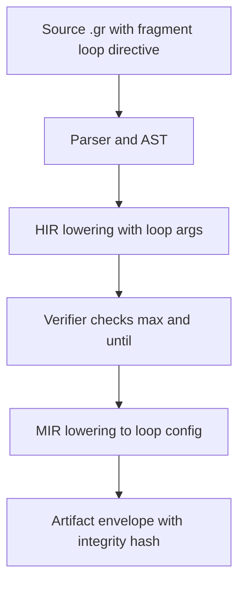
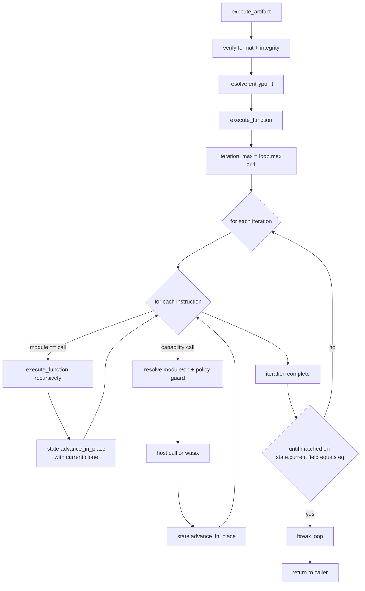
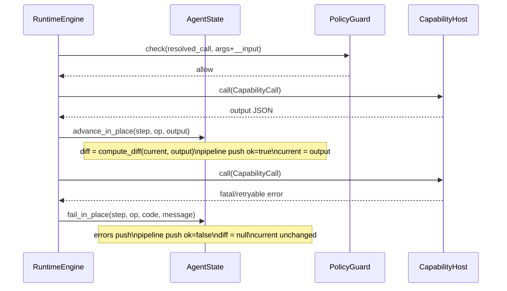
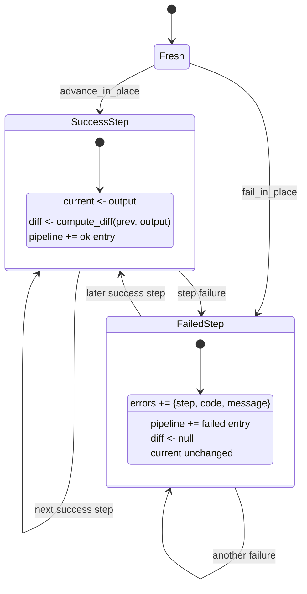

# Runtime Data and State Flow (Current)

This document describes the current control-flow and state behavior implemented in the codebase today.

Scope:

- Compiler lowering of `@loop(...)` metadata
- Runtime function execution, call dispatch, and loop behavior
- AgentState mutation behavior on success/failure
- Why loop handling feels fragile with the current state model

## 1) Compile-Time Flow for Loop Metadata

The compiler preserves loop directives from AST -> HIR -> MIR.

- HIR captures `loop_directive_count` and raw `loop_args` per executable.
- Verifier enforces one `@loop`, fragment-only placement, `max >= 1`, and `until` shape.
- MIR lowering converts loop args into `MirLoopConfig { max, until }`.

## 2) Runtime Execution Path

`RuntimeEngine::execute_artifact` resolves entrypoint and delegates to `execute_function`.

Inside `execute_function`:

- Determine `iteration_max` from `function.loop_config.max` (default `1`).
- For each iteration, execute blocks/instructions in order.
- For `call` module steps: recurse into another MIR function.
- For capability steps: resolve module/op, policy-check args, invoke host/wasm, advance state.
- After each full iteration, evaluate `loop_until_satisfied` against `state.current`.

## 3) Call Sequence and State Mutation

This sequence diagram reflects one successful capability step and one failure path.

## 4) AgentState Model (Current Behavior)

`AgentState` is a single mutable accumulator threaded through all calls and iterations:

- `current`: last successful output value
- `diff`: structural diff from previous `current` to new output
- `errors`: accumulated failures
- `pipeline`: append-only step history
- `proposed`: proposal tracking

### State Transition Shape

## 5) Why Looping Feels Bad Today

Based on current runtime/state code, the main pressure points are:

1. Single global `current` for all scopes
- Nested calls and loop iterations all write to one `state.current`.
- There is no per-call-frame local state snapshot.

2. Loop termination is tied to final top-level object shape
- `until` checks only `state.current[field] == eq` at end of each iteration.
- No path expressions, no nested lookup, and no richer predicate evaluation.

3. Loop/call provenance is missing in trace entries
- `pipeline` currently stores step index/op/output/ok/error only.
- Iteration index, call depth, and call target are not captured.

4. Error and diff semantics are coarse for control flow
- Any failed step forces immediate failure result and `diff = null` for that step.
- There is no first-class loop-local failure handling policy.

5. Input propagation is implicit and broad
- Each capability call gets `__input = state.current` merged into args.
- This makes data dependencies convenient, but also hides scope boundaries.

## 6) Practical Next Architecture Step

A good next step before redesigning language surface syntax is adding runtime trace context:

- Add `iteration_index`, `call_depth`, `function_name`, `call_target` to pipeline entries.
- Keep behavior unchanged initially; improve observability first.
- Then introduce scoped state (frame-local current/diff) with explicit merge rules.

That sequence keeps risk controlled while making loop bugs easier to reason about.
