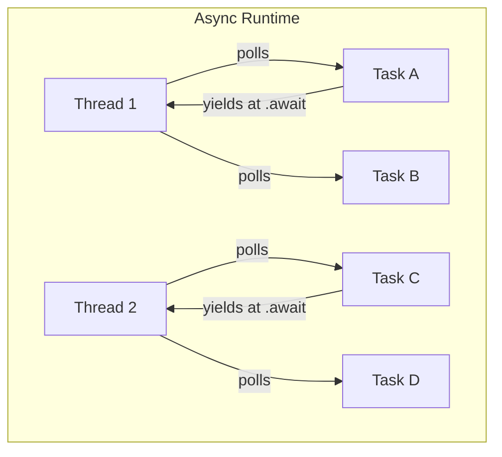

---
meta-description:
meta-theme-color: #ffffff
meta-viewport: width=device-width, initial-scale=1
title: Async Runtime Patterns - Rust Patterns Book
---


## Keyboard shortcuts

Press `←` or `→` to navigate between chapters

Press `S` or `/` to search in the book

Press `?` to show this help

Press `Esc` to hide this help


- Auto

- Light

- Rust

- Coal

- Navy

- Ayu


# Rust Patterns Book

[](print.html "Print this book")

# [Async Runtime Patterns](#async-runtime-patterns)

This chapter explores asynchronous programming patterns in Rust using async/await and async runtimes. We’ll cover future composition, stream processing, concurrency patterns, timeout handling, and runtime comparisons through practical, production-ready examples.

## [Pattern 1: Future Composition](#pattern-1-future-composition)

**Problem**: Chaining async operations with nested `.await` calls creates deeply nested code (callback hell). Running multiple async operations concurrently with manual spawning is verbose.

**Solution**: Use future combinators: `map()`, `and_then()`, `or_else()` for chaining transformations. Use `join!` and `try_join!` to run futures concurrently, waiting for all.

**Why It Matters**: Proper composition determines performance and readability. Sequential `.await` on 3 independent operations takes 300ms; concurrent `join!` takes 100ms—3x faster.

**Use Cases**: HTTP request batching (parallel API calls), database query composition (dependent queries), microservice orchestration, retry logic with fallbacks, concurrent file operations, fan-out/fan-in patterns.

### [to Cargo.toml](#to-cargotoml)

```toml
tokio = { version = "1.35", features = ["full"] }
reqwest = "0.11"
serde = { version = "1.0", features = ["derive"] }
serde_json = "1.0"

```


### [Example: Basic future composition with map](#example-basic-future-composition-with-map)

Chain async operations with synchronous transformations using combinators. The `.await` keyword completes the async call first, then `.map()` transforms the `Result` synchronously without requiring another await. This pattern keeps transformation logic clean and composable.

```rust
use std::time::Duration;

async fn fetch_user_name(id: u64) -> Result<String, String> {
    // Simulate API call
    tokio::time::sleep(Duration::from_millis(100)).await;

    if id == 0 {
        Err("Invalid user ID".to_string())
    } else {
        Ok(format!("User_{}", id))
    }
}

async fn get_uppercase(id: u64) -> Result<String, String> {
    // await completes async, map transforms sync
    fetch_user_name(id)
        .await
        .map(|name| name.to_uppercase())
}

#[tokio::main]
async fn main() {
    match get_uppercase(42).await {
        Ok(name) => println!("User: {}", name), // "USER_42"
        Err(e) => println!("Error: {}", e),
    }
}
```


### [Example: Chaining async operations](#example-chaining-async-operations)

The `?` operator provides early return on error. If `fetch_user_name` fails, we immediately return that error without attempting to fetch posts. This pattern mirrors sequential function calls in synchronous code while maintaining clean error propagation.

```rust
async fn fetch_user_posts(id: u64) -> Result<Vec<String>, String> {
    tokio::time::sleep(Duration::from_millis(100)).await;
    Ok(vec![
        format!("Post 1 by user {}", id),
        format!("Post 2 by user {}", id),
    ])
}

async fn get_user_with_posts(
    id: u64
) -> Result<(String, Vec<String>), String> {
    let name = fetch_user_name(id).await?; // Early return on fail
    let posts = fetch_user_posts(id).await?;
    Ok((name, posts))
}

#[tokio::main]
async fn main() -> Result<(), String> {
    let (name, posts) = get_user_with_posts(1).await?;
    println!("{} has {} posts", name, posts.len());
    Ok(())
}
```


### [Example: Error conversion and propagation](#example-error-conversion-and-propagation)

Create a unified error type implementing the `From` trait to automatically convert library-specific errors into your application error type. The `?` operator leverages these `From` implementations to convert `reqwest::Error` to `AppError::Network` automatically, enabling seamless error propagation.

```rust
#[derive(Debug)]
enum AppError {
    Network(String),
    NotFound,
    InvalidData(String),
}

impl From<reqwest::Error> for AppError {
    fn from(err: reqwest::Error) -> Self {
        AppError::Network(err.to_string())
    }
}

async fn fetch_json(url: &str) -> Result<serde_json::Value, AppError> {
    let response = reqwest::get(url).await?; // Auto-converts

    if !response.status().is_success() {
        return Err(AppError::NotFound);
    }

    let data = response.json().await?;
    Ok(data)
}

#[tokio::main]
async fn main() {
    let url = "https://api.github.com/users/rust-lang";
    match fetch_json(url).await {
        Ok(data) => println!("Got: {}", data),
        Err(AppError::Network(e)) => println!("Net err: {}", e),
        Err(AppError::NotFound) => println!("Not found"),
        Err(AppError::InvalidData(e)) => println!("Bad: {}", e),
    }
}
```


### [Example: HTTP client with retries](#example-http-client-with-retries)

Generic retry wrapper implementing exponential backoff for resilient HTTP requests. The closure-based design using `FnMut() -> Fut` allows retrying any async operation with configurable maximum attempts and increasing delays between retries to prevent overwhelming failing services.

```rust
async fn fetch_with_retry<F, Fut, T, E>(
    mut f: F,
    max_retries: usize,
) -> Result<T, E>
where
    F: FnMut() -> Fut,
    Fut: std::future::Future<Output = Result<T, E>>,
    E: std::fmt::Display,
{
    let mut attempts = 0;

    loop {
        match f().await {
            Ok(result) => return Ok(result),
            Err(e) => {
                attempts += 1;
                if attempts >= max_retries {
                    return Err(e);
                }
                println!("Attempt {} failed: {}", attempts, e);
                let delay = Duration::from_secs(
                    2u64.pow(attempts as u32)
                );
                tokio::time::sleep(delay).await;
            }
        }
    }
}

// Wrap any async operation with retry logic
async fn fetch_data_retry(
    url: String
) -> Result<String, reqwest::Error> {
    fetch_with_retry(
        || async { reqwest::get(&url).await?.text().await },
        3, // max 3 attempts
    ).await
}

#[tokio::main]
async fn main() {
    let url = "https://api.example.com/data".into();
    match fetch_data_retry(url).await {
        Ok(data) => println!("Fetched: {}", data),
        Err(e) => println!("Failed: {}", e),
    }
}
```
**Future Composition Patterns**:

- **map**: Transform success value
- **and_then**: Chain dependent operations
- **or_else**: Handle errors and recover
- **? operator**: Early return on error

---


### [Example: join! - wait for all futures](#example-join---wait-for-all-futures)

The `join!` macro runs futures concurrently, waiting for all to complete before continuing. Three independent 100ms operations finish in approximately 100ms total rather than 300ms sequentially. Returns a tuple containing all results in declaration order.

```rust
async fn concurrent_fetch() {
    // All start immediately, complete in ~100ms (not 300ms)
    let (r1, r2, r3) = tokio::join!(
        fetch_user_name(1),
        fetch_user_name(2),
        fetch_user_name(3),
    );

    println!("Results: {:?}, {:?}, {:?}", r1, r2, r3);
}

#[tokio::main]
async fn main() {
    concurrent_fetch().await;
}
```


### [Example: try_join! - wait for all, fail fast on error](#example-try_join---wait-for-all-fail-fast-on-error)

The `try_join!` macro works like `join!` but for `Result`-returning futures. If any future fails, it immediately cancels remaining futures and returns that error. On success, it unwraps all `Ok` values into a tuple for convenient destructuring.

```rust
async fn concurrent_fail_fast(
) -> Result<(String, String, String), String> {
    // If user 2 fails, user 3 is cancelled immediately
    tokio::try_join!(
        fetch_user_name(1),
        fetch_user_name(2),
        fetch_user_name(3),
    )
}

#[tokio::main]
async fn main() -> Result<(), String> {
    let (u1, u2, u3) = concurrent_fail_fast().await?;
    println!("Users: {}, {}, {}", u1, u2, u3);
    Ok(())
}
```


### [Example: select! - race futures, take first to complete](#example-select---race-futures-take-first-to-complete)

The `select!` macro races multiple futures concurrently, returning when the first one completes and automatically cancelling the others. This pattern is essential for implementing timeouts, redundant requests for reliability, and responding to cancellation signals.

```rust
use tokio::time::sleep;

async fn race_requests() -> String {
    tokio::select! {
        result = fetch_user_name(1) => {
            format!("Server 1 first: {:?}", result)
        }
        result = fetch_user_name(2) => {
            format!("Server 2 first: {:?}", result)
        }
        _ = sleep(Duration::from_secs(1)) => {
            "Both servers too slow - timeout".into()
        }
    }
}

#[tokio::main]
async fn main() {
    let winner = race_requests().await;
    println!("{}", winner);
}
```


### [Example: Dynamic number of futures with FuturesUnordered](#example-dynamic-number-of-futures-with-futuresunordered)

When the number of futures is determined at runtime, use `FuturesUnordered` to manage them efficiently. Results stream back in completion order with the fastest finishing first, rather than the original submission order, maximizing throughput.

```rust
use futures::stream::{FuturesUnordered, StreamExt};

async fn fetch_all_users(
    ids: Vec<u64>
) -> Vec<Result<String, String>> {
    // Works with any number of IDs - runtime determined
    let futures: FuturesUnordered<_> = ids
        .into_iter()
        .map(|id| fetch_user_name(id))
        .collect();

    // Results arrive in completion order
    futures.collect().await
}

#[tokio::main]
async fn main() {
    let users = fetch_all_users(vec![1, 2, 3, 4, 5]).await;
    println!("Fetched {} users", users.len());
}

```


### [Example: Parallel HTTP requests with limit](#example-parallel-http-requests-with-limit)

Processes URLs in fixed-size batches to limit concurrent connections. Each chunk runs in parallel via `join_all`, but chunks themselves execute sequentially. This approach provides simple concurrency limiting without requiring semaphores or complex coordination logic.

```rust
async fn fetch_urls_concurrent(
    urls: Vec<String>,
    max_concurrent: usize
) -> Vec<Result<String, reqwest::Error>> {
    let mut results = Vec::new();

    for chunk in urls.chunks(max_concurrent) {
        let futures: Vec<_> = chunk
            .iter()
            .map(|url| async move {
                reqwest::get(url)
                    .await?
                    .text()
                    .await
            })
            .collect();

        let chunk_results =
            futures::future::join_all(futures).await;
        results.extend(chunk_results);
    }

    results
}

#[tokio::main]
async fn main() {
    let urls: Vec<_> = (0..10)
        .map(|i| format!("https://httpbin.org/get?id={}", i))
        .collect();
    let results = fetch_urls_concurrent(urls, 3).await;
    let ok_count = results.iter().filter(|r| r.is_ok()).count();
    println!("Fetched {} URLs ({} ok)", results.len(), ok_count);
}
```


### [Example: Timeout wrapper](#example-timeout-wrapper)

A generic wrapper function that adds timeout capability to any future. Returns `Ok(result)` if the operation completes within the specified duration, or `Err(Elapsed)` if the timeout expires. The wrapped future is automatically cancelled when timeout occurs.

```rust
async fn with_timeout<F, T>(
    future: F,
    duration: Duration,
) -> Result<T, tokio::time::error::Elapsed>
where
    F: std::future::Future<Output = T>,
{
    tokio::time::timeout(duration, future).await
}

#[tokio::main]
async fn main() {
    let work = async {
        tokio::time::sleep(Duration::from_millis(50)).await;
        "done"
    };
    match with_timeout(work, Duration::from_millis(100)).await {
        Ok(result) => println!("Completed: {}", result),
        Err(_) => println!("Timed out"),
    }
}
```


### [Example: Cancellation-safe write](#example-cancellation-safe-write)

Implements atomic file writes that either complete fully or leave no partial data. The `sync_all()` call ensures all data is flushed to disk before returning success. This prevents data corruption if the operation is cancelled or the system crashes mid-write.

```rust
async fn safe_write(data: String) -> Result<(), std::io::Error> {
    use tokio::fs::File;
    use tokio::io::AsyncWriteExt;

    let mut file = File::create("output.txt").await?;
    file.write_all(data.as_bytes()).await?;
    file.sync_all().await?;
    Ok(())
}

#[tokio::main]
async fn main() {
    match safe_write("Hello, World!".into()).await {
        Ok(_) => println!("File written successfully"),
        Err(e) => println!("Write failed: {}", e),
    }
}
```
**Concurrent Patterns**:

- **join!**: All complete, collect all results
- **try_join!**: All complete or fail fast
- **select!**: First to complete wins
- **FuturesUnordered**: Dynamic collection, unordered completion
- **join_all**: Dynamic collection, ordered results

---


## [Pattern 2: Stream Processing](#pattern-2-stream-processing)

**Problem**: Processing infinite or unbounded sequences (websocket messages, sensor data, log streams) with standard iterators blocks thread. Collecting entire stream into Vec before processing wastes memory for large datasets.

**Solution**: Use `Stream` trait (async iterator) to yield values over time without blocking. Apply stream combinators: `.map()`, `.filter()`, `.fold()`, `.buffered()` for transformations.

**Why It Matters**: Streams enable processing data larger than memory—GB log file analyzed in constant memory. WebSocket connections handle millions of messages without collecting all.

**Use Cases**: WebSocket message processing, sensor data aggregation, log file streaming, database query result streaming, event sourcing, pub-sub systems, real-time analytics, infinite data sources.

### [Example: Creating streams](#example-creating-streams)

Three primary ways to create async streams: from iterators using `stream::iter()` for known data, from channels enabling producer-consumer patterns with backpressure, and from intervals for time-based events. Each approach suits different use cases.

```rust
use std::time::Duration;
use futures::stream::{self, StreamExt};

async fn create_streams() {
    // From iterator - instant conversion of known data
    let _s = stream::iter(vec![1, 2, 3, 4, 5]);

    // From channel - producer task sends values over time
    let (tx, rx) = tokio::sync::mpsc::channel(10);
    tokio::spawn(async move {
        for i in 0..5 {
            tx.send(i).await.unwrap();
        }
    });
    let _s =
        tokio_stream::wrappers::ReceiverStream::new(rx);

    // Interval stream - time-based events
    let _s = stream::StreamExt::take(
        tokio_stream::wrappers::IntervalStream::new(
            tokio::time::interval(Duration::from_millis(100))
        ),
        5,  // Stop after 5 ticks
    );

    println!("Streams created successfully");
}

#[tokio::main]
async fn main() {
    create_streams().await;
}
```


### [Example: Map and filter](#example-map-and-filter)

Stream combinators mirror iterator patterns: `filter()` retains elements matching a predicate, while `map()` transforms each element. Streams use lazy evaluation, processing elements only when consumed via `.collect()` or iterated with `.next()`.

```rust
use futures::stream::{self, StreamExt};

async fn transform_stream() {
    let stream = stream::iter(1..=10)
        .filter(|x| futures::future::ready(x % 2 == 0)) // evens
        .map(|x| x * 2); // double

    let results: Vec<i32> = stream.collect().await;
    println!("Transformed: {:?}", results); // [4, 8, 12, 16, 20]
}

#[tokio::main]
async fn main() {
    transform_stream().await;
}
```


### [Example: Then (async map)](#example-then-async-map)

Use `.then()` when transformation requires async operations. The closure returns a Future that gets awaited for each element. Elements process sequentially by default; combine with `.buffer_unordered()` to enable concurrent processing of multiple elements.

```rust
use std::time::Duration;
use futures::stream::{self, StreamExt};

async fn async_transform_stream() {
    let stream = stream::iter(1..=5)
        .then(|x| async move {
            // Async operation per element
            let dur = Duration::from_millis(10);
            tokio::time::sleep(dur).await;
            x * x
        });

    let results: Vec<i32> = stream.collect().await;
    println!("Transformed: {:?}", results); // [1, 4, 9, 16, 25]
}

#[tokio::main]
async fn main() {
    async_transform_stream().await;
}
```


### [Example: Fold and reduce](#example-fold-and-reduce)

Aggregates an entire stream into a single accumulated value. The `fold(initial, closure)` method applies the closure to each element along with the current accumulator value, ultimately returning the final computed result after processing all elements.

```rust
use futures::stream::{self, StreamExt};

async fn aggregate_stream() {
    let sum = stream::iter(1..=100)
        .fold(0, |acc, x| futures::future::ready(acc + x))
        .await;

    println!("Sum: {}", sum);  // 5050
}

#[tokio::main]
async fn main() {
    aggregate_stream().await;
}
```


### [Example: Take and skip](#example-take-and-skip)

Pagination primitives for stream slicing: `skip(n)` discards the first n elements, while `take(n)` limits output to n elements then stops. Combine both for offset-based pagination using the pattern `skip(page * size).take(size)` for paged results.

```rust
use futures::stream::{self, StreamExt};

async fn limit_stream() {
    let results: Vec<i32> = stream::iter(1..=100)
        .skip(10)   // Skip first 10 (1-10)
        .take(5)    // Take next 5 (11-15)
        .collect()
        .await;

    println!("Limited: {:?}", results); // [11, 12, 13, 14, 15]
}

#[tokio::main]
async fn main() {
    limit_stream().await;
}
```


### [Example: Rate Limiting](#example-rate-limiting)

Semaphore-based rate limiting controls concurrent operations by limiting available permits. Here, the semaphore allows maximum 5 concurrent executions. While `buffer_unordered(10)` permits 10 futures in flight, the semaphore restricts actual parallel execution to 5.

```rust
use std::sync::Arc;
use tokio::sync::Semaphore;

async fn rate_limited_requests(urls: Vec<String>) {
    let sem = Arc::new(Semaphore::new(5)); // Max 5 concurrent

    let stream = stream::iter(urls)
        .map(|url| {
            let permit = Arc::clone(&sem);
            async move {
                let _p = permit.acquire().await.unwrap();
                println!("Fetching: {}", url);
                tokio::time::sleep(Duration::from_millis(100)).await;
                format!("Response from {}", url)
            } // Permit released when dropped
        })
        .buffer_unordered(10); // 10 in-flight, sem limits to 5

    let results: Vec<String> = stream.collect().await;
    println!("Fetched {} URLs", results.len());
}

#[tokio::main]
async fn main() {
    let urls: Vec<_> = (0..20)
        .map(|i| format!("https://api.example.com/{}", i))
        .collect();
    rate_limited_requests(urls).await;
}
```


### [Example: Batch processing](#example-batch-processing)

Processes items in fixed-size batches for controlled throughput. The `chunks()` method divides input into batches, each processed sequentially with a delay between batches. This approach is useful for rate limiting bulk operations or respecting API quotas.

```rust
async fn batch_process<T: std::fmt::Debug>(
    items: Vec<T>,
    batch_size: usize
) {
    for (i, batch) in items.chunks(batch_size).enumerate() {
        println!("Batch {}: {:?}", i, batch);
        let dur = Duration::from_millis(50);
        tokio::time::sleep(dur).await;
    }
}

#[tokio::main]
async fn main() {
    batch_process((0..25).collect::<Vec<_>>(), 10).await;
}
```


### [Example: Stream merging](#example-stream-merging)

Combines two independent streams into a single merged stream, yielding elements interleaved as they become ready from either source. The order of output depends on which stream produces values first, enabling efficient multiplexing of multiple data sources.

```rust
use futures::stream;
use tokio_stream::StreamExt;

async fn merge_streams() {
    let stream1 = stream::iter(vec![1, 2, 3]);
    let stream2 = stream::iter(vec![4, 5, 6]);
    let merged = StreamExt::merge(stream1, stream2);
    let results: Vec<i32> = merged.collect().await;
    println!("Merged: {:?}", results);
}

#[tokio::main]
async fn main() {
    merge_streams().await;
}
```
**Stream Combinators**:

- **map/filter**: Synchronous transformation
- **then**: Async transformation
- **fold**: Aggregation
- **buffer_unordered**: Concurrent processing
- **merge**: Combine multiple streams

---


### [Example: Stream from Async Generators](#example-stream-from-async-generators)

Manual `Stream` trait implementation requires `poll_next()` returning `Ready(Some(item))` to yield values, `Ready(None)` when exhausted, or `Pending` to signal waiting. While this provides full control, prefer channel-based patterns for most use cases.

```rust
use std::pin::Pin;
use std::task::{Context, Poll};
use futures::Stream;
use tokio_stream::StreamExt;

struct CounterStream {
    count: u32,
    max: u32,
}

impl CounterStream {
    fn new(max: u32) -> Self {
        Self { count: 0, max }
    }
}

impl Stream for CounterStream {
    type Item = u32;

    fn poll_next(
        mut self: Pin<&mut Self>,
        _cx: &mut Context<'_>
    ) -> Poll<Option<Self::Item>> {
        if self.count < self.max {
            let current = self.count;
            self.count += 1;
            Poll::Ready(Some(current)) // Yield next value
        } else {
            Poll::Ready(None) // Stream exhausted
        }
    }
}

#[tokio::main]
async fn main() {
    let mut stream = CounterStream::new(5);
    while let Some(n) = stream.next().await {
        println!("Count: {}", n); // 0, 1, 2, 3, 4
    }
}
```


### [Example: Async generator pattern using channels](#example-async-generator-pattern-using-channels)

Spawn a producer task that sends values through a bounded channel, then wrap the receiver as a stream. The channel automatically provides backpressure when the consumer processes slower than the producer generates, preventing memory overflow.

```rust
async fn number_generator(max: u32) -> impl Stream<Item = u32> {
    let (tx, rx) = tokio::sync::mpsc::channel(10); // Buffer 10

    tokio::spawn(async move {
        for i in 0..max {
            let dur = std::time::Duration::from_millis(10);
            tokio::time::sleep(dur).await;
            if tx.send(i).await.is_err() {
                break; // Consumer dropped, stop
            }
        }
    });

    tokio_stream::wrappers::ReceiverStream::new(rx)
}

#[tokio::main]
async fn main() {
    use tokio_stream::StreamExt;
    let mut stream = number_generator(5).await;
    while let Some(n) = stream.next().await {
        println!("Generated: {}", n); // 0, 1, 2, 3, 4
    }
}
```


### [Example: File watcher stream](#example-file-watcher-stream)

This example bridges the synchronous `notify` crate with async Tokio streams. A blocking task watches the filesystem and forwards events through a channel that becomes an async stream.

```rust
use notify::{Watcher, RecursiveMode, Event};

async fn file_watcher_stream(
    path: String
) -> impl Stream<Item = notify::Result<Event>> {
    let (tx, rx) = tokio::sync::mpsc::channel(100);

    tokio::task::spawn_blocking(move || {
        let (ntx, nrx) = std::sync::mpsc::channel();
        let mut w = notify::recommended_watcher(ntx).unwrap();
        w.watch(
            path.as_ref(), RecursiveMode::Recursive
        ).unwrap();

        for event in nrx {
            if tx.blocking_send(event).is_err() {
                break;
            }
        }
    });

    tokio_stream::wrappers::ReceiverStream::new(rx)
}

// WebSocket stream (simulation)
use std::time::Duration;

#[derive(Debug)]
enum WsMessage {
    Text(String),
    Binary(Vec<u8>),
    Ping,
    Close,
}

async fn ws_stream() -> impl Stream<Item = WsMessage> {
    let (tx, rx) = tokio::sync::mpsc::channel(100);

    tokio::spawn(async move {
        let messages = vec![
            WsMessage::Text("Hello".to_string()),
            WsMessage::Text("World".to_string()),
            WsMessage::Ping,
            WsMessage::Binary(vec![1, 2, 3]),
            WsMessage::Close,
        ];

        for msg in messages {
            let dur = Duration::from_millis(100);
            tokio::time::sleep(dur).await;
            if tx.send(msg).await.is_err() {
                break;
            }
        }
    });

    tokio_stream::wrappers::ReceiverStream::new(rx)
}

#[tokio::main]
async fn main() {
    use tokio_stream::StreamExt;
    let mut s = ws_stream().await;
    while let Some(msg) = s.next().await {
        println!("Message: {:?}", msg);
    }
}
```


### [Example: Database query result stream](#example-database-query-result-stream)

Streams database rows incrementally without loading the entire result set into memory. Each row is fetched and yielded individually through the channel, enabling processing of large query results with constant memory usage regardless of total row count.

```rust
#[derive(Debug)]
struct Row { id: u64, data: String }

async fn db_query_stream(
    _query: String
) -> impl Stream<Item = Row> {
    let (tx, rx) = tokio::sync::mpsc::channel(100);
    tokio::spawn(async move {
        for i in 0..10 {
            let dur = Duration::from_millis(10);
            tokio::time::sleep(dur).await;
            let row = Row {
                id: i,
                data: format!("Data {}", i)
            };
            if tx.send(row).await.is_err() { break; }
        }
    });
    tokio_stream::wrappers::ReceiverStream::new(rx)
}

#[tokio::main]
async fn main() {
    use tokio_stream::StreamExt;
    let query = "SELECT * FROM users".into();
    let mut stream = db_query_stream(query).await;
    while let Some(row) = stream.next().await {
        println!("Row: {:?}", row);
    }
}
```


### [Example: Interval-based stream](#example-interval-based-stream)

Creates a stream that emits sequential values at fixed time intervals. Each tick of the interval triggers emission of the next value through the channel. Useful for implementing periodic tasks, heartbeats, polling mechanisms, or time-series data generation.

```rust
async fn ticker_stream(
    dur: Duration,
    count: usize
) -> impl Stream<Item = u64> {
    let (tx, rx) = tokio::sync::mpsc::channel(10);
    tokio::spawn(async move {
        let mut intv = tokio::time::interval(dur);
        for i in 0..count {
            intv.tick().await;
            if tx.send(i as u64).await.is_err() { break; }
        }
    });
    tokio_stream::wrappers::ReceiverStream::new(rx)
}

#[tokio::main]
async fn main() {
    use tokio_stream::StreamExt;
    let dur = Duration::from_millis(100);
    let mut stream = ticker_stream(dur, 5).await;
    while let Some(tick) = stream.next().await {
        println!("Tick: {}", tick);
    }
}
```
**Stream Creation Patterns**:

- **Manual implementation**: Full control with `Stream` trait
- **Channel-based**: Producer task sends to channel
- **Interval**: Time-based events
- **External sources**: File system, WebSocket, database

---


## [Pattern 3: Async/Await Patterns](#pattern-3-asyncawait-patterns)

**Problem**: Manual future polling with `.poll()` is complex and error-prone. Combinator chains (`.and_then().map()`) become unreadable for complex logic.

**Solution**: Use `async fn` and `.await` for sequential async code that reads like sync. Mark functions `async` to return `impl Future`.

**Why It Matters**: Async/await transforms async programming from callback spaghetti to readable imperative code. HTTP request handler with 5 operations: combinator chain is 20 lines of `.and_then()`, async/await is 10 lines reading like sync.

**Use Cases**: Web servers (async request handlers), database clients (async queries), HTTP clients (async requests), file I/O (async read/write), microservices (async RPC), chat servers, real-time systems.

### [Example: Task Spawning and Structured Concurrency](#example-task-spawning-and-structured-concurrency)

Demonstrates spawning concurrent tasks, managing their complete lifecycle, and coordinating their completion. Structured concurrency ensures all spawned work completes before the parent scope exits, preventing orphaned tasks and enabling proper resource cleanup.

```rust
#![allow(unused)]
fn main() {
use tokio;
use std::time::Duration;

}
```


### [Example: Basic task spawning](#example-basic-task-spawning)

The `tokio::spawn()` function creates concurrent tasks and returns a `JoinHandle` for awaiting results. Tasks execute in parallel across the thread pool. Spawned tasks require `'static` lifetime, so use `Arc` for shared data or move ownership.

```rust
async fn spawn_basic_tasks() {
    let h1 = tokio::spawn(async {
        let dur = Duration::from_millis(100);
        tokio::time::sleep(dur).await;
        println!("Task 1 done");
        42
    });

    let h2 = tokio::spawn(async {
        let dur = Duration::from_millis(200);
        tokio::time::sleep(dur).await;
        println!("Task 2 done");
        100
    });

    let (r1, r2) = tokio::join!(h1, h2);
    println!("Results: {:?}, {:?}", r1, r2);
}

#[tokio::main]
async fn main() {
    spawn_basic_tasks().await;
}
```


### [Example: Structured concurrency with JoinSet](#example-structured-concurrency-with-joinset)

`JoinSet` manages dynamic collections of spawned tasks with automatic cleanup when dropped. The `join_next()` method returns results in completion order, processing the fastest tasks first. Any incomplete tasks are automatically cancelled when the JoinSet is dropped.

```rust
async fn structured_concurrency() {
    use tokio::task::JoinSet;

    let mut set = JoinSet::new();

    for i in 0..5 {
        set.spawn(async move {
            let dur = Duration::from_millis(i * 50);
            tokio::time::sleep(dur).await;
            println!("Task {} done", i);
            i
        });
    }

    // Wait for all tasks
    while let Some(result) = set.join_next().await {
        match result {
            Ok(value) => println!("Got: {}", value),
            Err(e) => println!("Task failed: {}", e),
        }
    }
}

#[tokio::main]
async fn main() {
    structured_concurrency().await;
}
```


### [Example: Scoped tasks with JoinSet (guaranteed completion)](#example-scoped-tasks-with-joinset-guaranteed-completion)

Guarantees all spawned work completes before the function returns. The `while let` loop drains all tasks from the JoinSet, collecting every result before proceeding. This pattern ensures no work is abandoned or left running unexpectedly.

```rust
use tokio::task::JoinSet;

async fn scoped_tasks_with_joinset() {
    let data = vec![1, 2, 3, 4, 5];
    let mut set = JoinSet::new();

    for item in data {
        set.spawn(async move {
            // Process item
            item * 2
        });
    }

    // Wait for all tasks - guaranteed to complete
    let mut results = Vec::new();
    while let Some(result) = set.join_next().await {
        results.push(result.unwrap());
    }

    println!("Results: {:?}", results);
}

#[tokio::main]
async fn main() {
    scoped_tasks_with_joinset().await;
}
```


### [Example: Task cancellation](#example-task-cancellation)

`CancellationToken` enables cooperative task cancellation across async boundaries. Tasks monitor cancellation using `select!` with `token.cancelled()`. The `child_token()` method creates hierarchical cancellation, allowing parent cancellation to propagate to all child tasks automatically.

```rust
use tokio_util::sync::CancellationToken;

async fn cancellable_task() {
    let token = CancellationToken::new();
    let child_token = token.child_token();

    let task = tokio::spawn(async move {
        tokio::select! {
            _ = child_token.cancelled() => {
                println!("Task cancelled");
            }
            _ = tokio::time::sleep(Duration::from_secs(10)) => {
                println!("Task completed");
            }
        }
    });

    let dur = Duration::from_millis(100);
    tokio::time::sleep(dur).await;
    token.cancel();

    task.await.unwrap();
}

#[tokio::main]
async fn main() {
    cancellable_task().await;
}
```


### [Example: Worker pool pattern](#example-worker-pool-pattern)

Fixed-size worker pool processing tasks from a shared queue via `Arc<Mutex<Receiver>>`. Workers loop until the sender is dropped, signaling shutdown. This pattern bounds concurrency to a fixed number of workers while providing natural backpressure through the channel.

```rust
use std::sync::Arc;
use std::time::Duration;
use tokio::sync::mpsc;

type Task = Box<dyn FnOnce() + Send + 'static>;

struct WorkerPool {
    sender: mpsc::Sender<Task>,
}

impl WorkerPool {
    fn new(num_workers: usize) -> Self {
        let (tx, rx) = mpsc::channel::<Task>(100);
        let rx = Arc::new(tokio::sync::Mutex::new(rx));

        for i in 0..num_workers {
            let rx = Arc::clone(&rx);
            tokio::spawn(async move {
                loop {
                    let task = {
                        let mut guard = rx.lock().await;
                        guard.recv().await
                    };
                    match task {
                        Some(task) => {
                            println!("Worker {} exec", i);
                            task();
                        }
                        None => break, // Channel closed
                    }
                }
            });
        }

        Self { sender: tx }
    }

    async fn submit<F>(&self, task: F)
    where
        F: FnOnce() + Send + 'static,
    {
        self.sender.send(Box::new(task)).await.unwrap();
    }
}

#[tokio::main]
async fn main() {
    let pool = WorkerPool::new(4);
    for i in 0..10 {
        pool.submit(move || println!("Task {} exec", i)).await;
    }
    let dur = Duration::from_millis(100);
    tokio::time::sleep(dur).await;
}
```


### [Example: Supervisor pattern (restart on failure)](#example-supervisor-pattern-restart-on-failure)

Automatically restarts failed tasks up to N times with configurable delays between attempts. Inspired by Erlang supervisor trees, this pattern provides fault tolerance for critical background services that need automatic recovery from transient failures.

```rust
async fn supervised_task<F, Fut>(
    mut task_fn: F,
    max_restarts: usize,
) where
    F: FnMut() -> Fut,
    Fut: std::future::Future<Output = ()>,
{
    for attempt in 0..=max_restarts {
        let handle = tokio::spawn(task_fn());

        match handle.await {
            Ok(_) => {
                println!("Task completed successfully");
                break;
            }
            Err(e) => {
                if attempt < max_restarts {
                    println!("Fail (attempt {}): {}", attempt + 1, e);
                    let d = Duration::from_secs(1);
                    tokio::time::sleep(d).await;
                } else {
                    println!("Failed after {} attempts", max_restarts + 1);
                }
            }
        }
    }
}

#[tokio::main]
async fn main() {
    let task = || async { println!("Running task"); };
    supervised_task(task, 3).await;
}
```


### [Example: Background task with graceful shutdown](#example-background-task-with-graceful-shutdown)

Uses a `watch` channel to broadcast shutdown signals to multiple receivers. The service loops with `select!` monitoring both work and shutdown channels. When shutdown arrives, the current iteration completes gracefully before the service stops cleanly.

```rust
async fn background_service(
    shutdown: tokio::sync::watch::Receiver<bool>
) {
    let mut shutdown = shutdown;
    let dur = Duration::from_secs(1);
    let mut intv = tokio::time::interval(dur);

    loop {
        tokio::select! {
            _ = intv.tick() => {
                println!("Service tick");
            }
            _ = shutdown.changed() => {
                println!("Shutdown signal");
                break;
            }
        }
    }

    println!("Background service stopped");
}

async fn run_with_graceful_shutdown() {
    let (tx, rx) = tokio::sync::watch::channel(false);

    let service = tokio::spawn(background_service(rx));

    let dur = Duration::from_secs(3);
    tokio::time::sleep(dur).await;

    println!("Sending shutdown");
    tx.send(true).unwrap();

    service.await.unwrap();
}

#[tokio::main]
async fn main() {
    run_with_graceful_shutdown().await;
}
```
**Task Management Patterns**:

- **spawn**: Create independent task
- **JoinSet**: Manage dynamic set of tasks
- **Cancellation**: Cooperative cancellation with tokens
- **Supervisor**: Auto-restart on failure
- **Graceful shutdown**: Clean task termination

---


### [Example: Result propagation with ?](#example-result-propagation-with-)

The `?` operator propagates errors up the async call stack, returning early when encountering an `Err` value. This creates clean, linear error handling code without deeply nested match expressions, making async error flows read like synchronous code.

```rust
async fn fetch_user_data(id: u64) -> Result<String, String> {
    if id == 0 {
        return Err("Invalid ID".into());
    }
    Ok(format!("User {}", id))
}

async fn get_user_profile(id: u64) -> Result<String, String> {
    let data = fetch_user_data(id).await?;
    let profile = format!("Profile: {}", data);
    Ok(profile)
}

#[tokio::main]
async fn main() -> Result<(), String> {
    let profile = get_user_profile(42).await?;
    println!("{}", profile);
    Ok(())
}
```


### [Example: Retry with exponential backoff](#example-retry-with-exponential-backoff)

Retries failed operations with exponentially increasing delays between attempts. Starting from an initial delay, each subsequent failure doubles the wait time until reaching maximum retries. This pattern prevents overwhelming failing services while allowing recovery time.

```rust
async fn retry_with_backoff<F, Fut, T, E>(
    mut operation: F,
    max_retries: u32,
    initial_delay: Duration,
) -> Result<T, E>
where
    F: FnMut() -> Fut,
    Fut: std::future::Future<Output = Result<T, E>>,
    E: std::fmt::Display,
{
    let mut delay = initial_delay;

    for attempt in 0..max_retries {
        match operation().await {
            Ok(result) => return Ok(result),
            Err(e) if attempt < max_retries - 1 => {
                let msg = format!(
                    "Attempt {} failed: {}. Retry in {:?}",
                    attempt + 1, e, delay
                );
                println!("{}", msg);
                tokio::time::sleep(delay).await;
                delay *= 2; // Exponential backoff
            }
            Err(e) => return Err(e),
        }
    }

    unreachable!()
}

#[tokio::main]
async fn main() {
    let result = retry_with_backoff(
        || async { Ok::<_, &str>("Success!") },
        3,
        Duration::from_millis(100),
    ).await;
    println!("Result: {:?}", result);
}
```


### [Example: Circuit breaker](#example-circuit-breaker)

Implements three states: Closed for normal operation, Open to fail fast and reject requests, and HalfOpen to test recovery. The circuit opens after reaching a failure threshold, protecting downstream services. Essential for resilient microservice architectures.

```rust
use std::sync::Arc;
use tokio::sync::Mutex;

#[derive(Clone, Copy, Debug)]
enum CircuitState {
    Closed,
    Open,
    HalfOpen,
}

struct CircuitBreaker {
    state: Arc<Mutex<CircuitState>>,
    failure_threshold: usize,
    failures: Arc<Mutex<usize>>,
    success_threshold: usize,
    timeout: Duration,
}

impl CircuitBreaker {
    fn new(
        failure_threshold: usize,
        success_threshold: usize,
        timeout: Duration
    ) -> Self {
        Self {
            state: Arc::new(Mutex::new(CircuitState::Closed)),
            failure_threshold,
            failures: Arc::new(Mutex::new(0)),
            success_threshold,
            timeout,
        }
    }

    async fn call<F, Fut, T, E>(&self, operation: F) -> Result<T, E>
    where
        F: FnOnce() -> Fut,
        Fut: std::future::Future<Output = Result<T, E>>,
        E: From<String>,
    {
        let state = *self.state.lock().await;

        match state {
            CircuitState::Open => {
                return Err(E::from("Circuit open".into()));
            }
            CircuitState::HalfOpen => {
                // Try to recover
            }
            CircuitState::Closed => {
                // Normal operation
            }
        }

        match operation().await {
            Ok(result) => {
                // Reset failures
                *self.failures.lock().await = 0;
                if matches!(state, CircuitState::HalfOpen) {
                    *self.state.lock().await = CircuitState::Closed;
                }
                Ok(result)
            }
            Err(e) => {
                let mut failures = self.failures.lock().await;
                *failures += 1;

                if *failures >= self.failure_threshold {
                    println!("Circuit opened: {} failures", failures);
                    *self.state.lock().await = CircuitState::Open;

                    // Schedule transition to half-open
                    let state = Arc::clone(&self.state);
                    let timeout = self.timeout;
                    tokio::spawn(async move {
                        tokio::time::sleep(timeout).await;
                        *state.lock().await = CircuitState::HalfOpen;
                        println!("Circuit now half-open");
                    });
                }

                Err(e)
            }
        }
    }
}

#[tokio::main]
async fn main() {
    let dur = Duration::from_secs(2);
    let breaker = CircuitBreaker::new(3, 2, dur);
    let result: Result<String, String> = breaker
        .call(|| async { Ok("Success".into()) })
        .await;
    println!("Result: {:?}", result);
}
```


### [Example: Fallback pattern](#example-fallback-pattern)

Returns a default value when the primary operation fails, enabling graceful degradation of service quality rather than complete failure. Ideal for non-critical data paths like cached content, default settings, or supplementary information that enhances but isn’t essential.

```rust
#![allow(unused)]
fn main() {
async fn fetch_with_fallback<F, Fut, T>(
    primary: F,
    fallback_value: T,
) -> T
where
    F: FnOnce() -> Fut,
    Fut: std::future::Future<
        Output = Result<T, Box<dyn std::error::Error>>
    >,
{
    match primary().await {
        Ok(value) => value,
        Err(e) => {
            println!("Primary failed: {}. Fallback.", e);
            fallback_value
        }
    }
}
}
```


### [Example: Bulkhead pattern (resource isolation)](#example-bulkhead-pattern-resource-isolation)

Limits concurrent access to a resource using a semaphore for isolation. The `try_acquire()` method fails fast when no permits are available, rejecting excess requests immediately. This prevents one component from consuming all shared resources.

```rust
struct Bulkhead {
    semaphore: Arc<tokio::sync::Semaphore>,
}

impl Bulkhead {
    fn new(max_concurrent: usize) -> Self {
        Self {
            semaphore: Arc::new(
                tokio::sync::Semaphore::new(max_concurrent)
            ),
        }
    }

    async fn execute<F, Fut, T>(&self, operation: F) -> Result<T, String>
    where
        F: FnOnce() -> Fut,
        Fut: std::future::Future<Output = T>,
    {
        match self.semaphore.try_acquire() {
            Ok(permit) => {
                let result = operation().await;
                drop(permit);
                Ok(result)
            }
            Err(_) => Err("Bulkhead full - rejected".into()),
        }
    }
}

#[tokio::main]
async fn main() {
    // Fallback pattern example
    let result = fetch_with_fallback(
        || async {
            Ok::<_, Box<dyn std::error::Error>>("Primary".into())
        },
        "Fallback".into(),
    ).await;
    println!("Result: {}", result);

    // Bulkhead pattern example
    let bulkhead = Bulkhead::new(2);
    let result = bulkhead.execute(|| async { 42 }).await;
    println!("Bulkhead result: {:?}", result);
}
```
**Error Handling Patterns**:

- **Retry**: Exponential backoff
- **Circuit breaker**: Prevent cascading failures
- **Fallback**: Default value on error
- **Bulkhead**: Limit concurrent requests


## [Pattern 4: Select and Timeout Patterns](#pattern-4-select-and-timeout-patterns)

**Problem**: Waiting indefinitely for async operations causes hangs—network request that never responds blocks forever. Need to handle whichever of multiple operations completes first (user input vs network response).

**Solution**: Use `tokio::select!` to race multiple futures, completing when first finishes. Use `tokio::time::timeout()` to bound operation duration.

**Why It Matters**: Timeouts prevent resource leaks from hung operations—HTTP server without timeouts accumulates connections from slow clients until memory exhausted. Select enables responsive UIs: user input cancels background computation immediately.

**Use Cases**: HTTP clients (request timeouts), connection management (idle timeouts), health checks (periodic pings), graceful shutdown (timeout on cleanup), rate limiting (interval-based), user cancellation (input vs background work), circuit breakers.

### [Example: Select Patterns](#example-select-patterns)

The `select!` macro races multiple futures concurrently, executing whichever branch completes first while cancelling the others. Branches are checked in random order for fairness by default. Use this pattern for multiplexing events from different sources.

```rust
use std::time::Duration;
use tokio::sync::mpsc;

async fn select_two_channels() {
    let (tx1, mut rx1) = mpsc::channel::<i32>(10);
    let (tx2, mut rx2) = mpsc::channel::<String>(10);

    tokio::spawn(async move {
        let dur = Duration::from_millis(100);
        tokio::time::sleep(dur).await;
        tx1.send(42).await.unwrap();
    });

    tokio::spawn(async move {
        let dur = Duration::from_millis(200);
        tokio::time::sleep(dur).await;
        tx2.send("Hello".into()).await.unwrap();
    });

    tokio::select! {
        Some(num) = rx1.recv() => {
            println!("Got number: {}", num);
        }
        Some(msg) = rx2.recv() => {
            println!("Got message: {}", msg);
        }
    }
}

#[tokio::main]
async fn main() {
    select_two_channels().await;
}
```


### [Example: Select in a loop](#example-select-in-a-loop)

Implements an event loop using `select!` over multiple sources until all are exhausted. Guard conditions like `if !done` disable branches after their channels close. The `else` branch fires when all guarded branches become disabled, signaling loop termination.

```rust
use std::time::Duration;
use tokio::sync::mpsc;

async fn select_loop() {
    let (tx1, mut rx1) = mpsc::channel::<i32>(10);
    let (tx2, mut rx2) = mpsc::channel::<String>(10);

    // Spawn producers
    tokio::spawn(async move {
        for i in 0..5 {
            let dur = Duration::from_millis(100);
            tokio::time::sleep(dur).await;
            tx1.send(i).await.unwrap();
        }
    });

    tokio::spawn(async move {
        for i in 0..3 {
            let dur = Duration::from_millis(150);
            tokio::time::sleep(dur).await;
            tx2.send(format!("msg_{}", i)).await.unwrap();
        }
    });

    let mut done1 = false;
    let mut done2 = false;

    loop {
        tokio::select! {
            result = rx1.recv(), if !done1 => {
                match result {
                    Some(num) => println!("Number: {}", num),
                    None => done1 = true,
                }
            }
            result = rx2.recv(), if !done2 => {
                match result {
                    Some(msg) => println!("Message: {}", msg),
                    None => done2 = true,
                }
            }
            else => {
                println!("Both channels closed");
                break;
            }
        }
    }
}

#[tokio::main]
async fn main() {
    select_loop().await;
}
```


### [Example: Biased select (priority)](#example-biased-select-priority)

Adding `biased;` forces `select!` to check branches in declaration order rather than randomly. The first ready branch always wins, enabling priority-based handling. Use this for priority queues where certain event sources should take precedence over others.

```rust
use std::time::Duration;
use tokio::sync::mpsc;

async fn biased_select() {
    let (tx_hi, mut rx_hi) = mpsc::channel::<String>(10);
    let (tx_lo, mut rx_lo) = mpsc::channel::<String>(10);

    tokio::spawn(async move {
        tx_hi.send("High priority".into()).await.unwrap();
        tx_lo.send("Low priority".into()).await.unwrap();
    });

    let dur = Duration::from_millis(10);
    tokio::time::sleep(dur).await;

    // Biased: always checks branches in order
    tokio::select! {
        biased;

        Some(msg) = rx_hi.recv() => {
            println!("High: {}", msg);
        }
        Some(msg) = rx_lo.recv() => {
            println!("Low: {}", msg);
        }
    }
}

#[tokio::main]
async fn main() {
    biased_select().await;
}
```


### [Example: Request with cancellation](#example-request-with-cancellation)

Races an ongoing request against a cancellation signal using `select!`. If the cancellation arrives first, the request future is dropped and cancelled. For spawned tasks requiring true cooperative cancellation, use `CancellationToken` to signal tasks to stop gracefully.

```rust
use std::time::Duration;
use tokio::sync::mpsc;

async fn request_with_cancel() {
    let (cancel_tx, mut cancel_rx) = mpsc::channel::<()>(1);

    let request = tokio::spawn(async move {
        let dur = Duration::from_secs(5);
        tokio::time::sleep(dur).await;
        "Request complete"
    });

    tokio::spawn(async move {
        let dur = Duration::from_millis(500);
        tokio::time::sleep(dur).await;
        cancel_tx.send(()).await.unwrap();
    });

    tokio::select! {
        result = request => {
            println!("Request finished: {:?}", result);
        }
        _ = cancel_rx.recv() => {
            println!("Request cancelled");
        }
    }
}

#[tokio::main]
async fn main() {
    request_with_cancel().await;
}
```


### [Example: Server with shutdown signal](#example-server-with-shutdown-signal)

Server event loop using `select!` to multiplex between incoming requests and a shutdown signal channel. When shutdown is received, the loop breaks and exits. Currently in-flight requests complete processing while new incoming requests are rejected.

```rust
#![allow(unused)]
fn main() {
use std::time::Duration;
use tokio::sync::mpsc;

async fn server_with_shutdown() {
    let (stop_tx, mut stop_rx) = mpsc::channel::<()>(1);
    let (req_tx, mut req_rx) = mpsc::channel::<String>(10);

    // Simulate incoming requests
    let tx = req_tx.clone();
    tokio::spawn(async move {
        for i in 0..10 {
            let dur = Duration::from_millis(200);
            tokio::time::sleep(dur).await;
            let msg = format!("Request {}", i);
            if tx.send(msg).await.is_err() {
                break;
            }
        }
    });

    // Simulate shutdown after 1 second
    tokio::spawn(async move {
        let dur = Duration::from_secs(1);
        tokio::time::sleep(dur).await;
        stop_tx.send(()).await.unwrap();
    });

    // Server loop
    loop {
        tokio::select! {
            Some(req) = req_rx.recv() => {
                println!("Processing: {}", req);
            }
            _ = stop_rx.recv() => {
                println!("Shutdown signal");
                break;
            }
        }
    }

    println!("Server stopped");
}
}
```


### [Example: Select with default (non-blocking)](#example-select-with-default-non-blocking)

The `else` branch in `select!` fires when all other branches cannot make progress. This enables non-blocking polling: check if data is immediately available and return it, otherwise continue execution immediately without waiting for any future.

```rust
use std::time::Duration;
use tokio::sync::mpsc;

async fn select_with_default() {
    let (tx, mut rx) = mpsc::channel::<i32>(10);

    tokio::spawn(async move {
        let dur = Duration::from_millis(500);
        tokio::time::sleep(dur).await;
        tx.send(42).await.unwrap();
    });

    // Try to receive immediately
    tokio::select! {
        Some(value) = rx.recv() => {
            println!("Got value: {}", value);
        }
        else => {
            println!("No value available immediately");
        }
    }

    tokio::time::sleep(Duration::from_secs(1)).await;

    // Try again after delay
    tokio::select! {
        Some(value) = rx.recv() => {
            println!("Got value: {}", value);
        }
        else => {
            println!("No value available");
        }
    }
}

#[tokio::main]
async fn main() {
    select_with_default().await;
}
```

---


### [Example: Basic timeout](#example-basic-timeout)

The `timeout(duration, future)` function wraps any future with a time limit. Returns `Ok(result)` if the operation completes within the duration, or `Err(Elapsed)` when time expires. The wrapped future is automatically cancelled when timeout occurs.

```rust
use std::time::Duration;
use tokio::time::{sleep, timeout};

async fn basic_timeout() {
    let operation = async {
        sleep(Duration::from_secs(2)).await;
        "Completed"
    };

    match timeout(Duration::from_secs(1), operation).await {
        Ok(result) => println!("Result: {}", result),
        Err(_) => println!("Operation timed out"),
    }
}

#[tokio::main]
async fn main() {
    basic_timeout().await;
}
```


### [Example: Timeout with retry](#example-timeout-with-retry)

Combines timeout and retry patterns where each attempt receives a fresh timeout. Handles three outcomes: success, failure from operation error, and timeout from no response. Treating timeout as a retriable error handles both slow and failing services.

```rust
use std::time::Duration;
use tokio::time::{sleep, timeout};

async fn timeout_with_retry() {
    for attempt in 1..=3u64 {
        let operation = async {
            let dur = Duration::from_millis(attempt * 400);
            sleep(dur).await;
            if attempt < 3 {
                Err("Failed")
            } else {
                Ok("Success")
            }
        };

        match timeout(Duration::from_secs(1), operation).await {
            Ok(Ok(result)) => {
                println!("Success: {}", result);
                break;
            }
            Ok(Err(e)) => {
                println!("Attempt {} failed: {}", attempt, e);
            }
            Err(_) => {
                println!("Attempt {} timed out", attempt);
            }
        }
    }
}

#[tokio::main]
async fn main() {
    timeout_with_retry().await;
}
```


### [Example: Deadline tracking](#example-deadline-tracking)

Deadlines specify absolute completion times rather than relative durations. Convert deadline to remaining duration with `deadline.saturating_duration_since(Instant::now())`. Deadlines work better for multi-step operations where all steps must complete within a shared time budget.

```rust
use std::time::Duration;
use tokio::time::{sleep, timeout, Instant};

async fn with_deadline<F, T>(
    future: F,
    deadline: Instant,
) -> Result<T, &'static str>
where
    F: std::future::Future<Output = T>,
{
    let dur = deadline.saturating_duration_since(Instant::now());

    match timeout(dur, future).await {
        Ok(result) => Ok(result),
        Err(_) => Err("Deadline exceeded"),
    }
}

async fn deadline_example() {
    let dur = Duration::from_secs(1);
    let deadline = Instant::now() + dur;

    let result = with_deadline(
        async {
            sleep(Duration::from_millis(500)).await;
            42
        },
        deadline,
    ).await;

    println!("Result: {:?}", result);
}

#[tokio::main]
async fn main() {
    deadline_example().await;
}
```


### [Example: Timeout for multiple operations](#example-timeout-for-multiple-operations)

Applies a single timeout encompassing an entire batch of operations. All operations must complete within the total allocated time. If any individual operation takes too long, the entire batch fails with a timeout error.

```rust
use std::time::Duration;
use tokio::time::{sleep, timeout};

async fn timeout_all() {
    let operations = vec![
        tokio::spawn(async {
            let dur = Duration::from_millis(100);
            sleep(dur).await;
            1
        }),
        tokio::spawn(async {
            let dur = Duration::from_millis(200);
            sleep(dur).await;
            2
        }),
        tokio::spawn(async {
            let dur = Duration::from_millis(300);
            sleep(dur).await;
            3
        }),
    ];

    let all_done = async {
        let mut results = Vec::new();
        for handle in operations {
            results.push(handle.await.unwrap());
        }
        results
    };

    match timeout(Duration::from_millis(250), all_done).await {
        Ok(results) => println!("All done: {:?}", results),
        Err(_) => println!("Not all ops completed in time"),
    }
}

#[tokio::main]
async fn main() {
    timeout_all().await;
}
```


### [Example: Rate limiter with timeout](#example-rate-limiter-with-timeout)

Implements token bucket rate limiting using a semaphore with periodic refill. The `acquire_with_timeout` method fails fast if no tokens become available within the time limit, preventing indefinite waits. Essential for enforcing API rate limits.

```rust
use std::sync::Arc;
use std::time::Duration;
use tokio::sync::Semaphore;
use tokio::time::timeout;

struct RateLimiter {
    semaphore: Arc<Semaphore>,
    #[allow(dead_code)]
    refill_amount: usize,
    #[allow(dead_code)]
    refill_interval: Duration,
}

impl RateLimiter {
    fn new(
        capacity: usize,
        refill_amount: usize,
        refill_interval: Duration
    ) -> Self {
        let semaphore = Arc::new(Semaphore::new(capacity));

        // Refill task
        let sem = Arc::clone(&semaphore);
        tokio::spawn(async move {
            let mut intv =
                tokio::time::interval(refill_interval);
            loop {
                intv.tick().await;
                sem.add_permits(refill_amount);
            }
        });

        Self {
            semaphore,
            refill_amount,
            refill_interval,
        }
    }

    async fn acquire_with_timeout(
        &self,
        dur: Duration
    ) -> Result<(), &'static str> {
        match timeout(dur, self.semaphore.acquire()).await {
            Ok(Ok(permit)) => {
                permit.forget(); // Consume permit
                Ok(())
            }
            Ok(Err(_)) => Err("Semaphore closed"),
            Err(_) => Err("Timeout acquiring permit"),
        }
    }
}

#[tokio::main]
async fn main() {
    let dur = Duration::from_secs(1);
    let limiter = RateLimiter::new(5, 1, dur);
    let dur = Duration::from_millis(100);
    match limiter.acquire_with_timeout(dur).await {
        Ok(()) => println!("Acquired token"),
        Err(e) => println!("Failed: {}", e),
    }
}
```


### [Example: Health check with timeout](#example-health-check-with-timeout)

Performs HTTP health checks with timeout to detect unresponsive services quickly. Returns `Ok(true)` for healthy services responding with success status, `Ok(false)` for unhealthy responses, and `Err` for timeout or network failures.

```rust
use std::time::Duration;
use tokio::time::timeout;

type BoxErr = Box<dyn std::error::Error + Send + Sync>;

async fn health_check(url: &str) -> Result<bool, BoxErr> {
    let check = async {
        let resp = reqwest::get(url).await?;
        Ok::<bool, BoxErr>(resp.status().is_success())
    };

    timeout(Duration::from_secs(5), check)
        .await
        .map_err(|_| -> BoxErr { "Health check timeout".into() })?
}

#[tokio::main]
async fn main() {
    match health_check("https://example.com").await {
        Ok(healthy) => println!("Healthy: {}", healthy),
        Err(e) => println!("Check failed: {}", e),
    }
}
```


### [Example: Graceful timeout (finish current work)](#example-graceful-timeout-finish-current-work)

Waits for all workers to complete with an upper time bound. Workers receive a grace period to finish their current work, then the system proceeds regardless of completion status. This balances clean shutdown requirements against service availability.

```rust
use std::time::Duration;
use tokio::time::timeout;

async fn graceful_shutdown(
    workers: Vec<tokio::task::JoinHandle<()>>,
    grace: Duration,
) {
    let shutdown = async {
        for worker in workers {
            worker.await.ok();
        }
    };

    match timeout(grace, shutdown).await {
        Ok(_) => println!("Workers stopped gracefully"),
        Err(_) => println!("Timeout - forcing shutdown"),
    }
}

#[tokio::main]
async fn main() {
    let workers = vec![
        tokio::spawn(async {
            tokio::time::sleep(Duration::from_millis(100)).await
        }),
        tokio::spawn(async {
            tokio::time::sleep(Duration::from_millis(200)).await
        }),
    ];
    graceful_shutdown(workers, Duration::from_secs(1)).await;
}
```

---


## [Pattern 5: Runtime Comparison](#pattern-5-runtime-comparison)

**Problem**: Choosing wrong async runtime impacts performance, features, and maintainability. Tokio dominates ecosystem but isn’t always best choice.

**Solution**: Use Tokio for general-purpose applications: mature, full-featured, excellent ecosystem. Use async-std for simpler API, closer to std library patterns.

**Why It Matters**: Runtime choice determines ecosystem access—Tokio has 10x more compatible libraries than alternatives. Performance varies: work-stealing vs single-threaded, epoll vs io_uring.

**Use Cases**: Tokio for web servers, databases, general applications. async-std for learning, simpler projects. smol for single-threaded, minimal overhead. embassy for embedded systems, bare-metal. Runtime-agnostic libraries for maximum compatibility.

### [Example: Multi-threaded runtime (default)](#example-multi-threaded-runtime-default)

The `#[tokio::main]` attribute creates a multi-threaded runtime with worker threads equal to CPU core count by default. Work-stealing scheduling automatically distributes tasks across threads, ensuring efficient load balancing and maximum CPU utilization.

```rust
use std::time::Duration;

#[tokio::main]
async fn main() {
    println!("Running on multi-threaded runtime");

    let handles: Vec<_> = (0..10)
        .map(|i| {
            tokio::spawn(async move {
                let tid = std::thread::current().id();
                println!("Task {} on {:?}", i, tid);
                tokio::time::sleep(Duration::from_millis(10)).await;
            })
        })
        .collect();

    for handle in handles {
        handle.await.unwrap();
    }
}
```


### [Example: Single-threaded runtime](#example-single-threaded-runtime)

Using `flavor = "current_thread"` runs all tasks on the main thread only. This removes the `Send` requirement for spawned futures. Ideal for CLI tools, WebAssembly targets, or when using `!Send` types like `Rc` and `RefCell`.

```rust
#[tokio::main(flavor = "current_thread")]
async fn main() {
    println!("Running on single-threaded runtime");

    let thread_id = std::thread::current().id();

    for i in 0..5 {
        tokio::spawn(async move {
            let tid = std::thread::current().id();
            println!("Task {} on {:?}", i, tid);
        }).await.unwrap();
    }

    println!("All ran on {:?}", thread_id);
}
```


### [Example: Custom runtime configuration](#example-custom-runtime-configuration)

Build the runtime manually using `Builder` for fine-grained control over configuration. Customize worker thread count, thread names, and stack sizes. Use `block_on()` to execute async code on the custom runtime from synchronous contexts.

```rust
use std::time::Duration;

fn custom_runtime_example() {
    let rt = tokio::runtime::Builder::new_multi_thread()
        .worker_threads(4)
        .thread_name("my-worker")
        .thread_stack_size(3 * 1024 * 1024)
        .enable_all()
        .build()
        .unwrap();

    rt.block_on(async {
        println!("Running on custom runtime");

        for i in 0..4 {
            tokio::spawn(async move {
                println!("Task {} started", i);
                let dur = Duration::from_millis(100);
                tokio::time::sleep(dur).await;
            });
        }

        let dur = Duration::from_millis(200);
        tokio::time::sleep(dur).await;
    });
}

fn main() {
    custom_runtime_example();
}
```


### [Example: Blocking operations](#example-blocking-operations)

Never block the async runtime directly with synchronous operations. Use `spawn_blocking()` to run blocking code on a dedicated thread pool separate from async workers. Essential for synchronous I/O, CPU-intensive work, and blocking FFI calls.

```rust
use std::time::Duration;

async fn handle_blocking_operations() {
    // Bad: blocks the async runtime
    // std::thread::sleep(Duration::from_secs(1));

    // Good: run blocking code on dedicated thread pool
    let result = tokio::task::spawn_blocking(|| {
        std::thread::sleep(Duration::from_secs(1));
        "Blocking operation complete"
    }).await.unwrap();

    println!("{}", result);
}

#[tokio::main]
async fn main() {
    handle_blocking_operations().await;
}
```


### [Example: Local task set (for !Send futures)](#example-local-task-set-for-send-futures)

`LocalSet` enables running `!Send` futures that use types like `Rc` and `RefCell`. Tasks spawned via `spawn_local()` are guaranteed to stay on the current thread. Use this for WebAssembly or when interfacing with non-threadsafe libraries.

```rust
use tokio::task::LocalSet;

async fn local_task_set_example() {
    use std::rc::Rc;

    let local = LocalSet::new();

    let nonsend_data = Rc::new(42);

    local.run_until(async move {
        let data = Rc::clone(&nonsend_data);

        tokio::task::spawn_local(async move {
            println!("Local task with Rc: {}", data);
        }).await.unwrap();
    }).await;
}

#[tokio::main]
async fn main() {
    local_task_set_example().await;
}
```


### [Example: CPU-bound work with rayon](#example-cpu-bound-work-with-rayon)

Combine Tokio for async I/O operations with Rayon for parallel CPU-intensive computation. Wrap Rayon parallel operations inside `spawn_blocking()` to execute them on the blocking thread pool, preventing them from blocking the async runtime.

```rust
use rayon::prelude::*;

async fn cpu_bound_with_rayon() {
    let numbers: Vec<u64> = (0..1_000_000).collect();

    let sum = tokio::task::spawn_blocking(move || {
        numbers.par_iter().sum::<u64>()
    }).await.unwrap();

    println!("Sum: {}", sum);
}

#[tokio::main]
async fn main() {
    cpu_bound_with_rayon().await;
}
```


### [Example: Mixed workload (I/O and CPU)](#example-mixed-workload-io-and-cpu)

Run I/O-bound and CPU-bound tasks concurrently using appropriate primitives. I/O tasks use async sleep on the runtime, while CPU tasks use `spawn_blocking` for the blocking pool. The `join!` macro waits for both without blocking.

```rust
use std::time::Duration;

async fn mixed_workload() {
    let io_task = tokio::spawn(async {
        for i in 0..5 {
            println!("I/O task {}", i);
            let dur = Duration::from_millis(100);
            tokio::time::sleep(dur).await;
        }
    });

    let cpu_task = tokio::task::spawn_blocking(|| {
        for i in 0..5 {
            println!("CPU task {}", i);
            let dur = Duration::from_millis(100);
            std::thread::sleep(dur);

            // Simulate CPU-intensive work
            let _ = (0..1_000_000).sum::<u64>();
        }
    });

    let _ = tokio::join!(io_task, cpu_task);
}

#[tokio::main]
async fn main() {
    mixed_workload().await;
}
```

---


### [Example: Runtime Comparison and Interop](#example-runtime-comparison-and-interop)

Tokio and async-std provide similar APIs for common async operations. Tokio has the larger ecosystem and more third-party library support, while async-std mirrors standard library patterns. Feature flags enable compiling the same code for both runtimes.

```rust
#![allow(unused)]
fn main() {
// Tokio version
#[cfg(feature = "tokio-runtime")]
mod tokio_example {
    use tokio;
    use std::time::Duration;

    #[tokio::main]
    pub async fn run() {
        println!("=== Tokio Runtime ===");

        let handles: Vec<_> = (0..5)
            .map(|i| {
                tokio::spawn(async move {
                    let dur = Duration::from_millis(100);
                    tokio::time::sleep(dur).await;
                    i * 2
                })
            })
            .collect();

        for handle in handles {
            let result = handle.await.unwrap();
            println!("Result: {}", result);
        }
    }
}
}
```


### [Example: async-std version](#example-async-std-version)

Implements the same logic using async-std APIs instead of Tokio. The JoinHandle returns the value directly without needing `.unwrap()`. The API mirrors standard library naming conventions with `task::spawn` and `task::sleep`.

```rust
#![allow(unused)]
fn main() {
#[cfg(feature = "async-std-runtime")]
mod async_std_example {
    use async_std;
    use std::time::Duration;

    #[async_std::main]
    pub async fn run() {
        println!("=== async-std Runtime ===");

        let handles: Vec<_> = (0..5)
            .map(|i| {
                async_std::task::spawn(async move {
                    let dur = Duration::from_millis(100);
                    async_std::task::sleep(dur).await;
                    i * 2
                })
            })
            .collect();

        for handle in handles {
            let result = handle.await;
            println!("Result: {}", result);
        }
    }
}
}
```


### [Example: Runtime-agnostic code using futures](#example-runtime-agnostic-code-using-futures)

Write portable library code that works with any async runtime using the `futures` crate. Use the generic `Future` trait and combinators instead of runtime-specific APIs like Tokio’s spawn. Essential for creating reusable async libraries.

```rust
mod runtime_agnostic {
    use futures::future::join_all;
    use std::future::Future;
    use std::pin::Pin;

    pub async fn process_items<F, Fut>(
        items: Vec<i32>,
        process: F,
    ) -> Vec<i32>
    where
        F: Fn(i32) -> Fut,
        Fut: Future<Output = i32>,
    {
        let futures: Vec<_> =
            items.into_iter().map(process).collect();
        join_all(futures).await
    }
}

#[tokio::main]
async fn main() {
    let results = runtime_agnostic::process_items(
        vec![1, 2, 3, 4, 5],
        |x| async move { x * 2 },
    ).await;
    println!("Results: {:?}", results);
}
```


### [Feature comparison](#feature-comparison)

Tokio vs async-std:

Tokio:

- Work-stealing scheduler (better for CPU-intensive tasks)
- More configuration options
- Larger ecosystem (widely used)
- spawn_blocking for blocking operations
- Good for web servers, databases


async-std:

- Simpler API (mirrors std library)
- Easier to learn
- Good for general-purpose async
- Less configuration needed
- Good for CLI tools, simpler services


### [Example: Performance comparison](#example-performance-comparison)

Benchmarks spawn and completion overhead by creating 1000 concurrent tasks with minimal work. Results vary significantly based on workload characteristics and hardware. Always benchmark with your specific use case rather than relying on generic measurements.

```rust
#[cfg(feature = "tokio-runtime")]
async fn tokio_performance_test() {
    use tokio::time::{Instant, Duration};

    let start = Instant::now();

    let handles: Vec<_> = (0..1000)
        .map(|_| {
            tokio::spawn(async {
                let dur = Duration::from_micros(1);
                tokio::time::sleep(dur).await;
            })
        })
        .collect();

    for handle in handles {
        handle.await.unwrap();
    }

    println!("Tokio: 1000 tasks {:?}", start.elapsed());
}

#[cfg(feature = "async-std-runtime")]
async fn async_std_performance_test() {
    use async_std::task;
    use std::time::Instant;
    use std::time::Duration;

    let start = Instant::now();

    let handles: Vec<_> = (0..1000)
        .map(|_| {
            task::spawn(async {
                let dur = Duration::from_micros(1);
                task::sleep(dur).await;
            })
        })
        .collect();

    for handle in handles {
        handle.await;
    }

    println!("async-std: 1000 tasks {:?}", start.elapsed());
}

#[cfg(feature = "tokio-runtime")]
#[tokio::main]
async fn main() {
    tokio_performance_test().await;
}

#[cfg(feature = "async-std-runtime")]
#[async_std::main]
async fn main() {
    async_std_performance_test().await;
}
```


### [Example: using futures crate for compatibility](#example-using-futures-crate-for-compatibility)

The `futures::executor::block_on` function runs futures without requiring a full async runtime. Useful for tests, simple scripts, and synchronous contexts. Combinators from the futures crate work with any runtime, enabling portable async code.

```rust
use futures::executor::block_on;
use futures::future::join;

async fn runtime_independent_function() -> i32 {
    42
}

fn interop_example() {
    // Can run with any executor
    let result = block_on(async {
        let (a, b) = join(
            runtime_independent_function(),
            runtime_independent_function(),
        ).await;
        a + b
    });

    println!("Interop result: {}", result);
}

fn main() {
    interop_example();
}
```


## [Choosing a Runtime:](#choosing-a-runtime)

Use Tokio when:

- Building high-performance web servers
- Need fine-grained control over runtime
- Working with Tokio ecosystem (tonic, axum, etc.)
- CPU-bound tasks mixed with I/O


Use async-std when:

- Building CLI tools or simpler services
- Want std-like API familiarity
- Primarily I/O-bound workload
- Simpler application with less configuration


Use runtime-agnostic futures when:

- Writing libraries
- Need portability
- Want to avoid runtime lock-in


**Runtime Comparison**:

| Feature        | Tokio                  | async-std               |
| -------------- | ---------------------- | ----------------------- |
| Scheduler      | Work-stealing          | Work-stealing           |
| API Style      | Tokio-specific         | std-like                |
| Ecosystem      | Large                  | Moderate                |
| Configuration  | Extensive              | Minimal                 |
| Learning Curve | Moderate               | Gentle                  |
| Best For       | Web servers, databases | CLI tools, simpler apps |

---


### [Summary](#summary)

This chapter covered async runtime patterns in Rust:

1. **Future Composition**: Combinators, concurrent execution (join/select), error handling
2. **Stream Processing**: Combinators, async generators, rate limiting, batching
3. **Async/Await**: Task spawning, structured concurrency, cancellation, error recovery
4. **Select/Timeout**: Racing futures, deadlines, graceful shutdown, rate limiting
5. **Runtime Comparison**: Tokio vs async-std, features, performance, interoperability


**Key Takeaways**:

- **async/await** provides ergonomic async programming
- **Streams** process sequences of async values
- **select!** enables event-driven programming
- **Timeout** prevents indefinite blocking
- **Tokio** for high-performance servers, **async-std** for simpler apps
- Use **spawn_blocking** for CPU-bound work
- **Structured concurrency** with JoinSet ensures cleanup


**Performance Guidelines**:

- Prefer async for I/O-bound tasks
- Use spawn_blocking for CPU-bound work
- Limit concurrent tasks to avoid overwhelming resources
- Use streams for backpressure
- Benchmark runtime choice for your workload


**Common Patterns**:

- **Circuit breaker**: Prevent cascading failures
- **Retry with backoff**: Handle transient errors
- **Rate limiting**: Control resource usage
- **Graceful shutdown**: Clean termination
- **Request-response**: Structured communication


**Safety**:

- Send/Sync enforce thread safety
- Cancellation is cooperative
- No data races (enforced by type system)
- Borrow checker prevents use-after-free

---
canonical: https://oneuptime.com
meta-apple-mobile-web-app-capable: yes
meta-apple-mobile-web-app-status-bar-style: default
meta-apple-mobile-web-app-title: OneUptime
meta-application-name: OneUptime
meta-article:modified_time: 2026-01-07T00:00:00.000Z
meta-article:published_time: 2026-01-07T00:00:00.000Z
meta-article:publisher: https://www.facebook.com/OneUptime
meta-description:  Learn how to properly use async Rust without blocking the runtime. This guide covers common anti-patterns like block_on in async contexts, spawn_blocking for CPU work, and proper async/await patterns.
meta-mobile-web-app-capable: yes
meta-msapplication-TileColor: #000000
meta-msapplication-TileImage: /img/favicons/mstile-144x144.png
meta-og:description:  Learn how to properly use async Rust without blocking the runtime. This guide covers common anti-patterns like block_on in async contexts, spawn_blocking for CPU work, and proper async/await patterns.
meta-og:image: https://oneuptime.com/blog/post/2026-01-07-rust-async-without-blocking/social-media.png
meta-og:image:height: 720
meta-og:image:width: 1280
meta-og:site_name: OneUptime | One Complete Observability platform.
meta-og:title:  How to Use async Rust Without Blocking the Runtime
meta-og:type: article
meta-og:url: https://oneuptime.com/blog/post/2026-01-07-rust-async-without-blocking/view
meta-theme-color: #1E293B
meta-twitter:card: summary_large_image
meta-twitter:data1: Nawaz Dhandala
meta-twitter:description:  Learn how to properly use async Rust without blocking the runtime. This guide covers common anti-patterns like block_on in async contexts, spawn_blocking for CPU work, and proper async/await patterns.
meta-twitter:image: https://oneuptime.com/blog/post/2026-01-07-rust-async-without-blocking/social-media.png
meta-twitter:label1: Written by
meta-twitter:site: @OneUptimeHQ
meta-twitter:title:  How to Use async Rust Without Blocking the Runtime
meta-twitter:url: https://oneuptime.com/blog/post/2026-01-07-rust-async-without-blocking/view
meta-viewport: width=device-width, initial-scale=1, shrink-to-fit=no, viewport-fit=cover
title: How to Use async Rust Without Blocking the Runtime
---


[Skip to main content](#main-content)

[OneUptime ](/)

Open menu

[Sign in](/accounts) [Sign up](/accounts/register)


Close menu

Enterprise

[SVG Image DevOps](/solutions/devops) [SVG Image SRE](/solutions/sre) [SVG Image Platform](/solutions/platform)

[Pricing](/pricing) [Docs](/docs) [Request Demo](/enterprise/demo) [Support](/support)

[Sign up](/accounts/register)

Existing customer? [Sign in](/accounts)


# How to Use async Rust Without Blocking the Runtime

Learn how to properly use async Rust without blocking the runtime. This guide covers common anti-patterns like block_on in async contexts, spawn_blocking for CPU work, and proper async/await patterns.

[ @nawazdhandala](https://github.com/nawazdhandala) • Jan 07, 2026 •  Reading time

[Rust](/blog/tag/rust) [Async](/blog/tag/async) [Tokio](/blog/tag/tokio) [Concurrency](/blog/tag/concurrency) [Performance](/blog/tag/performance) [Runtime](/blog/tag/runtime) [Blocking](/blog/tag/blocking)

---

> Async Rust gives you the performance of threads with the simplicity of sequential code, but only if you follow the rules. One blocking call can grind your entire async runtime to a halt. This guide shows you how to avoid the pitfalls and write truly non-blocking async code.

The async runtime (like Tokio) uses a small number of threads to handle many concurrent tasks. When you block a thread, you're not just blocking your task-you're stealing a thread from all other tasks. Understanding this is crucial for building performant async applications.

---


## How Async Runtimes Work

Tokio's multi-threaded runtime typically uses N threads (where N = CPU cores) to execute M tasks (where M >> N).


When a task calls `.await`:

1. The task yields control back to the runtime
2. The thread picks up another task
3. When the awaited operation completes, the task is scheduled again


When a task **blocks**:

1. The thread is stuck on that task
2. Other tasks can't run on that thread
3. Throughput drops proportionally

---


## Anti-Pattern: Blocking in Async Context

### The Problem

```rust
// BAD: This blocks the runtime thread
async fn process_file_bad(path: &str) -> String {
    // std::fs is blocking - this freezes the runtime thread!
    std::fs::read_to_string(path).unwrap()
}

// BAD: CPU-intensive work blocks the runtime
async fn hash_password_bad(password: &str) -> String {
    // Argon2 is CPU-intensive - blocks for hundreds of milliseconds
    argon2::hash_password(password)
}

// BAD: Using block_on inside async context
async fn nested_block_on_bad() {
    let handle = tokio::runtime::Handle::current();
    // PANIC or DEADLOCK: Can't block_on from async context
    handle.block_on(async { do_work().await });
}
```


### Why It's Bad

When you run this server:

```rust
// Server with blocking handler
async fn handle_request(req: Request) -> Response {
    // Each request blocks a runtime thread for 100ms
    std::thread::sleep(Duration::from_millis(100));
    Response::ok()
}

#[tokio::main]
async fn main() {
    // Default runtime: 4 threads on 4-core machine
    // Maximum throughput: 40 requests/second
    // Because: 4 threads * (1000ms / 100ms) = 40 req/s
    serve(handle_request).await;
}
```
If you have 4 runtime threads and each request blocks for 100ms, you can only handle 40 requests per second-regardless of how many tasks are waiting!

---


## Solution: Use spawn_blocking for CPU Work

Move CPU-intensive or blocking operations to a dedicated thread pool.

```rust
use tokio::task;

/// Properly handle CPU-intensive password hashing
async fn hash_password(password: String) -> Result<String, HashError> {
    // spawn_blocking runs the closure on a dedicated blocking thread pool
    // The async task yields and resumes when the blocking work completes
    task::spawn_blocking(move || {
        // This runs on a blocking thread, not a runtime thread
        argon2::hash_password(&password)
    })
    .await
    .map_err(|e| HashError::JoinError(e))?
}

/// File operations should also use spawn_blocking
async fn read_large_file(path: String) -> Result<Vec<u8>, std::io::Error> {
    task::spawn_blocking(move || {
        std::fs::read(&path)
    })
    .await
    .unwrap()
}

/// Image processing example
async fn resize_image(image_data: Vec<u8>, width: u32, height: u32) -> Vec<u8> {
    task::spawn_blocking(move || {
        // CPU-intensive image processing
        let img = image::load_from_memory(&image_data).unwrap();
        let resized = img.resize(width, height, image::imageops::FilterType::Lanczos3);
        let mut output = Vec::new();
        resized.write_to(&mut std::io::Cursor::new(&mut output), image::ImageFormat::Png).unwrap();
        output
    })
    .await
    .unwrap()
}
```


### When to Use spawn_blocking

| Operation                         | Use spawn\_blocking?        |
| --------------------------------- | --------------------------- |
| std::fs file operations           | Yes                         |
| Password hashing (argon2, bcrypt) | Yes                         |
| Image processing                  | Yes                         |
| Compression/decompression         | Yes                         |
| JSON parsing (large documents)    | Maybe                       |
| Database queries (async driver)   | No                          |
| HTTP requests (async client)      | No                          |
| Timer/sleep                       | No (use tokio::time::sleep) |

Rule of thumb: If it takes >1ms of CPU time or uses std blocking APIs, use `spawn_blocking`.

---


## Solution: Use Async APIs

Prefer async-native libraries over blocking equivalents.

### File I/O

```rust
// BAD: Blocking file read
async fn read_bad(path: &str) -> String {
    std::fs::read_to_string(path).unwrap()  // Blocks!
}

// GOOD: Async file read with tokio
use tokio::fs;

async fn read_good(path: &str) -> String {
    fs::read_to_string(path).await.unwrap()  // Non-blocking
}
```


### HTTP Requests

```rust
// BAD: Blocking HTTP client
async fn fetch_bad(url: &str) -> String {
    reqwest::blocking::get(url).unwrap().text().unwrap()  // Blocks!
}

// GOOD: Async HTTP client
async fn fetch_good(url: &str) -> String {
    reqwest::get(url).await.unwrap().text().await.unwrap()  // Non-blocking
}
```


### Database Access

```rust
// BAD: Blocking database driver
async fn query_bad(pool: &diesel::PgPool) -> Vec<User> {
    pool.get().unwrap().query(...)  // Blocks!
}

// GOOD: Async database driver (sqlx)
use sqlx::PgPool;

async fn query_good(pool: &PgPool) -> Vec<User> {
    sqlx::query_as!(User, "SELECT * FROM users")
        .fetch_all(pool)
        .await
        .unwrap()
}
```

---


## Solution: Yield Periodically in Long Computations

For computations that can't easily be moved to spawn_blocking, yield periodically.

```rust
use tokio::task;

/// Process items with periodic yielding
async fn process_many_items(items: Vec<Item>) -> Vec<Result> {
    let mut results = Vec::with_capacity(items.len());

    for (i, item) in items.into_iter().enumerate() {
        // Process item (quick operation)
        let result = process_item(item);
        results.push(result);

        // Yield every 100 items to let other tasks run
        if i % 100 == 0 {
            task::yield_now().await;
        }
    }

    results
}

/// Alternative: Use channels for streaming processing
async fn process_stream(mut rx: tokio::sync::mpsc::Receiver<Item>) {
    while let Some(item) = rx.recv().await {
        // Each recv().await is a yield point
        process_item(item);
    }
}
```

---


## Anti-Pattern: Holding Locks Across Await

### The Problem

```rust
use std::sync::Mutex;

// BAD: Holding std::sync::Mutex across await
async fn update_bad(data: &Mutex<Data>) {
    let mut guard = data.lock().unwrap();
    // If we await here, we block the runtime thread holding the lock
    fetch_update().await;  // BAD: Lock held across await!
    guard.value = new_value;
}
```
Problems:

1. `std::sync::Mutex` is not async-aware
2. The runtime thread is blocked while waiting for the lock
3. Other tasks on that thread can't make progress
4. Potential deadlock if another task needs the lock


### Solution: Use Async-Aware Locks

```rust
use tokio::sync::Mutex;

// GOOD: Use tokio::sync::Mutex for async contexts
async fn update_good(data: &Mutex<Data>) {
    let mut guard = data.lock().await;  // Async lock - yields while waiting
    let update = fetch_update().await;
    guard.value = update;
}

// BETTER: Minimize lock scope
async fn update_better(data: &Mutex<Data>) {
    // Fetch update without holding lock
    let update = fetch_update().await;

    // Hold lock only for the mutation
    {
        let mut guard = data.lock().await;
        guard.value = update;
    }  // Lock released immediately
}

// BEST: Use RwLock for read-heavy workloads
use tokio::sync::RwLock;

async fn read_heavy(data: &RwLock<Data>) {
    // Multiple readers can proceed concurrently
    let guard = data.read().await;
    process(&guard.value);
}
```


### When std::sync::Mutex is OK

```rust
use std::sync::Mutex;

// OK: Lock is not held across await points
async fn quick_update(data: &Mutex<Data>) {
    {
        let mut guard = data.lock().unwrap();
        guard.counter += 1;
        // No await here - lock released immediately
    }

    // Now we can await
    notify_update().await;
}

// OK: Using parking_lot for quick critical sections
use parking_lot::Mutex;

async fn quick_access(data: &Mutex<Data>) {
    // parking_lot::Mutex is faster for uncontended cases
    let value = {
        let guard = data.lock();
        guard.value.clone()
    };

    process(value).await;
}
```

---


## Anti-Pattern: Creating Runtime Inside Runtime

### The Problem

```rust
// BAD: Creating nested runtime
#[tokio::main]
async fn main() {
    process_requests().await;
}

async fn process_requests() {
    for request in get_requests() {
        // PANIC: Cannot start a runtime from within a runtime
        let rt = tokio::runtime::Runtime::new().unwrap();
        rt.block_on(handle_request(request));
    }
}
```


### Solution: Use Proper Task Spawning

```rust
// GOOD: Spawn tasks on existing runtime
#[tokio::main]
async fn main() {
    process_requests().await;
}

async fn process_requests() {
    let handles: Vec<_> = get_requests()
        .into_iter()
        .map(|request| {
            tokio::spawn(async move {
                handle_request(request).await
            })
        })
        .collect();

    // Wait for all tasks
    for handle in handles {
        handle.await.unwrap();
    }
}

// GOOD: Using join_all for concurrent execution
use futures::future::join_all;

async fn process_requests_concurrent() {
    let futures: Vec<_> = get_requests()
        .into_iter()
        .map(|request| handle_request(request))
        .collect();

    let results = join_all(futures).await;
}
```

---


## Proper sync/async Boundary

When you need to call async code from sync context (e.g., in tests or CLI tools):

```rust
// Create runtime at program entry point
fn main() {
    let runtime = tokio::runtime::Runtime::new().unwrap();

    runtime.block_on(async {
        // All async code goes here
        run_application().await;
    });
}

// Or use the macro for simple cases
#[tokio::main]
async fn main() {
    run_application().await;
}

// For libraries: Provide both sync and async APIs
pub struct Client {
    inner: AsyncClient,
    runtime: Option<tokio::runtime::Runtime>,
}

impl Client {
    /// Async method for use in async contexts
    pub async fn fetch_async(&self, url: &str) -> Result<Response, Error> {
        self.inner.fetch(url).await
    }

    /// Sync wrapper for use in non-async contexts
    pub fn fetch(&self, url: &str) -> Result<Response, Error> {
        self.runtime
            .as_ref()
            .expect("Runtime required for sync API")
            .block_on(self.inner.fetch(url))
    }
}
```

---


## Detecting Blocking in Tests

Use tokio-test to detect blocking operations.

```rust
#[cfg(test)]
mod tests {
    use tokio::time::{timeout, Duration};

    #[tokio::test]
    async fn test_non_blocking() {
        // If this times out, the operation is likely blocking
        let result = timeout(
            Duration::from_millis(100),
            should_be_fast()
        ).await;

        assert!(result.is_ok(), "Operation took too long - might be blocking");
    }

    // Use console-subscriber in tests to detect blocking
    #[tokio::test]
    async fn test_with_console() {
        // console_subscriber::init();  // Uncomment to enable tokio-console

        // Run your test
        my_async_function().await;

        // Check tokio-console for blocked tasks
    }
}
```

---


## Configuration for Production

```rust
// Configure runtime for production workloads
fn build_runtime() -> tokio::runtime::Runtime {
    tokio::runtime::Builder::new_multi_thread()
        .worker_threads(num_cpus::get())  // One per CPU core
        .max_blocking_threads(512)         // Pool for spawn_blocking
        .thread_name("my-app-worker")
        .thread_stack_size(3 * 1024 * 1024)  // 3MB stack
        .enable_all()
        .build()
        .unwrap()
}

// Monitor runtime health
async fn monitor_runtime() {
    let metrics = tokio::runtime::Handle::current().metrics();

    loop {
        tokio::time::sleep(Duration::from_secs(10)).await;

        // Log runtime metrics
        tracing::info!(
            workers = metrics.num_workers(),
            blocking_threads = metrics.num_blocking_threads(),
            "Runtime metrics"
        );
    }
}
```

---


## Summary: Async Best Practices

| Do                                           | Don't                              |
| -------------------------------------------- | ---------------------------------- |
| Use async I/O libraries (tokio::fs, reqwest) | Use std::fs, blocking HTTP clients |
| spawn\_blocking for CPU work                 | Run CPU-intensive code directly    |
| Use tokio::sync::Mutex                       | Hold std::sync::Mutex across await |
| Yield in long loops                          | Block the runtime indefinitely     |
| Create runtime at program entry              | Create runtime from async context  |
| Use async-aware channel (tokio::sync::mpsc)  | Use std::sync::mpsc in async code  |

---


*Need to monitor your async Rust services? [OneUptime](https://oneuptime.com) provides observability for async applications with trace-based performance analysis.*

**Related Reading:**

- [How to Instrument Rust Applications with OpenTelemetry](https://oneuptime.com/blog/post/2026-01-07-rust-opentelemetry-instrumentation/view)
- [How to Profile Rust Applications](https://oneuptime.com/blog/post/2026-01-07-rust-profiling-perf-flamegraph/view)

Share this article

[](https://twitter.com/intent/tweet?text=%20How%20to%20Use%20async%20Rust%20Without%20Blocking%20the%20Runtime&url=https%3A%2F%2Foneuptime.com%2Fblog%2Fpost%2F2026-01-07-rust-async-without-blocking%2Fview "Share on X") [](https://www.linkedin.com/sharing/share-offsite/?url=https%3A%2F%2Foneuptime.com%2Fblog%2Fpost%2F2026-01-07-rust-async-without-blocking%2Fview "Share on LinkedIn") [](https://news.ycombinator.com/submitlink?u=https%3A%2F%2Foneuptime.com%2Fblog%2Fpost%2F2026-01-07-rust-async-without-blocking%2Fview&t=%20How%20to%20Use%20async%20Rust%20Without%20Blocking%20the%20Runtime "Discuss on Hacker News") 


### Nawaz Dhandala

Author

@nawazdhandala • Jan 07, 2026 •

Nawaz is building OneUptime with a passion for engineering reliable systems and improving observability.

[![SVG Image](data:image/svg+xml;base64,PHN2ZyBmaWxsPSJjdXJyZW50Q29sb3IiIHZpZXdCb3g9IjAgMCAyNCAyNCIgY2xhc3M9InctMy41IGgtMy41Ij48cGF0aCBkPSJNMTIgMGMtNi42MjYgMC0xMiA1LjM3My0xMiAxMiAwIDUuMzAyIDMuNDM4IDkuOCA4LjIwNyAxMS4zODcuNTk5LjExMS43OTMtLjI2MS43OTMtLjU3N3YtMi4yMzRjLTMuMzM4LjcyNi00LjAzMy0xLjQxNi00LjAzMy0xLjQxNi0uNTQ2LTEuMzg3LTEuMzMzLTEuNzU2LTEuMzMzLTEuNzU2LTEuMDg5LS43NDUuMDgzLS43MjkuMDgzLS43MjkgMS4yMDUuMDg0IDEuODM5IDEuMjM3IDEuODM5IDEuMjM3IDEuMDcgMS44MzQgMi44MDcgMS4zMDQgMy40OTIuOTk3LjEwNy0uNzc1LjQxOC0xLjMwNS43NjItMS42MDQtMi42NjUtLjMwNS01LjQ2Ny0xLjMzNC01LjQ2Ny01LjkzMSAwLTEuMzExLjQ2OS0yLjM4MSAxLjIzNi0zLjIyMS0uMTI0LS4zMDMtLjUzNS0xLjUyNC4xMTctMy4xNzYgMCAwIDEuMDA4LS4zMjIgMy4zMDEgMS4yMy45NTctLjI2NiAxLjk4My0uMzk5IDMuMDAzLS40MDQgMS4wMi4wMDUgMi4wNDcuMTM4IDMuMDA2LjQwNCAyLjI5MS0xLjU1MiAzLjI5Ny0xLjIzIDMuMjk3LTEuMjMuNjUzIDEuNjUzLjI0MiAyLjg3NC4xMTggMy4xNzYuNzcuODQgMS4yMzUgMS45MTEgMS4yMzUgMy4yMjEgMCA0LjYwOS0yLjgwNyA1LjYyNC01LjQ3OSA1LjkyMS40My4zNzIuODIzIDEuMTAyLjgyMyAyLjIyMnYzLjI5M2MwIC4zMTkuMTkyLjY5NC44MDEuNTc2IDQuNzY1LTEuNTg5IDguMTk5LTYuMDg2IDguMTk5LTExLjM4NiAwLTYuNjI3LTUuMzczLTEyLTEyLTEyeiIgLz48L3N2Zz4=) GitHub](https://github.com/nawazdhandala)


### Improve this Blog Post

All our blog posts are open source. Found a typo, want to add more detail, or have a better explanation? Anyone can contribute and make this post better for everyone.

[![SVG Image](data:image/svg+xml;base64,PHN2ZyBmaWxsPSJjdXJyZW50Q29sb3IiIHZpZXdCb3g9IjAgMCAyNCAyNCIgY2xhc3M9InctNCBoLTQiPjxwYXRoIGQ9Ik0xMiAwYy02LjYyNiAwLTEyIDUuMzczLTEyIDEyIDAgNS4zMDIgMy40MzggOS44IDguMjA3IDExLjM4Ny41OTkuMTExLjc5My0uMjYxLjc5My0uNTc3di0yLjIzNGMtMy4zMzguNzI2LTQuMDMzLTEuNDE2LTQuMDMzLTEuNDE2LS41NDYtMS4zODctMS4zMzMtMS43NTYtMS4zMzMtMS43NTYtMS4wODktLjc0NS4wODMtLjcyOS4wODMtLjcyOSAxLjIwNS4wODQgMS44MzkgMS4yMzcgMS44MzkgMS4yMzcgMS4wNyAxLjgzNCAyLjgwNyAxLjMwNCAzLjQ5Mi45OTcuMTA3LS43NzUuNDE4LTEuMzA1Ljc2Mi0xLjYwNC0yLjY2NS0uMzA1LTUuNDY3LTEuMzM0LTUuNDY3LTUuOTMxIDAtMS4zMTEuNDY5LTIuMzgxIDEuMjM2LTMuMjIxLS4xMjQtLjMwMy0uNTM1LTEuNTI0LjExNy0zLjE3NiAwIDAgMS4wMDgtLjMyMiAzLjMwMSAxLjIzLjk1Ny0uMjY2IDEuOTgzLS4zOTkgMy4wMDMtLjQwNCAxLjAyLjAwNSAyLjA0Ny4xMzggMy4wMDYuNDA0IDIuMjkxLTEuNTUyIDMuMjk3LTEuMjMgMy4yOTctMS4yMy42NTMgMS42NTMuMjQyIDIuODc0LjExOCAzLjE3Ni43Ny44NCAxLjIzNSAxLjkxMSAxLjIzNSAzLjIyMSAwIDQuNjA5LTIuODA3IDUuNjI0LTUuNDc5IDUuOTIxLjQzLjM3Mi44MjMgMS4xMDIuODIzIDIuMjIydjMuMjkzYzAgLjMxOS4xOTIuNjk0LjgwMS41NzYgNC43NjUtMS41ODkgOC4xOTktNi4wODYgOC4xOTktMTEuMzg2IDAtNi42MjctNS4zNzMtMTItMTItMTJ6IiAvPjwvc3ZnPg==) Edit this Post on GitHub](https://github.com/oneuptime/blog/tree/master/posts/2026-01-07-rust-async-without-blocking) [ Contributing Guidelines](https://github.com/oneuptime/blog)

[![SVG Image](data:image/svg+xml;base64,PHN2ZyBmaWxsPSJjdXJyZW50Q29sb3IiIGFyaWEtaGlkZGVuPSJ0cnVlIiB2aWV3Qm94PSIwIDAgMjQgMjQiIGNsYXNzPSJoLTQgdy00Ij4KICAgICAgICAgICAgPHBhdGggZmlsbC1ydWxlPSJldmVub2RkIiBkPSJNMTIgMkM2LjQ3NyAyIDIgNi40ODQgMiAxMi4wMTdjMCA0LjQyNSAyLjg2NSA4LjE4IDYuODM5IDkuNTA0LjUuMDkyLjY4Mi0uMjE3LjY4Mi0uNDgzIDAtLjIzNy0uMDA4LS44NjgtLjAxMy0xLjcwMy0yLjc4Mi42MDUtMy4zNjktMS4zNDMtMy4zNjktMS4zNDMtLjQ1NC0xLjE1OC0xLjExLTEuNDY2LTEuMTEtMS40NjYtLjkwOC0uNjIuMDY5LS42MDguMDY5LS42MDggMS4wMDMuMDcgMS41MzEgMS4wMzIgMS41MzEgMS4wMzIuODkyIDEuNTMgMi4zNDEgMS4wODggMi45MS44MzIuMDkyLS42NDcuMzUtMS4wODguNjM2LTEuMzM4LTIuMjItLjI1My00LjU1NS0xLjExMy00LjU1NS00Ljk1MSAwLTEuMDkzLjM5LTEuOTg4IDEuMDI5LTIuNjg4LS4xMDMtLjI1My0uNDQ2LTEuMjcyLjA5OC0yLjY1IDAgMCAuODQtLjI3IDIuNzUgMS4wMjZBOS41NjQgOS41NjQgMCAwMTEyIDYuODQ0Yy44NS4wMDQgMS43MDUuMTE1IDIuNTA0LjMzNyAxLjkwOS0xLjI5NiAyLjc0Ny0xLjAyNyAyLjc0Ny0xLjAyNy41NDYgMS4zNzkuMjAyIDIuMzk4LjEgMi42NTEuNjQuNyAxLjAyOCAxLjU5NSAxLjAyOCAyLjY4OCAwIDMuODQ4LTIuMzM5IDQuNjk1LTQuNTY2IDQuOTQzLjM1OS4zMDkuNjc4LjkyLjY3OCAxLjg1NSAwIDEuMzM4LS4wMTIgMi40MTktLjAxMiAyLjc0NyAwIC4yNjguMTguNTguNjg4LjQ4MkExMC4wMTkgMTAuMDE5IDAgMDAyMiAxMi4wMTdDMjIgNi40ODQgMTcuNTIyIDIgMTIgMnoiIGNsaXAtcnVsZT0iZXZlbm9kZCIgLz4KICAgICAgICAgIDwvc3ZnPg==) Open source](https://github.com/oneuptime/oneuptime)

## OneUptime is the Open-Source  Observability Platform

Your complete reliability stack unified: infrastructure monitoring, incident management, status pages, and APM. Open-source and self-hostable.

[Get started for free ](/accounts/register) [Request a demo](/enterprise/demo)

[SVG Image Status Page Real-time status updates](/product/status-page) [SVG Image Incidents Detect and resolve fast](/product/incident-management) [SVG Image Monitoring Monitor any resource](/product/monitoring) [SVG Image On-Call Smart alert routing](/product/on-call) [SVG Image Maintenance Plan & communicate downtime](/product/scheduled-maintenance) [SVG Image Logs Fastest log ingest and search](/product/logs-management) [SVG Image Metrics Performance insights](/product/metrics) [SVG Image Traces End-to-end distributed tracing](/product/traces) [SVG Image Exceptions Catch and fix bugs early](/product/exceptions) [SVG Image Workflows Automate any process](/product/workflows) [SVG Image Dashboards Visualize all your data](/product/dashboards) [SVG Image Kubernetes Monitor K8s clusters](/product/kubernetes) [SVG Image Profiles CPU & memory profiling](/product/profiles)

[SVG Image AI AgentAutomatically detect, diagnose, and resolve incidents with AI-powered root cause analysis and code fixes. SVG Image](/product/ai-agent)

We use cookies to enhance your browsing experience and provide
 personalized content. By clicking "Accept," you consent to the use of cookies.

Our product uses both first-party and third-party cookies for session storage and for various other purposes.

Please note that disabling certain cookies may affect the functionality and performance of our product.

For more information about how we handle your data and cookies, please read our Privacy Policy.

By continuing to use our site without changing your cookie settings, you agree to our use of cookies as
 described above. See our [terms](/legal/terms) and our [privacy policy](/legal/privacy)

Accept
 all

Reject all

## Footer


Open Source Observability

### Build reliable systems with confidence

Join thousands of developers using OneUptime to monitor, debug, and optimize their infrastructure, stack, and apps.

[ Read Blog](/blog) [![SVG Image](data:image/svg+xml;base64,PHN2ZyBmaWxsPSJjdXJyZW50Q29sb3IiIHZpZXdCb3g9IjAgMCAyNCAyNCIgY2xhc3M9ImgtNCB3LTQiPgogICAgICAgICAgICAgICAgPHBhdGggZD0iTTEyIDJDNi40NzcgMiAyIDYuNDg0IDIgMTIuMDE3YzAgNC40MjUgMi44NjUgOC4xOCA2LjgzOSA5LjUwNC41LjA5Mi42ODItLjIxNy42ODItLjQ4MyAwLS4yMzctLjAwOC0uODY4LS4wMTMtMS43MDMtMi43ODIuNjA1LTMuMzY5LTEuMzQzLTMuMzY5LTEuMzQzLS40NTQtMS4xNTgtMS4xMS0xLjQ2Ni0xLjExLTEuNDY2LS45MDgtLjYyLjA2OS0uNjA4LjA2OS0uNjA4IDEuMDAzLjA3IDEuNTMxIDEuMDMyIDEuNTMxIDEuMDMyLjg5MiAxLjUzIDIuMzQxIDEuMDg4IDIuOTEuODMyLjA5Mi0uNjQ3LjM1LTEuMDg4LjYzNi0xLjMzOC0yLjIyLS4yNTMtNC41NTUtMS4xMTMtNC41NTUtNC45NTEgMC0xLjA5My4zOS0xLjk4OCAxLjAyOS0yLjY4OC0uMTAzLS4yNTMtLjQ0Ni0xLjI3Mi4wOTgtMi42NSAwIDAgLjg0LS4yNyAyLjc1IDEuMDI2QTkuNTY0IDkuNTY0IDAgMDExMiA2Ljg0NGMuODUuMDA0IDEuNzA1LjExNSAyLjUwNC4zMzcgMS45MDktMS4yOTYgMi43NDctMS4wMjcgMi43NDctMS4wMjcuNTQ2IDEuMzc5LjIwMiAyLjM5OC4xIDIuNjUxLjY0LjcgMS4wMjggMS41OTUgMS4wMjggMi42ODggMCAzLjg0OC0yLjMzOSA0LjY5NS00LjU2NiA0Ljk0My4zNTkuMzA5LjY3OC45Mi42NzggMS44NTUgMCAxLjMzOC0uMDEyIDIuNDE5LS4wMTIgMi43NDcgMCAuMjY4LjE4LjU4LjY4OC40ODJBMTAuMDE5IDEwLjAxOSAwIDAwMjIgMTIuMDE3QzIyIDYuNDg0IDE3LjUyMiAyIDEyIDJ6IiBjbGlwLXJ1bGU9ImV2ZW5vZGQiIGZpbGwtcnVsZT0iZXZlbm9kZCIgLz4KICAgICAgICAgICAgICA8L3N2Zz4=) Star on GitHub](https://github.com/oneuptime/oneuptime)

[](/)

The complete open-source observability platform. Monitor, debug, and improve your entire stack in one place.

[GitHub![SVG Image](data:image/svg+xml;base64,PHN2ZyBhcmlhLWhpZGRlbj0idHJ1ZSIgZmlsbD0iY3VycmVudENvbG9yIiB2aWV3Qm94PSIwIDAgMjQgMjQiIGNsYXNzPSJoLTUgdy01Ij4KICAgICAgICAgICAgICAgIDxwYXRoIGNsaXAtcnVsZT0iZXZlbm9kZCIgZmlsbC1ydWxlPSJldmVub2RkIiBkPSJNMTIgMkM2LjQ3NyAyIDIgNi40ODQgMiAxMi4wMTdjMCA0LjQyNSAyLjg2NSA4LjE4IDYuODM5IDkuNTA0LjUuMDkyLjY4Mi0uMjE3LjY4Mi0uNDgzIDAtLjIzNy0uMDA4LS44NjgtLjAxMy0xLjcwMy0yLjc4Mi42MDUtMy4zNjktMS4zNDMtMy4zNjktMS4zNDMtLjQ1NC0xLjE1OC0xLjExLTEuNDY2LTEuMTEtMS40NjYtLjkwOC0uNjIuMDY5LS42MDguMDY5LS42MDggMS4wMDMuMDcgMS41MzEgMS4wMzIgMS41MzEgMS4wMzIuODkyIDEuNTMgMi4zNDEgMS4wODggMi45MS44MzIuMDkyLS42NDcuMzUtMS4wODguNjM2LTEuMzM4LTIuMjItLjI1My00LjU1NS0xLjExMy00LjU1NS00Ljk1MSAwLTEuMDkzLjM5LTEuOTg4IDEuMDI5LTIuNjg4LS4xMDMtLjI1My0uNDQ2LTEuMjcyLjA5OC0yLjY1IDAgMCAuODQtLjI3IDIuNzUgMS4wMjZBOS41NjQgOS41NjQgMCAwMTEyIDYuODQ0Yy44NS4wMDQgMS43MDUuMTE1IDIuNTA0LjMzNyAxLjkwOS0xLjI5NiAyLjc0Ny0xLjAyNyAyLjc0Ny0xLjAyNy41NDYgMS4zNzkuMjAyIDIuMzk4LjEgMi42NTEuNjQuNyAxLjAyOCAxLjU5NSAxLjAyOCAyLjY4OCAwIDMuODQ4LTIuMzM5IDQuNjk1LTQuNTY2IDQuOTQzLjM1OS4zMDkuNjc4LjkyLjY3OCAxLjg1NSAwIDEuMzM4LS4wMTIgMi40MTktLjAxMiAyLjc0NyAwIC4yNjguMTguNTguNjg4LjQ4MkExMC4wMTkgMTAuMDE5IDAgMDAyMiAxMi4wMTdDMjIgNi40ODQgMTcuNTIyIDIgMTIgMnoiIC8+CiAgICAgICAgICAgICAgPC9zdmc+)](https://github.com/oneuptime/oneuptime) [X](https://x.com/oneuptimehq) [YouTube](https://www.youtube.com/@OneUptimeHQ) [Reddit![SVG Image](data:image/svg+xml;base64,PHN2ZyBmaWxsPSJjdXJyZW50Q29sb3IiIHZpZXdCb3g9IjAgMCAyNCAyNCIgYXJpYS1oaWRkZW49InRydWUiIGNsYXNzPSJoLTUgdy01Ij4KICAgICAgICAgICAgICAgIDxwYXRoIGQ9Ik0xNC4yMzggMTUuMzQ4Yy4wODUuMDg0LjA4NS4yMjEgMCAuMzA2LS40NjUuNDYyLTEuMTk0LjY4Ny0yLjIzMS42ODdsLS4wMDgtLjAwMi0uMDA4LjAwMmMtMS4wMzYgMC0xLjc2Ni0uMjI1LTIuMjMxLS42ODgtLjA4NS0uMDg0LS4wODUtLjIyMSAwLS4zMDUuMDg0LS4wODQuMjIyLS4wODQuMzA3IDAgLjM3OS4zNzcgMS4wMDguNTYxIDEuOTI0LjU2MWwuMDA4LjAwMi4wMDgtLjAwMmMuOTE1IDAgMS41NDQtLjE4NCAxLjkyNC0uNTYxLjA4NS0uMDg0LjIyMy0uMDg0LjMwNyAwem0tMy40NC0yLjQxOGMwLS41MDctLjQxNC0uOTE5LS45MjItLjkxOS0uNTA5IDAtLjkyMy40MTItLjkyMy45MTkgMCAuNTA2LjQxNC45MTguOTIzLjkxOC41MDguMDAxLjkyMi0uNDExLjkyMi0uOTE4em0xMy4yMDItLjkzYzAgNi42MjctNS4zNzMgMTItMTIgMTJzLTEyLTUuMzczLTEyLTEyIDUuMzczLTEyIDEyLTEyIDEyIDUuMzczIDEyIDEyem0tNS0uMTI5YzAtLjg1MS0uNjk1LTEuNTQzLTEuNTUtMS41NDMtLjQxNyAwLS43OTUuMTY3LTEuMDc0LjQzNS0xLjA1Ni0uNjk1LTIuNDg1LTEuMTM3LTQuMDY2LTEuMTk0bC44NjUtMi43MjQgMi4zNDMuNTQ5LS4wMDMuMDM0YzAgLjY5Ni41NjkgMS4yNjIgMS4yNjggMS4yNjIuNjk5IDAgMS4yNjctLjU2NiAxLjI2Ny0xLjI2MnMtLjU2OC0xLjI2Mi0xLjI2Ny0xLjI2MmMtLjUzNyAwLS45OTQuMzM1LTEuMTc5LjgwNGwtMi41MjUtLjU5MmMtLjExLS4wMjctLjIyMy4wMzctLjI1Ny4xNDVsLS45NjUgMy4wMzhjLTEuNjU2LjAyLTMuMTU1LjQ2Ni00LjI1OCAxLjE4MS0uMjc3LS4yNTUtLjY0NC0uNDE1LTEuMDUtLjQxNS0uODU0LjAwMS0xLjU0OS42OTMtMS41NDkgMS41NDQgMCAuNTY2LjMxMSAxLjA1Ni43NjggMS4zMjUtLjAzLjE2NC0uMDUuMzMxLS4wNS41IDAgMi4yODEgMi44MDUgNC4xMzcgNi4yNTMgNC4xMzdzNi4yNTMtMS44NTYgNi4yNTMtNC4xMzdjMC0uMTYtLjAxNy0uMzE3LS4wNDQtLjQ3Mi40ODYtLjI2MS44Mi0uNzY2LjgyLTEuMzUzem0tNC44NzIuMTQxYy0uNTA5IDAtLjkyMi40MTItLjkyMi45MTkgMCAuNTA2LjQxNC45MTguOTIyLjkxOHMuOTIyLS40MTIuOTIyLS45MThjMC0uNTA3LS40MTMtLjkxOS0uOTIyLS45MTl6IiAvPgogICAgICAgICAgICAgIDwvc3ZnPg==)](https://www.reddit.com/r/oneuptimehq/) [LinkedIn](https://www.linkedin.com/company/oneuptime)

Trusted by thousands of teams worldwide - from Fortune 500 enterprises to fast-growing startups.

### Products

- [Status Page](/product/status-page)
- [Incidents](/product/incident-management)
- [Monitoring](/product/monitoring)
- [On-Call](/product/on-call)
- [Logs](/product/logs-management)
- [Metrics](/product/metrics)
- [Traces](/product/traces)
- [Exceptions](/product/exceptions)
- [Profiles](/product/profiles)
- [Kubernetes](/product/kubernetes)
- [Docker](/product/docker)
- [Hosts](/product/host)
- [Workflows](/product/workflows)
- [Dashboards](/product/dashboards)
- [AI Agent](/product/ai-agent)

### Solutions

- [Enterprise](/enterprise/overview)
- [Request Demo](/enterprise/demo)
- [Pricing](/pricing)
- [Data Residency](/legal/data-residency)


### Teams

- [DevOps](/solutions/devops)
- [SRE](/solutions/sre)
- [Platform](/solutions/platform)
- [Developers](/solutions/developers)


### Tools

- [MCP Server](/tool/mcp-server)
- [CLI](/tool/cli)

### Resources

- [Documentation](/docs)
- [API Reference](/reference)
- [Blog](/blog)
- [Help & Support](/support)
- [GitHub](https://github.com/oneuptime/oneuptime)
- [Changelog](https://github.com/oneuptime/oneuptime/releases)
- [Open Source Friends](/oss-friends)


### Industries

- [FinTech](/industries/fintech)
- [SaaS](/industries/saas)
- [Healthcare](/industries/healthcare)
- [E-Commerce](/industries/ecommerce)
- [Media](/industries/media)
- [Government](/industries/government)

### Company

- [About Us](/about)
- [Careers](https://github.com/OneUptime/interview)
- [Merch Store](https://shop.oneuptime.com)
- [Contact](/legal/contact)


### Legal

- [Trust Center](/trust)
- [Terms of Service](/legal/terms)
- [Privacy Policy](/legal/privacy)
- [SLA](/legal/sla)
- [Legal Center](/legal)


### Compare

- [vs PagerDuty](/compare/pagerduty)
- [vs Statuspage](/compare/statuspage.io)
- [vs Incident.io](/compare/incident.io)
- [vs Pingdom](/compare/pingdom)
- [vs Datadog](/compare/datadog)
- [vs New Relic](/compare/newrelic)
- [vs Better Stack](/compare/better-uptime)
- [vs Uptime Robot](/compare/uptime-robot)
- [vs Checkly](/compare/checkly)
- [vs SigNoz](/compare/signoz)

© 2026 HackerBay, Inc. All rights reserved.

[![SVG Image](data:image/svg+xml;base64,PHN2ZyBmaWxsPSJjdXJyZW50Q29sb3IiIHZpZXdCb3g9IjAgMCAyNCAyNCIgY2xhc3M9ImgtMy41IHctMy41IHRleHQtZ3JheS02MDAgZ3JvdXAtaG92ZXI6dGV4dC13aGl0ZSB0cmFuc2l0aW9uLWNvbG9ycyBkdXJhdGlvbi0yMDAiPgogICAgICAgICAgICAgICAgICAgIDxwYXRoIGNsaXAtcnVsZT0iZXZlbm9kZCIgZmlsbC1ydWxlPSJldmVub2RkIiBkPSJNMTIgMkM2LjQ3NyAyIDIgNi40ODQgMiAxMi4wMTdjMCA0LjQyNSAyLjg2NSA4LjE4IDYuODM5IDkuNTA0LjUuMDkyLjY4Mi0uMjE3LjY4Mi0uNDgzIDAtLjIzNy0uMDA4LS44NjgtLjAxMy0xLjcwMy0yLjc4Mi42MDUtMy4zNjktMS4zNDMtMy4zNjktMS4zNDMtLjQ1NC0xLjE1OC0xLjExLTEuNDY2LTEuMTEtMS40NjYtLjkwOC0uNjIuMDY5LS42MDguMDY5LS42MDggMS4wMDMuMDcgMS41MzEgMS4wMzIgMS41MzEgMS4wMzIuODkyIDEuNTMgMi4zNDEgMS4wODggMi45MS44MzIuMDkyLS42NDcuMzUtMS4wODguNjM2LTEuMzM4LTIuMjItLjI1My00LjU1NS0xLjExMy00LjU1NS00Ljk1MSAwLTEuMDkzLjM5LTEuOTg4IDEuMDI5LTIuNjg4LS4xMDMtLjI1My0uNDQ2LTEuMjcyLjA5OC0yLjY1IDAgMCAuODQtLjI3IDIuNzUgMS4wMjZBOS41NjQgOS41NjQgMCAwMTEyIDYuODQ0Yy44NS4wMDQgMS43MDUuMTE1IDIuNTA0LjMzNyAxLjkwOS0xLjI5NiAyLjc0Ny0xLjAyNyAyLjc0Ny0xLjAyNy41NDYgMS4zNzkuMjAyIDIuMzk4LjEgMi42NTEuNjQuNyAxLjAyOCAxLjU5NSAxLjAyOCAyLjY4OCAwIDMuODQ4LTIuMzM5IDQuNjk1LTQuNTY2IDQuOTQzLjM1OS4zMDkuNjc4LjkyLjY3OCAxLjg1NSAwIDEuMzM4LS4wMTIgMi40MTktLjAxMiAyLjc0NyAwIC4yNjguMTguNTguNjg4LjQ4MkExMC4wMTkgMTAuMDE5IDAgMDAyMiAxMi4wMTdDMjIgNi40ODQgMTcuNTIyIDIgMTIgMnoiIC8+CiAgICAgICAgICAgICAgICAgIDwvc3ZnPg==) Open Source](https://github.com/oneuptime/oneuptime) | Made with care for developers worldwide

[SOC 2](/legal/soc-2) [HIPAA](/legal/hipaa) [GDPR](/legal/gdpr) [ISO 27001](/legal/iso-27001)

---
meta-description:
meta-theme-color: #ffffff
meta-viewport: width=device-width, initial-scale=1
title: Fundamentals of Asynchronous Programming: Async, Await, Futures, and Streams - The Rust Programming Language
---


## Keyboard shortcuts

Press `←` or `→` to navigate between chapters

Press `S` or `/` to search in the book

Press `?` to show this help

Press `Esc` to hide this help


- Auto

- Light

- Rust

- Coal

- Navy

- Ayu


# The Rust Programming Language

[](print.html "Print this book") [![SVG Image](data:image/svg+xml;base64,PHN2ZyB4bWxucz0iaHR0cDovL3d3dy53My5vcmcvMjAwMC9zdmciIHZpZXdCb3g9IjAgMCA0OTYgNTEyIj48cGF0aCBkPSJNMTY1LjkgMzk3LjRjMCAyLTIuMyAzLjYtNS4yIDMuNi0zLjMuMy01LjYtMS4zLTUuNi0zLjYgMC0yIDIuMy0zLjYgNS4yLTMuNiAzLS4zIDUuNiAxLjMgNS42IDMuNnptLTMxLjEtNC41Yy0uNyAyIDEuMyA0LjMgNC4zIDQuOSAyLjYgMSA1LjYgMCA2LjItMnMtMS4zLTQuMy00LjMtNS4yYy0yLjYtLjctNS41LjMtNi4yIDIuM3ptNDQuMi0xLjdjLTIuOS43LTQuOSAyLjYtNC42IDQuOS4zIDIgMi45IDMuMyA1LjkgMi42IDIuOS0uNyA0LjktMi42IDQuNi00LjYtLjMtMS45LTMtMy4yLTUuOS0yLjl6TTI0NC44IDhDMTA2LjEgOCAwIDExMy4zIDAgMjUyYzAgMTEwLjkgNjkuOCAyMDUuOCAxNjkuNSAyMzkuMiAxMi44IDIuMyAxNy4zLTUuNiAxNy4zLTEyLjEgMC02LjItLjMtNDAuNC0uMy02MS40IDAgMC03MCAxNS04NC43LTI5LjggMCAwLTExLjQtMjkuMS0yNy44LTM2LjYgMCAwLTIyLjktMTUuNyAxLjYtMTUuNCAwIDAgMjQuOSAyIDM4LjYgMjUuOCAyMS45IDM4LjYgNTguNiAyNy41IDcyLjkgMjAuOSAyLjMtMTYgOC44LTI3LjEgMTYtMzMuNy01NS45LTYuMi0xMTIuMy0xNC4zLTExMi4zLTExMC41IDAtMjcuNSA3LjYtNDEuMyAyMy42LTU4LjktMi42LTYuNS0xMS4xLTMzLjMgMi42LTY3LjkgMjAuOS02LjUgNjkgMjcgNjkgMjcgMjAtNS42IDQxLjUtOC41IDYyLjgtOC41czQyLjggMi45IDYyLjggOC41YzAgMCA0OC4xLTMzLjYgNjktMjcgMTMuNyAzNC43IDUuMiA2MS40IDIuNiA2Ny45IDE2IDE3LjcgMjUuOCAzMS41IDI1LjggNTguOSAwIDk2LjUtNTguOSAxMDQuMi0xMTQuOCAxMTAuNSA5LjIgNy45IDE3IDIyLjkgMTcgNDYuNCAwIDMzLjctLjMgNzUuNC0uMyA4My42IDAgNi41IDQuNiAxNC40IDE3LjMgMTIuMUM0MjguMiA0NTcuOCA0OTYgMzYyLjkgNDk2IDI1MiA0OTYgMTEzLjMgMzgzLjUgOCAyNDQuOCA4ek05Ny4yIDM1Mi45Yy0xLjMgMS0xIDMuMy43IDUuMiAxLjYgMS42IDMuOSAyLjMgNS4yIDEgMS4zLTEgMS0zLjMtLjctNS4yLTEuNi0xLjYtMy45LTIuMy01LjItMXptLTEwLjgtOC4xYy0uNyAxLjMuMyAyLjkgMi4zIDMuOSAxLjYgMSAzLjYuNyA0LjMtLjcuNy0xLjMtLjMtMi45LTIuMy0zLjktMi0uNi0zLjYtLjMtNC4zLjd6bTMyLjQgMzUuNmMtMS42IDEuMy0xIDQuMyAxLjMgNi4yIDIuMyAyLjMgNS4yIDIuNiA2LjUgMSAxLjMtMS4zLjctNC4zLTEuMy02LjItMi4yLTIuMy01LjItMi42LTYuNS0xem0tMTEuNC0xNC43Yy0xLjYgMS0xLjYgMy42IDAgNS45IDEuNiAyLjMgNC4zIDMuMyA1LjYgMi4zIDEuNi0xLjMgMS42LTMuOSAwLTYuMi0xLjQtMi4zLTQtMy4zLTUuNi0yeiIgLz48L3N2Zz4=)](https://github.com/rust-lang/book "Git repository")

# [Fundamentals of Asynchronous Programming: Async, Await, Futures, and Streams](#fundamentals-of-asynchronous-programming-async-await-futures-and-streams)

Many operations we ask the computer to do can take a while to finish. It would
be nice if we could do something else while we’re waiting for those
long-running processes to complete. Modern computers offer two techniques for
working on more than one operation at a time: parallelism and concurrency. Our
programs’ logic, however, is written in a mostly linear fashion. We’d like to
be able to specify the operations a program should perform and points at which
a function could pause and some other part of the program could run instead,
without needing to specify up front exactly the order and manner in which each
bit of code should run. *Asynchronous programming* is an abstraction that lets
us express our code in terms of potential pausing points and eventual results
that takes care of the details of coordination for us.

This chapter builds on Chapter 16’s use of threads for parallelism and
concurrency by introducing an alternative approach to writing code: Rust’s
futures, streams, and the `async` and `await` syntax that let us express how
operations could be asynchronous, and the third-party crates that implement
asynchronous runtimes: code that manages and coordinates the execution of
asynchronous operations.

Let’s consider an example. Say you’re exporting a video you’ve created of a
family celebration, an operation that could take anywhere from minutes to
hours. The video export will use as much CPU and GPU power as it can. If you
had only one CPU core and your operating system didn’t pause that export until
it completed—that is, if it executed the export *synchronously*—you couldn’t do
anything else on your computer while that task was running. That would be a
pretty frustrating experience. Fortunately, your computer’s operating system
can, and does, invisibly interrupt the export often enough to let you get other
work done simultaneously.

Now say you’re downloading a video shared by someone else, which can also take
a while but does not take up as much CPU time. In this case, the CPU has to
wait for data to arrive from the network. While you can start reading the data
once it starts to arrive, it might take some time for all of it to show up.
Even once the data is all present, if the video is quite large, it could take
at least a second or two to load it all. That might not sound like much, but
it’s a very long time for a modern processor, which can perform billions of
operations every second. Again, your operating system will invisibly interrupt
your program to allow the CPU to perform other work while waiting for the
network call to finish.

The video export is an example of a *CPU-bound* or *compute-bound* operation.
It’s limited by the computer’s potential data processing speed within the CPU
or GPU, and how much of that speed it can dedicate to the operation. The video
download is an example of an *I/O-bound* operation, because it’s limited by the
speed of the computer’s *input and output*; it can only go as fast as the data
can be sent across the network.

In both of these examples, the operating system’s invisible interrupts provide
a form of concurrency. That concurrency happens only at the level of the entire
program, though: the operating system interrupts one program to let other
programs get work done. In many cases, because we understand our programs at a
much more granular level than the operating system does, we can spot
opportunities for concurrency that the operating system can’t see.

For example, if we’re building a tool to manage file downloads, we should be
able to write our program so that starting one download won’t lock up the UI,
and users should be able to start multiple downloads at the same time. Many
operating system APIs for interacting with the network are *blocking*, though;
that is, they block the program’s progress until the data they’re processing is
completely ready.

Note: This is how *most* function calls work, if you think about it. However,
the term *blocking* is usually reserved for function calls that interact with
files, the network, or other resources on the computer, because those are the
cases where an individual program would benefit from the operation being *non*-blocking.

We could avoid blocking our main thread by spawning a dedicated thread to
download each file. However, the overhead of the system resources used by those
threads would eventually become a problem. It would be preferable if the call
didn’t block in the first place, and instead we could define a number of tasks
that we’d like our program to complete and allow the runtime to choose the best
order and manner in which to run them.

That is exactly what Rust’s *async* (short for *asynchronous*) abstraction
gives us. In this chapter, you’ll learn all about async as we cover the
following topics:

- How to use Rust’s `async` and `await` syntax and execute asynchronous
functions with a runtime
- How to use the async model to solve some of the same challenges we looked at
in Chapter 16
- How multithreading and async provide complementary solutions that you can
combine in many cases


Before we see how async works in practice, though, we need to take a short
detour to discuss the differences between parallelism and concurrency.

## [Parallelism and Concurrency](#parallelism-and-concurrency)

We’ve treated parallelism and concurrency as mostly interchangeable so far. Now
we need to distinguish between them more precisely, because the differences
will show up as we start working.

Consider the different ways a team could split up work on a software project.
You could assign a single member multiple tasks, assign each member one task,
or use a mix of the two approaches.

When an individual works on several different tasks before any of them is
complete, this is *concurrency*. One way to implement concurrency is similar to
having two different projects checked out on your computer, and when you get
bored or stuck on one project, you switch to the other. You’re just one person,
so you can’t make progress on both tasks at the exact same time, but you can
multitask, making progress on one at a time by switching between them (see
Figure 17-1).


*Figure 17-1: A concurrent workflow, switching between Task A and Task B*

When the team splits up a group of tasks by having each member take one task
and work on it alone, this is *parallelism*. Each person on the team can make
progress at the exact same time (see Figure 17-2).


*Figure 17-2: A parallel workflow, where work happens on Task A and Task B independently*

In both of these workflows, you might have to coordinate between different
tasks. Maybe you thought the task assigned to one person was totally
independent from everyone else’s work, but it actually requires another person
on the team to finish their task first. Some of the work could be done in
parallel, but some of it was actually *serial*: it could only happen in a
series, one task after the other, as in Figure 17-3.


*Figure 17-3: A partially parallel workflow, where work happens on Task A and Task B independently until Task A3 is blocked on the results of Task B3.*

Likewise, you might realize that one of your own tasks depends on another of
your tasks. Now your concurrent work has also become serial.

Parallelism and concurrency can intersect with each other, too. If you learn
that a colleague is stuck until you finish one of your tasks, you’ll probably
focus all your efforts on that task to “unblock” your colleague. You and your
coworker are no longer able to work in parallel, and you’re also no longer able
to work concurrently on your own tasks.

The same basic dynamics come into play with software and hardware. On a machine
with a single CPU core, the CPU can perform only one operation at a time, but
it can still work concurrently. Using tools such as threads, processes, and
async, the computer can pause one activity and switch to others before
eventually cycling back to that first activity again. On a machine with
multiple CPU cores, it can also do work in parallel. One core can be performing
one task while another core performs a completely unrelated one, and those
operations actually happen at the same time.

Running async code in Rust usually happens concurrently. Depending on the
hardware, the operating system, and the async runtime we are using (more on
async runtimes shortly), that concurrency may also use parallelism under the
hood.

Now, let’s dive into how async programming in Rust actually works.

